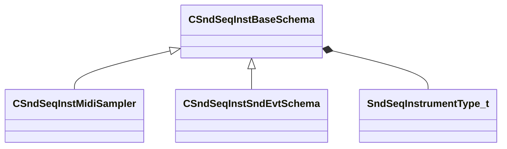

[Schemas](../../schemas.md) / [soundsystem](../soundsystem.md) / CSndSeqInstBaseSchema

# CSndSeqInstBaseSchema

> Source: **Build 25000182** · 2026-08-28 · `windows-x86_64` · schema `0.10.0`

**Kind:** class · **Size:** 32 bytes (`0x20`) · **Align:** n/a (unspecified) · **Module:** soundsystem

**Derived by:** [CSndSeqInstMidiSampler](../soundsystem/CSndSeqInstMidiSampler.md), [CSndSeqInstSndEvtSchema](../soundsystem/CSndSeqInstSndEvtSchema.md)

**Metadata:** `MPropertyAutoExpandSelf`, `MPropertyPolymorphicClass`

**Relationships:**

## Memory layout

5 fields (5 declared here, 0 inherited). Offsets are absolute from the object base.

| Offset | Field | Type | From | Annotations |
|--------|-------|------|------|-------------|
| `0x8` | `m_nType` | [SndSeqInstrumentType_t](../soundsystem/SndSeqInstrumentType_t.md) |  |  |
| `0xe` | `m_bStopCurrentEvents` | bool |  |  |
| `0x10` | `m_flBPM` | float32 |  |  |
| `0x14` | `m_flBPMFactor` | float32 |  |  |
| `0x18` | `m_flBPMInvFactor` | float32 |  |  |
