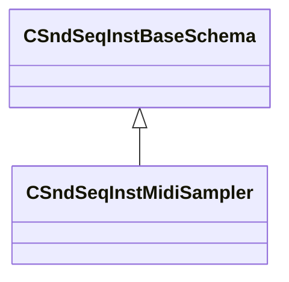

[Schemas](../../schemas.md) / [soundsystem](../soundsystem.md) / CSndSeqInstMidiSampler

# CSndSeqInstMidiSampler

> Source: **Build 25000182** · 2026-08-28 · `windows-x86_64` · schema `0.10.0`

**Kind:** class · **Size:** 224 bytes (`0xe0`) · **Align:** 8 · **Module:** soundsystem

**Inherits from:** [CSndSeqInstBaseSchema](../soundsystem/CSndSeqInstBaseSchema.md)

**Metadata:** `MPropertyFriendlyName Midi Sampler`

**Relationships:**

## Memory layout

16 fields (11 declared here, 5 inherited). Offsets are absolute from the object base.

| Offset | Field | Type | From | Annotations |
|--------|-------|------|------|-------------|
| `0x8` | `m_nType` | [SndSeqInstrumentType_t](../soundsystem/SndSeqInstrumentType_t.md) | [CSndSeqInstBaseSchema](../soundsystem/CSndSeqInstBaseSchema.md) |  |
| `0xe` | `m_bStopCurrentEvents` | bool | [CSndSeqInstBaseSchema](../soundsystem/CSndSeqInstBaseSchema.md) |  |
| `0x10` | `m_flBPM` | float32 | [CSndSeqInstBaseSchema](../soundsystem/CSndSeqInstBaseSchema.md) |  |
| `0x14` | `m_flBPMFactor` | float32 | [CSndSeqInstBaseSchema](../soundsystem/CSndSeqInstBaseSchema.md) |  |
| `0x18` | `m_flBPMInvFactor` | float32 | [CSndSeqInstBaseSchema](../soundsystem/CSndSeqInstBaseSchema.md) |  |
| `0x20` | `m_bIsSoundEvent` | bool |  |  |
| `0x21` | `m_bStopPrevious` | bool |  |  |
| `0x22` | `m_nMinNote` | uint8 |  |  |
| `0x23` | `m_nMaxNote` | uint8 |  |  |
| `0x24` | `m_flMinVelocityAtten` | float32 |  |  |
| `0x28` | `m_flMaxVelocityAtten` | float32 |  |  |
| `0x2c` | `m_flAttack` | float32 |  |  |
| `0x30` | `m_flRelease` | float32 |  |  |
| `0x34` | `m_bBeatEnvelopes` | bool |  |  |
| `0xd4` | `m_nNextVoiceSlot` | uint8 |  |  |
| `0xd8` | `m_hSoundEventHash` | uint32 |  |  |

KV3 class defaults

<pre>{
	&quot;_class&quot;: &quot;CSndSeqInstMidiSampler&quot;,
	&quot;m_nType&quot;: &quot;eSndSeqInstMidiSampler&quot;,
	&quot;m_bStopCurrentEvents&quot;: false,
	&quot;m_flBPM&quot;: 120.000000,
	&quot;m_flBPMFactor&quot;: 2.000000,
	&quot;m_flBPMInvFactor&quot;: 0.500000,
	&quot;m_bIsSoundEvent&quot;: false,
	&quot;m_bStopPrevious&quot;: true,
	&quot;m_nMinNote&quot;: 0,
	&quot;m_nMaxNote&quot;: 0,
	&quot;m_flMinVelocityAtten&quot;: 0.000000,
	&quot;m_flMaxVelocityAtten&quot;: 0.000000,
	&quot;m_flAttack&quot;: 0.000000,
	&quot;m_flRelease&quot;: 0.000000,
	&quot;m_bBeatEnvelopes&quot;: true,
	&quot;m_nNextVoiceSlot&quot;: 0,
	&quot;m_hSoundEventHash&quot;: 0
}</pre>

