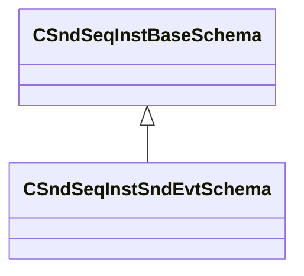

[Schemas](../../schemas.md) / [soundsystem](../soundsystem.md) / CSndSeqInstSndEvtSchema

# CSndSeqInstSndEvtSchema

> Source: **Build 25000182** · 2026-08-28 · `windows-x86_64` · schema `0.10.0`

**Kind:** class · **Size:** 32 bytes (`0x20`) · **Align:** 8 · **Module:** soundsystem

**Inherits from:** [CSndSeqInstBaseSchema](../soundsystem/CSndSeqInstBaseSchema.md)

**Metadata:** `MPropertyFriendlyName SoundEvent on Start`

**Relationships:**

## Memory layout

5 fields (0 declared here, 5 inherited). Offsets are absolute from the object base.

| Offset | Field | Type | From | Annotations |
|--------|-------|------|------|-------------|
| `0x8` | `m_nType` | [SndSeqInstrumentType_t](../soundsystem/SndSeqInstrumentType_t.md) | [CSndSeqInstBaseSchema](../soundsystem/CSndSeqInstBaseSchema.md) |  |
| `0xe` | `m_bStopCurrentEvents` | bool | [CSndSeqInstBaseSchema](../soundsystem/CSndSeqInstBaseSchema.md) |  |
| `0x10` | `m_flBPM` | float32 | [CSndSeqInstBaseSchema](../soundsystem/CSndSeqInstBaseSchema.md) |  |
| `0x14` | `m_flBPMFactor` | float32 | [CSndSeqInstBaseSchema](../soundsystem/CSndSeqInstBaseSchema.md) |  |
| `0x18` | `m_flBPMInvFactor` | float32 | [CSndSeqInstBaseSchema](../soundsystem/CSndSeqInstBaseSchema.md) |  |

KV3 class defaults

<pre>{
	&quot;_class&quot;: &quot;CSndSeqInstSndEvtSchema&quot;,
	&quot;m_nType&quot;: &quot;eSndSeqInstSndEvt&quot;,
	&quot;m_bStopCurrentEvents&quot;: false,
	&quot;m_flBPM&quot;: 0.000000,
	&quot;m_flBPMFactor&quot;: 0.000000,
	&quot;m_flBPMInvFactor&quot;: 0.000000
}</pre>

