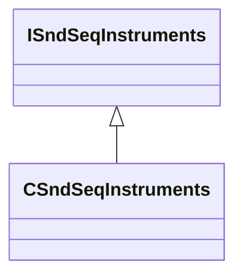

[Schemas](../../schemas.md) / [soundsystem](../soundsystem.md) / CSndSeqInstruments

# CSndSeqInstruments

**Kind:** class · **Size:** 40 bytes (`0x28`) · **Align:** 255 · **Module:** soundsystem

**Inherits from:** [ISndSeqInstruments](../soundsystem/ISndSeqInstruments.md)

**Relationships:**

