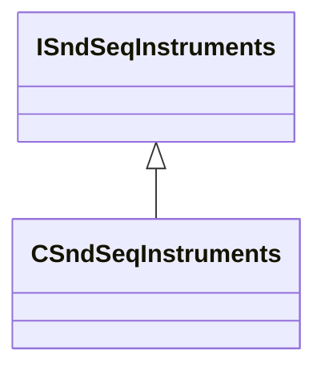

[Schemas](../../schemas.md) / [soundsystem](../soundsystem.md) / CSndSeqInstruments

# CSndSeqInstruments

> Source: **Build 25175329** · 2026-09-07 · `windows-x86_64` · schema `0.10.0`

**Kind:** class · **Size:** 40 bytes (`0x28`) · **Align:** n/a (unspecified) · **Module:** soundsystem

**Inherits from:** [ISndSeqInstruments](../soundsystem/ISndSeqInstruments.md)

**Relationships:**

```mermaid
classDiagram
    ISndSeqInstruments <|-- CSndSeqInstruments
```

## Memory layout

No schema-visible fields (40 bytes of opaque storage).
