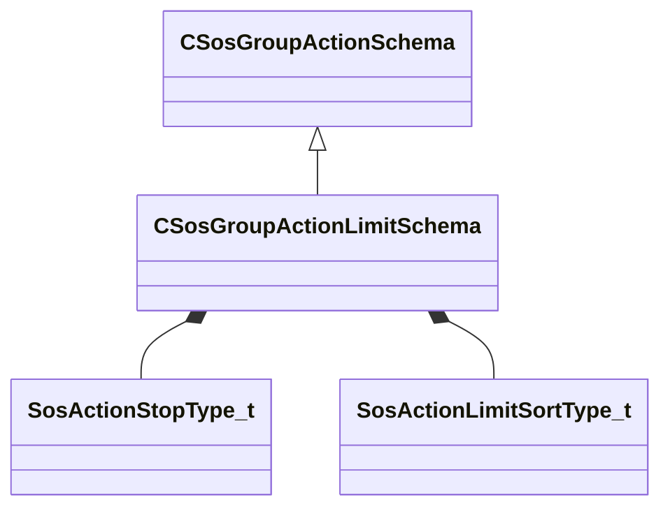

[Schemas](../../schemas.md) / [soundsystem](../soundsystem.md) / CSosGroupActionLimitSchema

# CSosGroupActionLimitSchema

**Kind:** class · **Size:** 24 bytes (`0x18`) · **Align:** 8 · **Module:** soundsystem

**Inherits from:** [CSosGroupActionSchema](../soundsystem/CSosGroupActionSchema.md)

**Metadata:** `MPropertyFriendlyName Limiter`

**Relationships:**

## Memory layout

5 fields (5 declared here, 0 inherited). Offsets are absolute from the object base.

| Offset | Field | Type | From | Annotations |
|--------|-------|------|------|-------------|
| `0x8` | `m_nMaxCount` | int32 |  |  |
| `0xc` | `m_nStopType` | [SosActionStopType_t](../!GlobalTypes/SosActionStopType_t.md) |  |  |
| `0x10` | `m_nSortType` | [SosActionLimitSortType_t](../!GlobalTypes/SosActionLimitSortType_t.md) |  |  |
| `0x14` | `m_bStopImmediate` | bool |  |  |
| `0x15` | `m_bCountStopped` | bool |  | `MPropertyFriendlyName Count Stopped Events` |

KV3 class defaults

<pre>{
	&quot;_class&quot;: &quot;CSosGroupActionLimitSchema&quot;,
	&quot;m_nMaxCount&quot;: -1,
	&quot;m_nStopType&quot;: &quot;SOS_STOPTYPE_NONE&quot;,
	&quot;m_nSortType&quot;: &quot;SOS_LIMIT_SORTTYPE_HIGHEST&quot;,
	&quot;m_bStopImmediate&quot;: false,
	&quot;m_bCountStopped&quot;: true
}</pre>

