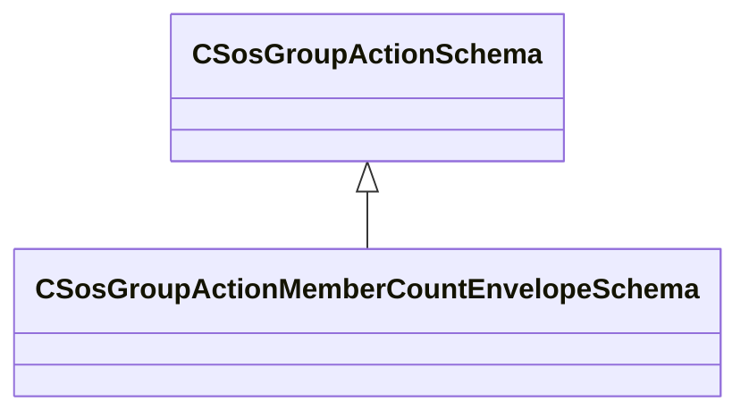

[Schemas](../../schemas.md) / [soundsystem](../soundsystem.md) / CSosGroupActionMemberCountEnvelopeSchema

# CSosGroupActionMemberCountEnvelopeSchema

> Source: **Build 25000182** · 2026-08-28 · `windows-x86_64` · schema `0.10.0`

**Kind:** class · **Size:** 48 bytes (`0x30`) · **Align:** 8 · **Module:** soundsystem

**Inherits from:** [CSosGroupActionSchema](../soundsystem/CSosGroupActionSchema.md)

**Metadata:** `MPropertyFriendlyName Count Envelope`

**Relationships:**

## Memory layout

8 fields (8 declared here, 0 inherited). Offsets are absolute from the object base.

| Offset | Field | Type | From | Annotations |
|--------|-------|------|------|-------------|
| `0x8` | `m_nBaseCount` | int32 |  | `MPropertyFriendlyName Min Threshold Count` |
| `0xc` | `m_nTargetCount` | int32 |  | `MPropertyFriendlyName Max Target Count` |
| `0x10` | `m_flBaseValue` | float32 |  | `MPropertyFriendlyName Threshold Value` |
| `0x14` | `m_flTargetValue` | float32 |  | `MPropertyFriendlyName Target Value` |
| `0x18` | `m_flAttack` | float32 |  | `MPropertyFriendlyName Attack` |
| `0x1c` | `m_flDecay` | float32 |  | `MPropertyFriendlyName Decay` |
| `0x20` | `m_resultVarName` | CUtlString |  | `MPropertyFriendlyName Result Variable Name` |
| `0x28` | `m_bSaveToGroup` | bool |  | `MPropertyFriendlyName Save Result to Group` |

KV3 class defaults

<pre>{
	&quot;_class&quot;: &quot;CSosGroupActionMemberCountEnvelopeSchema&quot;,
	&quot;m_nBaseCount&quot;: 0,
	&quot;m_nTargetCount&quot;: 1,
	&quot;m_flBaseValue&quot;: 0.000000,
	&quot;m_flTargetValue&quot;: 0.000000,
	&quot;m_flAttack&quot;: 1.000000,
	&quot;m_flDecay&quot;: 1.000000,
	&quot;m_resultVarName&quot;: &quot;envelope_result&quot;,
	&quot;m_bSaveToGroup&quot;: false
}</pre>

