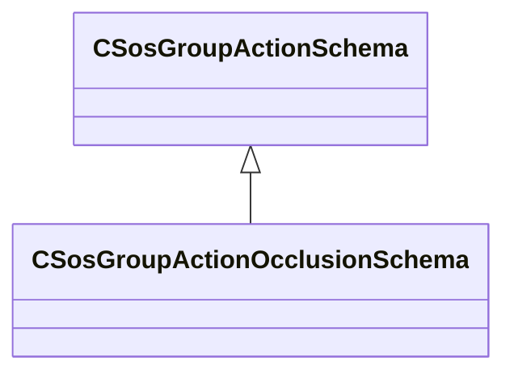

[Schemas](../../schemas.md) / [soundsystem](../soundsystem.md) / CSosGroupActionOcclusionSchema

# CSosGroupActionOcclusionSchema

**Kind:** class · **Size:** 32 bytes (`0x20`) · **Align:** 8 · **Module:** soundsystem

**Inherits from:** [CSosGroupActionSchema](../soundsystem/CSosGroupActionSchema.md)

**Metadata:** `MPropertyFriendlyName Occlusion Info`

**Relationships:**

## Memory layout

6 fields (6 declared here, 0 inherited). Offsets are absolute from the object base.

| Offset | Field | Type | From | Annotations |
|--------|-------|------|------|-------------|
| `0x8` | `m_flCalculationInterval` | float32 |  | `MPropertyFriendlyName Calculation interval ( seconds ).` |
| `0xc` | `m_flRadius` | float32 |  | `MPropertyFriendlyName Occlusion radius.` |
| `0x10` | `m_flOcclusionScale` | float32 |  | `MPropertyFriendlyName Occlusion scale.` |
| `0x14` | `m_flOcclusionMin` | float32 |  | `MPropertyFriendlyName Occlusion min.` |
| `0x18` | `m_flOcclusionMax` | float32 |  | `MPropertyFriendlyName Occlusion max.` |
| `0x1c` | `m_flTestDepth` | float32 |  | `MPropertyFriendlyName Test depth.` |

KV3 class defaults

<pre>{
	&quot;_class&quot;: &quot;CSosGroupActionOcclusionSchema&quot;,
	&quot;m_flCalculationInterval&quot;: 0.100000,
	&quot;m_flRadius&quot;: 0.000000,
	&quot;m_flOcclusionScale&quot;: 1.000000,
	&quot;m_flOcclusionMin&quot;: 0.000000,
	&quot;m_flOcclusionMax&quot;: 1.000000,
	&quot;m_flTestDepth&quot;: 0.000000
}</pre>

