[Schemas](../../schemas.md) / [soundsystem](../soundsystem.md) / CSosGroupActionSchema

# CSosGroupActionSchema

**Kind:** class · **Size:** 8 bytes (`0x8`) · **Align:** 255 · **Module:** soundsystem

**Derived by:** [CSosGroupActionLimitSchema](../soundsystem/CSosGroupActionLimitSchema.md), [CSosGroupActionMemberCountEnvelopeSchema](../soundsystem/CSosGroupActionMemberCountEnvelopeSchema.md), [CSosGroupActionOcclusionSchema](../soundsystem/CSosGroupActionOcclusionSchema.md), [CSosGroupActionSetSoundeventParameterSchema](../soundsystem/CSosGroupActionSetSoundeventParameterSchema.md), [CSosGroupActionSoundeventClusterSchema](../soundsystem/CSosGroupActionSoundeventClusterSchema.md), [CSosGroupActionSoundeventCountSchema](../soundsystem/CSosGroupActionSoundeventCountSchema.md), [CSosGroupActionSoundeventMinMaxValuesSchema](../soundsystem/CSosGroupActionSoundeventMinMaxValuesSchema.md), [CSosGroupActionSoundeventPrioritySchema](../soundsystem/CSosGroupActionSoundeventPrioritySchema.md), [CSosGroupActionTimeBlockLimitSchema](../soundsystem/CSosGroupActionTimeBlockLimitSchema.md), [CSosGroupActionTimeLimitSchema](../soundsystem/CSosGroupActionTimeLimitSchema.md)

**Metadata:** `MPropertyAutoExpandSelf`, `MPropertyPolymorphicClass`

**Relationships:**

```mermaid
classDiagram
    CSosGroupActionSchema <|-- CSosGroupActionLimitSchema
    CSosGroupActionSchema <|-- CSosGroupActionMemberCountEnvelopeSchema
    CSosGroupActionSchema <|-- CSosGroupActionOcclusionSchema
    CSosGroupActionSchema <|-- CSosGroupActionSetSoundeventParameterSchema
    CSosGroupActionSchema <|-- CSosGroupActionSoundeventClusterSchema
    CSosGroupActionSchema <|-- CSosGroupActionSoundeventCountSchema
    CSosGroupActionSchema <|-- CSosGroupActionSoundeventMinMaxValuesSchema
    CSosGroupActionSchema <|-- CSosGroupActionSoundeventPrioritySchema
    CSosGroupActionSchema <|-- CSosGroupActionTimeBlockLimitSchema
    CSosGroupActionSchema <|-- CSosGroupActionTimeLimitSchema
```

