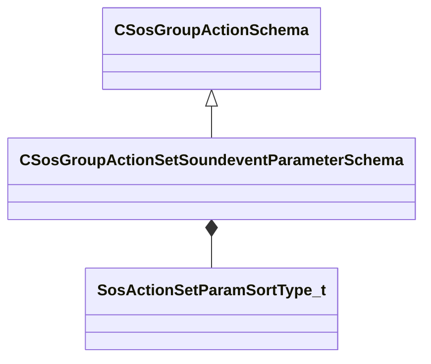

[Schemas](../../schemas.md) / [soundsystem](../soundsystem.md) / CSosGroupActionSetSoundeventParameterSchema

# CSosGroupActionSetSoundeventParameterSchema

**Kind:** class · **Size:** 40 bytes (`0x28`) · **Align:** 8 · **Module:** soundsystem

**Inherits from:** [CSosGroupActionSchema](../soundsystem/CSosGroupActionSchema.md)

**Metadata:** `MPropertyFriendlyName Set Sound Event Parameter`

**Relationships:**

## Memory layout

5 fields (5 declared here, 0 inherited). Offsets are absolute from the object base.

| Offset | Field | Type | From | Annotations |
|--------|-------|------|------|-------------|
| `0x8` | `m_nMaxCount` | int32 |  |  |
| `0xc` | `m_flMinValue` | float32 |  |  |
| `0x10` | `m_flMaxValue` | float32 |  |  |
| `0x18` | `m_opvarName` | CUtlString |  | `MPropertyFriendlyName Parameter Name` |
| `0x20` | `m_nSortType` | [SosActionSetParamSortType_t](../!GlobalTypes/SosActionSetParamSortType_t.md) |  |  |

KV3 class defaults

<pre>{
	&quot;_class&quot;: &quot;CSosGroupActionSetSoundeventParameterSchema&quot;,
	&quot;m_nMaxCount&quot;: -1,
	&quot;m_flMinValue&quot;: 0.000000,
	&quot;m_flMaxValue&quot;: 1.000000,
	&quot;m_opvarName&quot;: &quot;None&quot;,
	&quot;m_nSortType&quot;: &quot;SOS_SETPARAM_SORTTYPE_LOWEST&quot;
}</pre>

