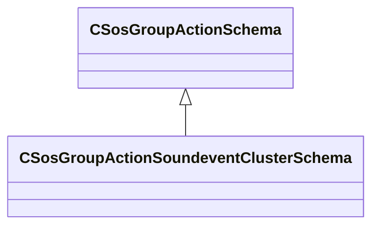

[Schemas](../../schemas.md) / [soundsystem](../soundsystem.md) / CSosGroupActionSoundeventClusterSchema

# CSosGroupActionSoundeventClusterSchema

> Source: **Build 25000182** · 2026-08-28 · `windows-x86_64` · schema `0.10.0`

**Kind:** class · **Size:** 80 bytes (`0x50`) · **Align:** 8 · **Module:** soundsystem

**Inherits from:** [CSosGroupActionSchema](../soundsystem/CSosGroupActionSchema.md)

**Metadata:** `MPropertyFriendlyName Soundevent Cluster`

**Relationships:**

## Memory layout

7 fields (7 declared here, 0 inherited). Offsets are absolute from the object base.

| Offset | Field | Type | From | Annotations |
|--------|-------|------|------|-------------|
| `0x8` | `m_nMinNearby` | int32 |  | `MPropertyFriendlyName Minimum Nearby Soundevents` |
| `0xc` | `m_flClusterEpsilon` | float32 |  | `MPropertyFriendlyName Search Radius to Cluster Soundevents` |
| `0x10` | `m_shouldPlayOpvar` | CUtlString |  | `MPropertyFriendlyName 'Should Play' Opvar Name` |
| `0x18` | `m_shouldPlayClusterChild` | CUtlString |  | `MPropertyFriendlyName 'Should Play Cluster Child' Opvar Name` |
| `0x20` | `m_clusterSizeOpvar` | CUtlString |  | `MPropertyFriendlyName Cluster Size Opvar Name` |
| `0x28` | `m_groupBoundingBoxMinsOpvar` | CUtlString |  | `MPropertyFriendlyName 'Group Box Mins' Opvar Name` |
| `0x30` | `m_groupBoundingBoxMaxsOpvar` | CUtlString |  | `MPropertyFriendlyName 'Group Box Maxs' Opvar Name` |

KV3 class defaults

<pre>{
	&quot;_class&quot;: &quot;CSosGroupActionSoundeventClusterSchema&quot;,
	&quot;m_nMinNearby&quot;: 6,
	&quot;m_flClusterEpsilon&quot;: 36.000000,
	&quot;m_shouldPlayOpvar&quot;: &quot;cluster_should_play&quot;,
	&quot;m_shouldPlayClusterChild&quot;: &quot;cluster_should_play_child&quot;,
	&quot;m_clusterSizeOpvar&quot;: &quot;cluster_size&quot;,
	&quot;m_groupBoundingBoxMinsOpvar&quot;: &quot;cluster_group_box_mins&quot;,
	&quot;m_groupBoundingBoxMaxsOpvar&quot;: &quot;cluster_group_box_maxs&quot;
}</pre>

