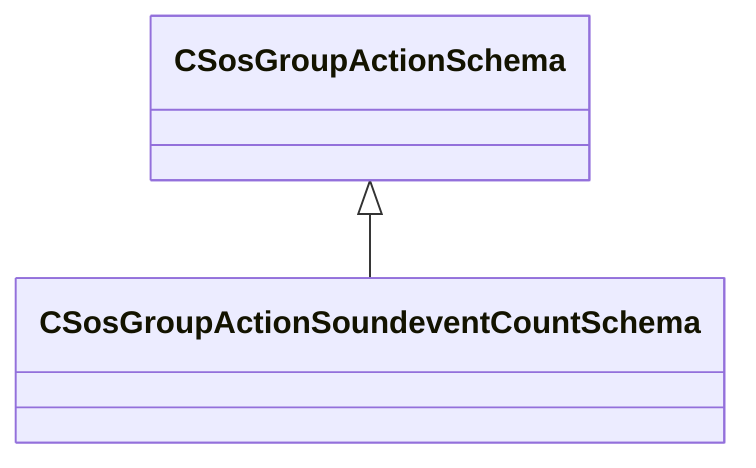

[Schemas](../../schemas.md) / [soundsystem](../soundsystem.md) / CSosGroupActionSoundeventCountSchema

# CSosGroupActionSoundeventCountSchema

> Source: **Build 25000182** · 2026-08-28 · `windows-x86_64` · schema `0.10.0`

**Kind:** class · **Size:** 24 bytes (`0x18`) · **Align:** 8 · **Module:** soundsystem

**Inherits from:** [CSosGroupActionSchema](../soundsystem/CSosGroupActionSchema.md)

**Metadata:** `MPropertyFriendlyName Soundevent Count`

**Relationships:**

## Memory layout

2 fields (2 declared here, 0 inherited). Offsets are absolute from the object base.

| Offset | Field | Type | From | Annotations |
|--------|-------|------|------|-------------|
| `0x8` | `m_bExcludeStoppedSounds` | bool |  | `MPropertyFriendlyName Exclude Stopped Sounds from Count` |
| `0x10` | `m_strCountKeyName` | CUtlString |  | `MPropertyFriendlyName Result Current Count` |

KV3 class defaults

<pre>{
	&quot;_class&quot;: &quot;CSosGroupActionSoundeventCountSchema&quot;,
	&quot;m_bExcludeStoppedSounds&quot;: true,
	&quot;m_strCountKeyName&quot;: &quot;current_count&quot;
}</pre>

