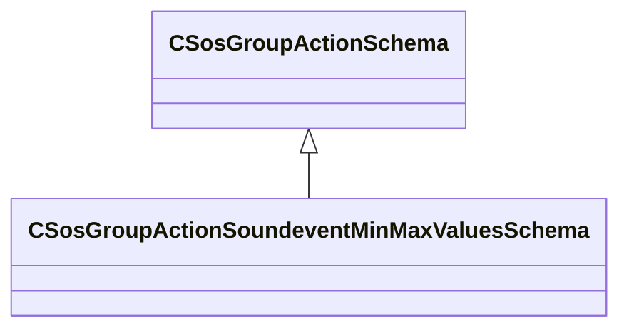

[Schemas](../../schemas.md) / [soundsystem](../soundsystem.md) / CSosGroupActionSoundeventMinMaxValuesSchema

# CSosGroupActionSoundeventMinMaxValuesSchema

> Source: **Build 25000182** · 2026-08-28 · `windows-x86_64` · schema `0.10.0`

**Kind:** class · **Size:** 64 bytes (`0x40`) · **Align:** 8 · **Module:** soundsystem

**Inherits from:** [CSosGroupActionSchema](../soundsystem/CSosGroupActionSchema.md)

**Metadata:** `MPropertyFriendlyName Soundevent Min/Max Values`

**Relationships:**

## Memory layout

10 fields (10 declared here, 0 inherited). Offsets are absolute from the object base.

| Offset | Field | Type | From | Annotations |
|--------|-------|------|------|-------------|
| `0x8` | `m_strQueryPublicFieldName` | CUtlString |  | `MPropertyFriendlyName Public field name to query.` |
| `0x10` | `m_strDelayPublicFieldName` | CUtlString |  | `MPropertyFriendlyName Public field 'delay' name.` |
| `0x18` | `m_bExcludeStoppedSounds` | bool |  | `MPropertyFriendlyName Exclude stopped sounds from evaluation` |
| `0x19` | `m_bExcludeDelayedSounds` | bool |  | `MPropertyFriendlyName Exclude delayed sounds from evaluation` |
| `0x1a` | `m_bExcludeSoundsBelowThreshold` | bool |  | `MPropertyFriendlyName Exclude sounds from evaluation less than or equal to a min value threshold.` |
| `0x1c` | `m_flExcludeSoundsMinThresholdValue` | float32 |  | `MPropertyFriendlyName The minimum threshold value to exclude sounds.` |
| `0x20` | `m_bExcludSoundsAboveThreshold` | bool |  | `MPropertyFriendlyName Exclude sounds from evaluation greater than or equal to a max value threshold.` |
| `0x24` | `m_flExcludeSoundsMaxThresholdValue` | float32 |  | `MPropertyFriendlyName The maximum threshold value to exclude sounds.` |
| `0x28` | `m_strMinValueName` | CUtlString |  | `MPropertyFriendlyName Min value property name` |
| `0x30` | `m_strMaxValueName` | CUtlString |  | `MPropertyFriendlyName Max value property name` |

KV3 class defaults

<pre>{
	&quot;_class&quot;: &quot;CSosGroupActionSoundeventMinMaxValuesSchema&quot;,
	&quot;m_strQueryPublicFieldName&quot;: &quot;min_max_query&quot;,
	&quot;m_strDelayPublicFieldName&quot;: &quot;delay&quot;,
	&quot;m_bExcludeStoppedSounds&quot;: true,
	&quot;m_bExcludeDelayedSounds&quot;: true,
	&quot;m_bExcludeSoundsBelowThreshold&quot;: false,
	&quot;m_flExcludeSoundsMinThresholdValue&quot;: -1.000000,
	&quot;m_bExcludSoundsAboveThreshold&quot;: false,
	&quot;m_flExcludeSoundsMaxThresholdValue&quot;: -1.000000,
	&quot;m_strMinValueName&quot;: &quot;min&quot;,
	&quot;m_strMaxValueName&quot;: &quot;max&quot;
}</pre>

