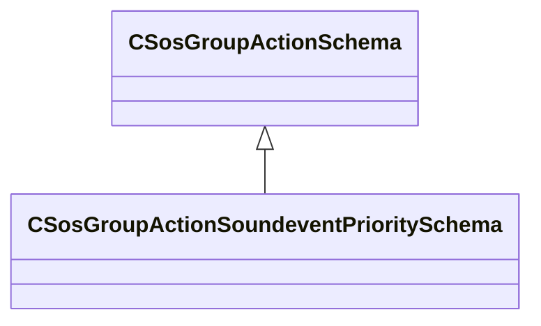

[Schemas](../../schemas.md) / [soundsystem](../soundsystem.md) / CSosGroupActionSoundeventPrioritySchema

# CSosGroupActionSoundeventPrioritySchema

**Kind:** class · **Size:** 56 bytes (`0x38`) · **Align:** 8 · **Module:** soundsystem

**Inherits from:** [CSosGroupActionSchema](../soundsystem/CSosGroupActionSchema.md)

**Metadata:** `MPropertyFriendlyName Soundevent Priority`

**Relationships:**

## Memory layout

4 fields (4 declared here, 0 inherited). Offsets are absolute from the object base.

| Offset | Field | Type | From | Annotations |
|--------|-------|------|------|-------------|
| `0x8` | `m_priorityValue` | CUtlString |  | `MPropertyFriendlyName Priority Value, typically 0.0 to 1.0` |
| `0x10` | `m_priorityVolumeScalar` | CUtlString |  | `MPropertyFriendlyName Priority-Based Volume Multiplier, 0.0 to 1.0` |
| `0x18` | `m_priorityContributeButDontRead` | CUtlString |  | `MPropertyFriendlyName Contribute to the priority system, but volume is unaffected by it (bool)` |
| `0x20` | `m_bPriorityReadButDontContribute` | CUtlString |  | `MPropertyFriendlyName Don't contribute to the priority system, but volume is affected by it (bool)` |

KV3 class defaults

<pre>{
	&quot;_class&quot;: &quot;CSosGroupActionSoundeventPrioritySchema&quot;,
	&quot;m_priorityValue&quot;: &quot;priority_value&quot;,
	&quot;m_priorityVolumeScalar&quot;: &quot;priority_volume_scalar&quot;,
	&quot;m_priorityContributeButDontRead&quot;: &quot;priority_contribute_dont_read&quot;,
	&quot;m_bPriorityReadButDontContribute&quot;: &quot;priority_read_dont_contribute&quot;
}</pre>

