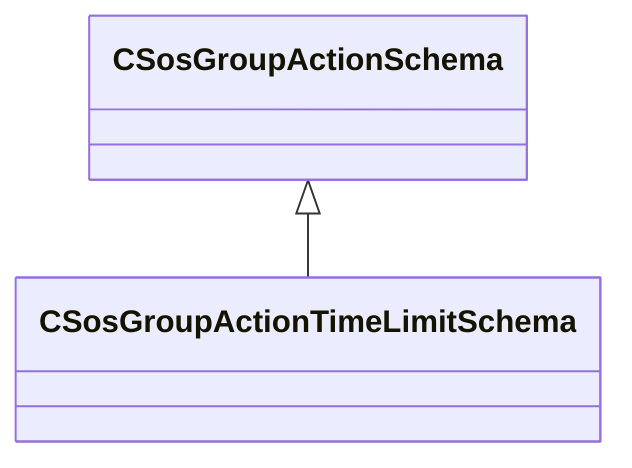

[Schemas](../../schemas.md) / [soundsystem](../soundsystem.md) / CSosGroupActionTimeLimitSchema

# CSosGroupActionTimeLimitSchema

> Source: **Build 25000182** · 2026-08-28 · `windows-x86_64` · schema `0.10.0`

**Kind:** class · **Size:** 16 bytes (`0x10`) · **Align:** 8 · **Module:** soundsystem

**Inherits from:** [CSosGroupActionSchema](../soundsystem/CSosGroupActionSchema.md)

**Metadata:** `MPropertyFriendlyName Time Limiter`

**Relationships:**

## Memory layout

1 field (1 declared here, 0 inherited). Offsets are absolute from the object base.

| Offset | Field | Type | From | Annotations |
|--------|-------|------|------|-------------|
| `0x8` | `m_flMaxDuration` | float32 |  |  |

KV3 class defaults

<pre>{
	&quot;_class&quot;: &quot;CSosGroupActionTimeLimitSchema&quot;,
	&quot;m_flMaxDuration&quot;: -1.000000
}</pre>

