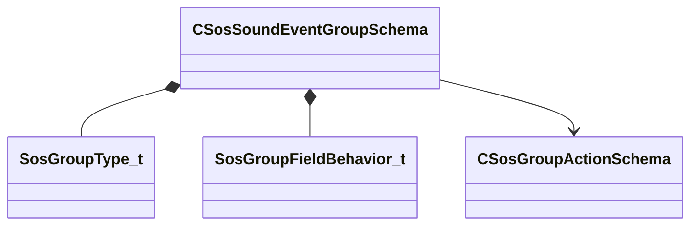

[Schemas](../../schemas.md) / [soundsystem](../soundsystem.md) / CSosSoundEventGroupSchema

# CSosSoundEventGroupSchema

**Kind:** class · **Size:** 112 bytes (`0x70`) · **Align:** 8 · **Module:** soundsystem

**Metadata:** `MVDataRoot`

**Relationships:**

## Memory layout

16 fields (16 declared here, 0 inherited). Offsets are absolute from the object base.

| Offset | Field | Type | From | Annotations |
|--------|-------|------|------|-------------|
| `0x8` | `m_nGroupType` | [SosGroupType_t](../soundsystem/SosGroupType_t.md) |  | `MPropertyAttributeEditor Radio` |
| `0xc` | `m_bBlocksEvents` | bool |  | `MPropertyStartGroup +Block Events` |
| `0x10` | `m_nBlockMaxCount` | int32 |  | `MPropertyReadonlyExpr !m_bBlocksEvents` |
| `0x14` | `m_flMemberLifespanTime` | float32 |  | `MPropertyStartGroup` |
| `0x18` | `m_bInvertMatch` | bool |  |  |
| `0x1c` | `m_Behavior_EventName` | [SosGroupFieldBehavior_t](../soundsystem/SosGroupFieldBehavior_t.md) |  | `MPropertyAttributeEditor Radio` `MPropertyReadonlyExpr m_bMatchEventSubString` `MPropertyStartGroup +Event Name` |
| `0x20` | `m_matchSoundEventName` | CUtlString |  | `MPropertyReadonlyExpr m_Behavior_EventName != kMatch \|\| m_bMatchEventSubString` |
| `0x28` | `m_bMatchEventSubString` | bool |  | `MPropertyStartGroup +Event SubString` |
| `0x30` | `m_matchSoundEventSubString` | CUtlString |  | `MPropertyReadonlyExpr !m_bMatchEventSubString` |
| `0x38` | `m_Behavior_EntIndex` | [SosGroupFieldBehavior_t](../soundsystem/SosGroupFieldBehavior_t.md) |  | `MPropertyAttributeEditor Radio` `MPropertyStartGroup +Ent Index` |
| `0x3c` | `m_flEntIndex` | float32 |  | `MPropertyReadonlyExpr m_Behavior_EntIndex != kMatch` |
| `0x40` | `m_Behavior_Opvar` | [SosGroupFieldBehavior_t](../soundsystem/SosGroupFieldBehavior_t.md) |  | `MPropertyAttributeEditor Radio` `MPropertyStartGroup +OpVar Float` `MPropertySuppressExpr m_nGroupType == SOS_GROUPTYPE_STATIC` |
| `0x44` | `m_flOpvar` | float32 |  | `MPropertyReadonlyExpr m_Behavior_Opvar != kMatch` `MPropertySuppressExpr m_nGroupType == SOS_GROUPTYPE_STATIC` |
| `0x48` | `m_Behavior_String` | [SosGroupFieldBehavior_t](../soundsystem/SosGroupFieldBehavior_t.md) |  | `MPropertyAttributeEditor Radio` `MPropertyStartGroup +OpVar String` `MPropertySuppressExpr m_nGroupType == SOS_GROUPTYPE_STATIC` |
| `0x50` | `m_opvarString` | CUtlString |  | `MPropertyReadonlyExpr m_Behavior_String != kMatch` `MPropertySuppressExpr m_nGroupType == SOS_GROUPTYPE_STATIC` |
| `0x58` | `m_vActions` | CUtlVector< [CSosGroupActionSchema](../soundsystem/CSosGroupActionSchema.md)* > |  | `MPropertyAutoExpandSelf` `MPropertyStartGroup` |

KV3 class defaults

<pre>{
	&quot;m_nGroupType&quot;: &quot;SOS_GROUPTYPE_DYNAMIC&quot;,
	&quot;m_bBlocksEvents&quot;: false,
	&quot;m_nBlockMaxCount&quot;: 0,
	&quot;m_flMemberLifespanTime&quot;: -1.000000,
	&quot;m_bInvertMatch&quot;: false,
	&quot;m_Behavior_EventName&quot;: &quot;kIgnore&quot;,
	&quot;m_matchSoundEventName&quot;: &quot;&quot;,
	&quot;m_bMatchEventSubString&quot;: false,
	&quot;m_matchSoundEventSubString&quot;: &quot;&quot;,
	&quot;m_Behavior_EntIndex&quot;: &quot;kIgnore&quot;,
	&quot;m_flEntIndex&quot;: -1.000000,
	&quot;m_Behavior_Opvar&quot;: &quot;kIgnore&quot;,
	&quot;m_flOpvar&quot;: -1.000000,
	&quot;m_Behavior_String&quot;: &quot;kIgnore&quot;,
	&quot;m_opvarString&quot;: &quot;&quot;,
	&quot;m_vActions&quot;:
	[
	]
}</pre>

