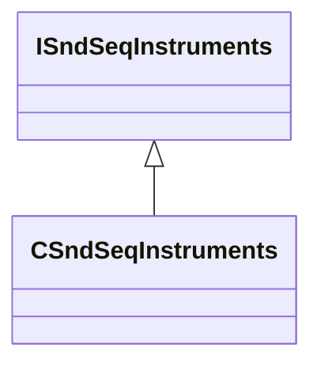

[Schemas](../../schemas.md) / [soundsystem](../soundsystem.md) / ISndSeqInstruments

# ISndSeqInstruments

> Source: **Build 25000182** · 2026-08-28 · `windows-x86_64` · schema `0.10.0`

**Kind:** class · **Size:** 8 bytes (`0x8`) · **Align:** n/a (unspecified) · **Module:** soundsystem

**Derived by:** [CSndSeqInstruments](../soundsystem/CSndSeqInstruments.md)

**Relationships:**

## Memory layout

No schema-visible fields (8 bytes of opaque storage).
