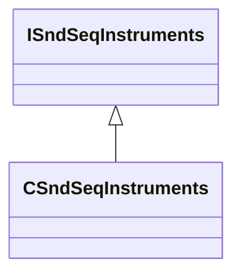

[Schemas](../../schemas.md) / [soundsystem](../soundsystem.md) / ISndSeqInstruments

# ISndSeqInstruments

**Kind:** class · **Size:** 8 bytes (`0x8`) · **Align:** 255 · **Module:** soundsystem

**Derived by:** [CSndSeqInstruments](../soundsystem/CSndSeqInstruments.md)

**Relationships:**

