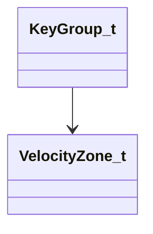

[Schemas](../../schemas.md) / [soundsystem](../soundsystem.md) / KeyGroup_t

# KeyGroup_t

> Source: **Build 25000182** · 2026-08-28 · `windows-x86_64` · schema `0.10.0`

**Kind:** class · **Size:** 16 bytes (`0x10`) · **Align:** n/a (unspecified) · **Module:** soundsystem

**Relationships:**

## Memory layout

5 fields (5 declared here, 0 inherited). Offsets are absolute from the object base.

| Offset | Field | Type | From | Annotations |
|--------|-------|------|------|-------------|
| `0x0` | `nCenterNote` | uint8 |  |  |
| `0x1` | `nMinNote` | uint8 |  |  |
| `0x2` | `nMaxNote` | uint8 |  |  |
| `0x3` | `nNumVelocityZones` | uint8 |  |  |
| `0x8` | `pVelocityZones` | [VelocityZone_t](../soundsystem/VelocityZone_t.md)* |  |  |
