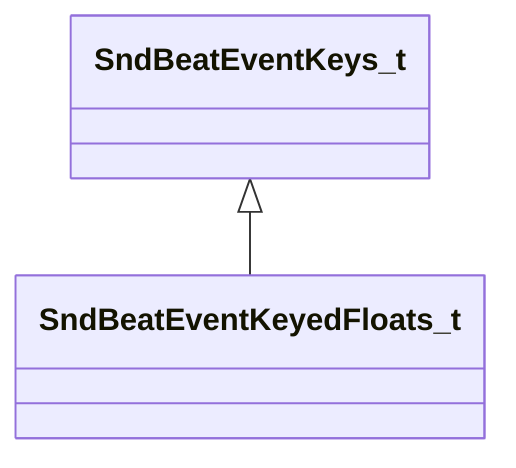

[Schemas](../../schemas.md) / [soundsystem](../soundsystem.md) / SndBeatEventKeyedFloats_t

# SndBeatEventKeyedFloats_t

> Source: **Build 25000182** · 2026-08-28 · `windows-x86_64` · schema `0.10.0`

**Kind:** class · **Size:** 24 bytes (`0x18`) · **Align:** 8 · **Module:** soundsystem

**Inherits from:** [SndBeatEventKeys_t](../soundsystem/SndBeatEventKeys_t.md)

**Relationships:**

## Memory layout

2 fields (1 declared here, 1 inherited). Offsets are absolute from the object base.

| Offset | Field | Type | From | Annotations |
|--------|-------|------|------|-------------|
| `0x8` | `m_flKey` | float32 | [SndBeatEventKeys_t](../soundsystem/SndBeatEventKeys_t.md) | `MPropertyFriendlyName Key` |
| `0x10` | `m_flFloat` | float32 |  | `MPropertyFriendlyName Float` |

KV3 class defaults

<pre>{
	&quot;_class&quot;: &quot;SndBeatEventKeyedFloats_t&quot;,
	&quot;m_flKey&quot;: 0.000000,
	&quot;m_flFloat&quot;: 0.000000
}</pre>

