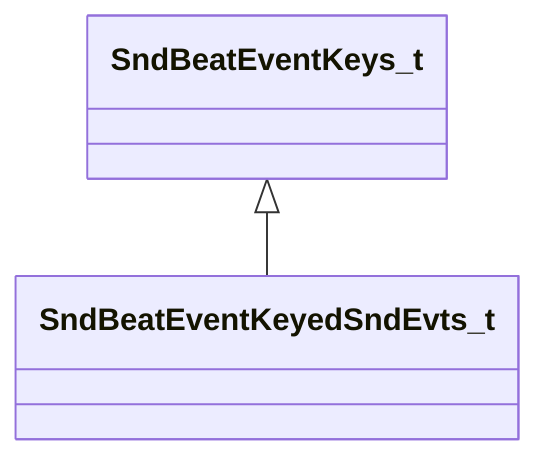

[Schemas](../../schemas.md) / [soundsystem](../soundsystem.md) / SndBeatEventKeyedSndEvts_t

# SndBeatEventKeyedSndEvts_t

**Kind:** class · **Size:** 24 bytes (`0x18`) · **Align:** 8 · **Module:** soundsystem

**Inherits from:** [SndBeatEventKeys_t](../soundsystem/SndBeatEventKeys_t.md)

**Relationships:**

## Memory layout

2 fields (1 declared here, 1 inherited). Offsets are absolute from the object base.

| Offset | Field | Type | From | Annotations |
|--------|-------|------|------|-------------|
| `0x8` | `m_flKey` | float32 | [SndBeatEventKeys_t](../soundsystem/SndBeatEventKeys_t.md) | `MPropertyFriendlyName Key` |
| `0x10` | `m_strSoundEventName` | CUtlString |  | `MPropertyFriendlyName SoundEvent Name` |

KV3 class defaults

<pre>{
	&quot;_class&quot;: &quot;SndBeatEventKeyedSndEvts_t&quot;,
	&quot;m_flKey&quot;: 0.000000,
	&quot;m_strSoundEventName&quot;: &quot;&quot;
}</pre>

