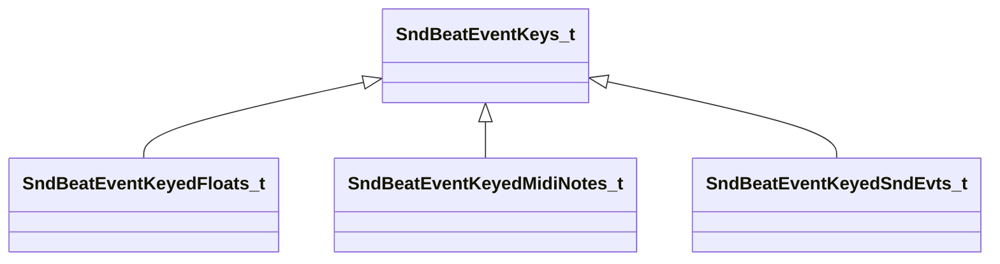

[Schemas](../../schemas.md) / [soundsystem](../soundsystem.md) / SndBeatEventKeys_t

# SndBeatEventKeys_t

> Source: **Build 25000182** · 2026-08-28 · `windows-x86_64` · schema `0.10.0`

**Kind:** class · **Size:** 16 bytes (`0x10`) · **Align:** 8 · **Module:** soundsystem

**Derived by:** [SndBeatEventKeyedFloats_t](../soundsystem/SndBeatEventKeyedFloats_t.md), [SndBeatEventKeyedMidiNotes_t](../soundsystem/SndBeatEventKeyedMidiNotes_t.md), [SndBeatEventKeyedSndEvts_t](../soundsystem/SndBeatEventKeyedSndEvts_t.md)

**Metadata:** `MVDataBase`, `MVDataNodeType 1`

**Relationships:**

## Memory layout

1 field (1 declared here, 0 inherited). Offsets are absolute from the object base.

| Offset | Field | Type | From | Annotations |
|--------|-------|------|------|-------------|
| `0x8` | `m_flKey` | float32 |  | `MPropertyFriendlyName Key` |

KV3 class defaults

<pre>{
	&quot;_class&quot;: &quot;SndBeatEventKeys_t&quot;,
	&quot;m_flKey&quot;: 0.000000
}</pre>

