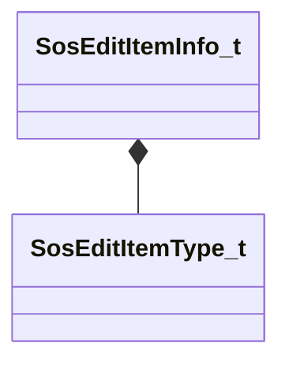

[Schemas](../../schemas.md) / [soundsystem](../soundsystem.md) / SosEditItemInfo_t

# SosEditItemInfo_t

**Kind:** class · **Size:** 48 bytes (`0x30`) · **Align:** 8 · **Module:** soundsystem

**Relationships:**

## Memory layout

5 fields (5 declared here, 0 inherited). Offsets are absolute from the object base.

| Offset | Field | Type | From | Annotations |
|--------|-------|------|------|-------------|
| `0x0` | `itemType` | [SosEditItemType_t](../soundsystem/SosEditItemType_t.md) |  |  |
| `0x8` | `itemName` | CUtlString |  |  |
| `0x10` | `itemTypeName` | CUtlString |  |  |
| `0x20` | `itemKVString` | CUtlString |  |  |
| `0x28` | `itemPos` | Vector2D |  |  |

KV3 class defaults

<pre>{
	&quot;itemType&quot;: &quot;SOS_EDIT_ITEM_TYPE_SOUNDEVENTS&quot;,
	&quot;itemName&quot;: &quot;&quot;,
	&quot;itemTypeName&quot;: &quot;&quot;,
	&quot;itemKVString&quot;: &quot;&quot;,
	&quot;itemPos&quot;:
	[
		0.000000,
		0.000000
	]
}</pre>

