# Module: soundsystem_lowlevel

[📊 View UML Diagram](../diagrams/soundsystem_lowlevel.md)

| Name | Kind | Bases | Fields |
|------|------|-------|--------|
| [CVMixAdditionalOutput](#cvmixadditionaloutput) | class |  | 1 |
| [CVMixAudioMeter](#cvmixaudiometer) | class |  | 2 |
| [CVMixAutoFilterProcessorDesc](#cvmixautofilterprocessordesc) | class | CVMixBaseProcessorDesc | 1 |
| [CVMixAutomaticControlInput](#cvmixautomaticcontrolinput) | class |  | 4 |
| [CVMixBaseProcessorDesc](#cvmixbaseprocessordesc) | class |  | 3 |
| [CVMixBoxverb2ProcessorDesc](#cvmixboxverb2processordesc) | class | CVMixBaseProcessorDesc | 1 |
| [CVMixBoxverbProcessorDesc](#cvmixboxverbprocessordesc) | class | CVMixBaseProcessorDesc | 1 |
| [CVMixCommand](#cvmixcommand) | class |  | 8 |
| [CVMixControlInput](#cvmixcontrolinput) | class | CVMixInputBase | 1 |
| [CVMixControlInputArray](#cvmixcontrolinputarray) | class | CVMixInputBase | 1 |
| [CVMixControlMeter](#cvmixcontrolmeter) | class | CVMixInputBase | 1 |
| [CVMixControlOutput](#cvmixcontroloutput) | class | CVMixInputBase | 1 |
| [CVMixConvolutionProcessorDesc](#cvmixconvolutionprocessordesc) | class | CVMixBaseProcessorDesc | 1 |
| [CVMixCurveHeader](#cvmixcurveheader) | class |  | 2 |
| [CVMixDelayProcessorDesc](#cvmixdelayprocessordesc) | class | CVMixBaseProcessorDesc | 1 |
| [CVMixDiffusorProcessorDesc](#cvmixdiffusorprocessordesc) | class | CVMixBaseProcessorDesc | 1 |
| [CVMixDualCompressorProcessorDesc](#cvmixdualcompressorprocessordesc) | class | CVMixBaseProcessorDesc | 1 |
| [CVMixDynamics3BandProcessorDesc](#cvmixdynamics3bandprocessordesc) | class | CVMixBaseProcessorDesc | 1 |
| [CVMixDynamicsCompressorProcessorDesc](#cvmixdynamicscompressorprocessordesc) | class | CVMixBaseProcessorDesc | 1 |
| [CVMixDynamicsProcessorDesc](#cvmixdynamicsprocessordesc) | class | CVMixBaseProcessorDesc | 1 |
| [CVMixEQ8ProcessorDesc](#cvmixeq8processordesc) | class | CVMixBaseProcessorDesc | 1 |
| [CVMixEffectChainProcessorDesc](#cvmixeffectchainprocessordesc) | class | CVMixBaseProcessorDesc | 1 |
| [CVMixEnvelopeProcessorDesc](#cvmixenvelopeprocessordesc) | class | CVMixBaseProcessorDesc | 1 |
| [CVMixFilterProcessorDesc](#cvmixfilterprocessordesc) | class | CVMixBaseProcessorDesc | 1 |
| [CVMixFlangerProcessorDesc](#cvmixflangerprocessordesc) | class | CVMixBaseProcessorDesc | 1 |
| [CVMixFreeverbProcessorDesc](#cvmixfreeverbprocessordesc) | class | CVMixBaseProcessorDesc | 1 |
| [CVMixGraphDescData](#cvmixgraphdescdata) | class |  | 3 |
| [CVMixImpulseResponseInput](#cvmiximpulseresponseinput) | class | CVMixInputBase | 0 |
| [CVMixInputBase](#cvmixinputbase) | class |  | 1 |
| [CVMixModDelayProcessorDesc](#cvmixmoddelayprocessordesc) | class | CVMixBaseProcessorDesc | 1 |
| [CVMixNameInput](#cvmixnameinput) | class | CVMixInputBase | 1 |
| [CVMixNameInputMeter](#cvmixnameinputmeter) | class | CVMixInputBase | 1 |
| [CVMixOscProcessorDesc](#cvmixoscprocessordesc) | class | CVMixBaseProcessorDesc | 1 |
| [CVMixPannerProcessorDesc](#cvmixpannerprocessordesc) | class | CVMixBaseProcessorDesc | 1 |
| [CVMixPitchShiftProcessorDesc](#cvmixpitchshiftprocessordesc) | class | CVMixBaseProcessorDesc | 1 |
| [CVMixPlateReverbProcessorDesc](#cvmixplatereverbprocessordesc) | class | CVMixBaseProcessorDesc | 1 |
| [CVMixPresetDSPProcessorDesc](#cvmixpresetdspprocessordesc) | class | CVMixBaseProcessorDesc | 1 |
| [CVMixShaperProcessorDesc](#cvmixshaperprocessordesc) | class | CVMixBaseProcessorDesc | 1 |
| [CVMixSteamAudioDirectProcessorDesc](#cvmixsteamaudiodirectprocessordesc) | class | CVMixBaseProcessorDesc | 0 |
| [CVMixSteamAudioHRTFProcessorDesc](#cvmixsteamaudiohrtfprocessordesc) | class | CVMixBaseProcessorDesc | 0 |
| [CVMixSteamAudioHybridReverbProcessorDesc](#cvmixsteamaudiohybridreverbprocessordesc) | class | CVMixBaseProcessorDesc | 0 |
| [CVMixSteamAudioPathingProcessorDesc](#cvmixsteamaudiopathingprocessordesc) | class | CVMixBaseProcessorDesc | 0 |
| [CVMixStereoDelayProcessorDesc](#cvmixstereodelayprocessordesc) | class | CVMixBaseProcessorDesc | 0 |
| [CVMixSubgraphSwitchProcessorDesc](#cvmixsubgraphswitchprocessordesc) | class | CVMixBaseProcessorDesc | 1 |
| [CVMixUtilityProcessorDesc](#cvmixutilityprocessordesc) | class | CVMixBaseProcessorDesc | 1 |
| [CVMixVocoderProcessorDesc](#cvmixvocoderprocessordesc) | class | CVMixBaseProcessorDesc | 1 |
| [CVMixVsndInput](#cvmixvsndinput) | class | CVMixInputBase | 2 |
| [VMixAutoFilterDesc_t](#vmixautofilterdesc_t) | class |  | 8 |
| [VMixBoxverbDesc_t](#vmixboxverbdesc_t) | class |  | 17 |
| [VMixChannelOperation_t](#vmixchanneloperation_t) | enum |  | 6 |
| [VMixConvolutionDesc_t](#vmixconvolutiondesc_t) | class |  | 8 |
| [VMixDelayDesc_t](#vmixdelaydesc_t) | class |  | 7 |
| [VMixDiffusorDesc_t](#vmixdiffusordesc_t) | class |  | 4 |
| [VMixDualCompressorDesc_t](#vmixdualcompressordesc_t) | class |  | 5 |
| [VMixDynamics3BandDesc_t](#vmixdynamics3banddesc_t) | class |  | 10 |
| [VMixDynamicsBand_t](#vmixdynamicsband_t) | class |  | 10 |
| [VMixDynamicsCompressorDesc_t](#vmixdynamicscompressordesc_t) | class |  | 9 |
| [VMixDynamicsDesc_t](#vmixdynamicsdesc_t) | class |  | 12 |
| [VMixEQ8Desc_t](#vmixeq8desc_t) | class |  | 1 |
| [VMixEffectChainDesc_t](#vmixeffectchaindesc_t) | class |  | 1 |
| [VMixEnvelopeDesc_t](#vmixenvelopedesc_t) | class |  | 3 |
| [VMixFilterDesc_t](#vmixfilterdesc_t) | class |  | 6 |
| [VMixFilterSlope_t](#vmixfilterslope_t) | enum |  | 9 |
| [VMixFilterType_t](#vmixfiltertype_t) | enum |  | 10 |
| [VMixFlangerDesc_t](#vmixflangerdesc_t) | class |  | 9 |
| [VMixFreeverbDesc_t](#vmixfreeverbdesc_t) | class |  | 4 |
| [VMixGraphCommandID_t](#vmixgraphcommandid_t) | enum |  | 39 |
| [VMixLFOShape_t](#vmixlfoshape_t) | enum |  | 5 |
| [VMixModDelayDesc_t](#vmixmoddelaydesc_t) | class |  | 9 |
| [VMixOscDesc_t](#vmixoscdesc_t) | class |  | 3 |
| [VMixPannerDesc_t](#vmixpannerdesc_t) | class |  | 2 |
| [VMixPannerType_t](#vmixpannertype_t) | enum |  | 2 |
| [VMixPitchShiftDesc_t](#vmixpitchshiftdesc_t) | class |  | 4 |
| [VMixPlateverbDesc_t](#vmixplateverbdesc_t) | class |  | 7 |
| [VMixPresetDSPDesc_t](#vmixpresetdspdesc_t) | class |  | 1 |
| [VMixShaperDesc_t](#vmixshaperdesc_t) | class |  | 5 |
| [VMixSubgraphSwitchDesc_t](#vmixsubgraphswitchdesc_t) | class |  | 6 |
| [VMixSubgraphSwitchInterpolationType_t](#vmixsubgraphswitchinterpolationtype_t) | enum |  | 3 |
| [VMixUtilityDesc_t](#vmixutilitydesc_t) | class |  | 6 |
| [VMixVocoderDesc_t](#vmixvocoderdesc_t) | class |  | 10 |

---

### CVMixAdditionalOutput

**Metadata:** `MGetKV3ClassDefaults {
	"m_name": "output"
}`

**Fields:**

| Name | Type | Annotations |
|------|------|-------------|
| `m_name` | CUtlString |  |

### CVMixAudioMeter

**Metadata:** `MGetKV3ClassDefaults {
	"m_name": "output",
	"m_displayName": ""
}`

**Fields:**

| Name | Type | Annotations |
|------|------|-------------|
| `m_name` | CUtlString |  |
| `m_displayName` | CUtlString |  |

### CVMixAutoFilterProcessorDesc

**Inherits from:** [CVMixBaseProcessorDesc](soundsystem_lowlevel.md#cvmixbaseprocessordesc)

**Metadata:** `MGetKV3ClassDefaults {
	"_class": "CVMixAutoFilterProcessorDesc",
	"m_name": "",
	"m_nChannels": -1,
	"m_flxfade": 0.100000,
	"m_desc":
	{
		"m_flEnvelopeAmount": 0.000000,
		"m_flAttackTimeMS": 5.000000,
		"m_flReleaseTimeMS": 200.000000,
		"m_filter":
		{
			"m_nFilterType": "FILTER_UNKNOWN",
			"m_nFilterSlope": "FILTER_SLOPE_12dB",
			"m_bEnabled": true,
			"m_fldbGain": 0.000000,
			"m_flCutoffFreq": 1000.000000,
			"m_flQ": 0.707107
		},
		"m_flLFOAmount": 0.000000,
		"m_flLFORate": 0.000000,
		"m_flPhase": 0.000000,
		"m_nLFOShape": "LFO_SHAPE_SINE"
	}
}`

**Relationships:**

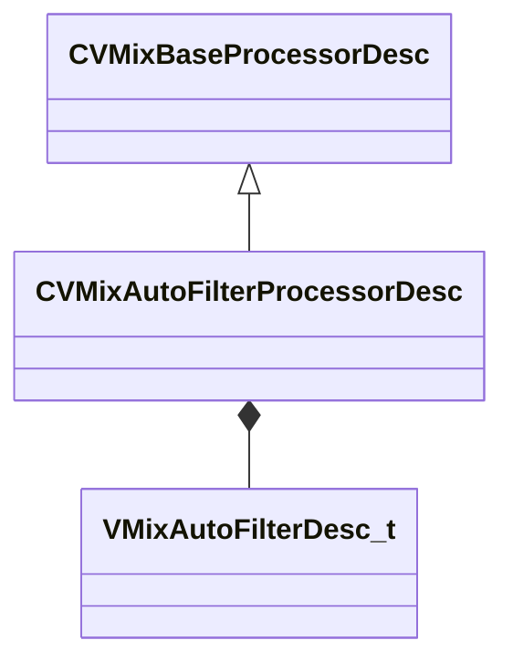

**Fields:**

| Name | Type | Annotations |
|------|------|-------------|
| `m_desc` | [VMixAutoFilterDesc_t](../schemas/soundsystem_lowlevel.md#vmixautofilterdesc_t) |  |

### CVMixAutomaticControlInput

**Metadata:** `MGetKV3ClassDefaults {
	"m_name": "play time",
	"m_nControlInputIndex": -1,
	"m_bIsTrackSend": false,
	"m_bIsStackVar": false
}`

**Fields:**

| Name | Type | Annotations |
|------|------|-------------|
| `m_name` | CUtlString |  |
| `m_nControlInputIndex` | int32 |  |
| `m_bIsTrackSend` | bool |  |
| `m_bIsStackVar` | bool |  |

### CVMixBaseProcessorDesc

**Derived by:** [CVMixAutoFilterProcessorDesc](soundsystem_lowlevel.md#cvmixautofilterprocessordesc), [CVMixBoxverb2ProcessorDesc](soundsystem_lowlevel.md#cvmixboxverb2processordesc), [CVMixBoxverbProcessorDesc](soundsystem_lowlevel.md#cvmixboxverbprocessordesc), [CVMixConvolutionProcessorDesc](soundsystem_lowlevel.md#cvmixconvolutionprocessordesc), [CVMixDelayProcessorDesc](soundsystem_lowlevel.md#cvmixdelayprocessordesc), [CVMixDiffusorProcessorDesc](soundsystem_lowlevel.md#cvmixdiffusorprocessordesc), [CVMixDualCompressorProcessorDesc](soundsystem_lowlevel.md#cvmixdualcompressorprocessordesc), [CVMixDynamics3BandProcessorDesc](soundsystem_lowlevel.md#cvmixdynamics3bandprocessordesc), [CVMixDynamicsCompressorProcessorDesc](soundsystem_lowlevel.md#cvmixdynamicscompressorprocessordesc), [CVMixDynamicsProcessorDesc](soundsystem_lowlevel.md#cvmixdynamicsprocessordesc), [CVMixEQ8ProcessorDesc](soundsystem_lowlevel.md#cvmixeq8processordesc), [CVMixEffectChainProcessorDesc](soundsystem_lowlevel.md#cvmixeffectchainprocessordesc), [CVMixEnvelopeProcessorDesc](soundsystem_lowlevel.md#cvmixenvelopeprocessordesc), [CVMixFilterProcessorDesc](soundsystem_lowlevel.md#cvmixfilterprocessordesc), [CVMixFlangerProcessorDesc](soundsystem_lowlevel.md#cvmixflangerprocessordesc), [CVMixFreeverbProcessorDesc](soundsystem_lowlevel.md#cvmixfreeverbprocessordesc), [CVMixModDelayProcessorDesc](soundsystem_lowlevel.md#cvmixmoddelayprocessordesc), [CVMixOscProcessorDesc](soundsystem_lowlevel.md#cvmixoscprocessordesc), [CVMixPannerProcessorDesc](soundsystem_lowlevel.md#cvmixpannerprocessordesc), [CVMixPitchShiftProcessorDesc](soundsystem_lowlevel.md#cvmixpitchshiftprocessordesc), [CVMixPlateReverbProcessorDesc](soundsystem_lowlevel.md#cvmixplatereverbprocessordesc), [CVMixPresetDSPProcessorDesc](soundsystem_lowlevel.md#cvmixpresetdspprocessordesc), [CVMixShaperProcessorDesc](soundsystem_lowlevel.md#cvmixshaperprocessordesc), [CVMixSteamAudioDirectProcessorDesc](soundsystem_lowlevel.md#cvmixsteamaudiodirectprocessordesc), [CVMixSteamAudioHRTFProcessorDesc](soundsystem_lowlevel.md#cvmixsteamaudiohrtfprocessordesc), [CVMixSteamAudioHybridReverbProcessorDesc](soundsystem_lowlevel.md#cvmixsteamaudiohybridreverbprocessordesc), [CVMixSteamAudioPathingProcessorDesc](soundsystem_lowlevel.md#cvmixsteamaudiopathingprocessordesc), [CVMixStereoDelayProcessorDesc](soundsystem_lowlevel.md#cvmixstereodelayprocessordesc), [CVMixSubgraphSwitchProcessorDesc](soundsystem_lowlevel.md#cvmixsubgraphswitchprocessordesc), [CVMixUtilityProcessorDesc](soundsystem_lowlevel.md#cvmixutilityprocessordesc), [CVMixVocoderProcessorDesc](soundsystem_lowlevel.md#cvmixvocoderprocessordesc)

**Metadata:** `MGetKV3ClassDefaults Could not parse KV3 Defaults`

**Relationships:**


**Fields:**

| Name | Type | Annotations |
|------|------|-------------|
| `m_name` | CUtlString |  |
| `m_nChannels` | int32 |  |
| `m_flxfade` | float32 |  |

### CVMixBoxverb2ProcessorDesc

**Inherits from:** [CVMixBaseProcessorDesc](soundsystem_lowlevel.md#cvmixbaseprocessordesc)

**Metadata:** `MGetKV3ClassDefaults {
	"_class": "CVMixBoxverb2ProcessorDesc",
	"m_name": "",
	"m_nChannels": -1,
	"m_flxfade": 0.100000,
	"m_desc":
	{
		"m_flSizeMax": 0.000000,
		"m_flSizeMin": 0.000000,
		"m_flComplexity": 0.000000,
		"m_flDiffusion": 0.000000,
		"m_flModDepth": 0.000000,
		"m_flModRate": 0.000000,
		"m_bParallel": false,
		"m_filterType":
		{
			"m_nFilterType": "FILTER_UNKNOWN",
			"m_nFilterSlope": "FILTER_SLOPE_12dB",
			"m_bEnabled": true,
			"m_fldbGain": 0.000000,
			"m_flCutoffFreq": 1000.000000,
			"m_flQ": 0.707107
		},
		"m_flWidth": 0.000000,
		"m_flHeight": 0.000000,
		"m_flDepth": 0.000000,
		"m_flFeedbackScale": 0.000000,
		"m_flFeedbackWidth": 0.000000,
		"m_flFeedbackHeight": 0.000000,
		"m_flFeedbackDepth": 0.000000,
		"m_flOutputGain": 0.000000,
		"m_flTaps": 0.000000
	}
}`

**Relationships:**

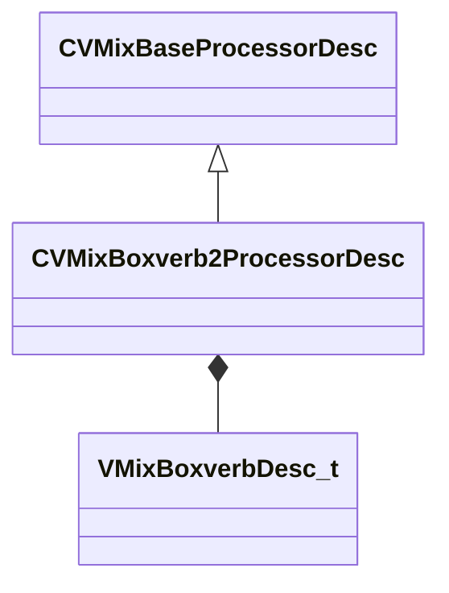

**Fields:**

| Name | Type | Annotations |
|------|------|-------------|
| `m_desc` | [VMixBoxverbDesc_t](../schemas/soundsystem_lowlevel.md#vmixboxverbdesc_t) |  |

### CVMixBoxverbProcessorDesc

**Inherits from:** [CVMixBaseProcessorDesc](soundsystem_lowlevel.md#cvmixbaseprocessordesc)

**Metadata:** `MGetKV3ClassDefaults {
	"_class": "CVMixBoxverbProcessorDesc",
	"m_name": "",
	"m_nChannels": -1,
	"m_flxfade": 0.100000,
	"m_desc":
	{
		"m_flSizeMax": 0.000000,
		"m_flSizeMin": 0.000000,
		"m_flComplexity": 0.000000,
		"m_flDiffusion": 0.000000,
		"m_flModDepth": 0.000000,
		"m_flModRate": 0.000000,
		"m_bParallel": false,
		"m_filterType":
		{
			"m_nFilterType": "FILTER_UNKNOWN",
			"m_nFilterSlope": "FILTER_SLOPE_12dB",
			"m_bEnabled": true,
			"m_fldbGain": 0.000000,
			"m_flCutoffFreq": 1000.000000,
			"m_flQ": 0.707107
		},
		"m_flWidth": 0.000000,
		"m_flHeight": 0.000000,
		"m_flDepth": 0.000000,
		"m_flFeedbackScale": 0.000000,
		"m_flFeedbackWidth": 0.000000,
		"m_flFeedbackHeight": 0.000000,
		"m_flFeedbackDepth": 0.000000,
		"m_flOutputGain": 0.000000,
		"m_flTaps": 0.000000
	}
}`

**Relationships:**

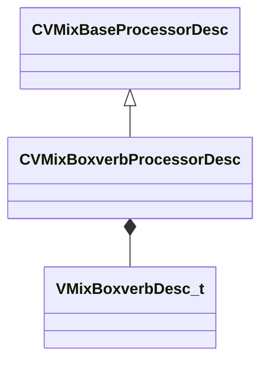

**Fields:**

| Name | Type | Annotations |
|------|------|-------------|
| `m_desc` | [VMixBoxverbDesc_t](../schemas/soundsystem_lowlevel.md#vmixboxverbdesc_t) |  |

### CVMixCommand

**Metadata:** `MGetKV3ClassDefaults {
	"command": "CMD_INVALID",
	"paramName": 0,
	"outputSubmix": -1,
	"inputSubmix0": -1,
	"inputSubmix1": -1,
	"processor": -1,
	"inputValue0": -1,
	"inputValue1": -1
}`

**Relationships:**

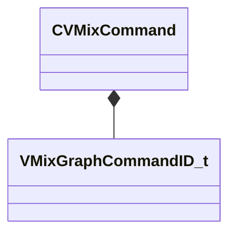

**Fields:**

| Name | Type | Annotations |
|------|------|-------------|
| `m_nCommand` | [VMixGraphCommandID_t](../schemas/soundsystem_lowlevel.md#vmixgraphcommandid_t) | `MKV3TransferName "command"` |
| `m_nParameterNameHash` | uint32 | `MKV3TransferName "paramName"` |
| `m_nOutputSubmix` | int32 | `MKV3TransferName "outputSubmix"` |
| `m_nInputSubmix0` | int32 | `MKV3TransferName "inputSubmix0"` |
| `m_nInputSubmix1` | int32 | `MKV3TransferName "inputSubmix1"` |
| `m_nProcessor` | int32 | `MKV3TransferName "processor"` |
| `m_nInputValue0` | int32 | `MKV3TransferName "inputValue0"` |
| `m_nInputValue1` | int32 | `MKV3TransferName "inputValue1"` |

### CVMixControlInput

**Inherits from:** [CVMixInputBase](soundsystem_lowlevel.md#cvmixinputbase)

**Metadata:** `MGetKV3ClassDefaults {
	"m_name": "GameInput",
	"m_flDefaultValue": 0.000000
}`

**Relationships:**

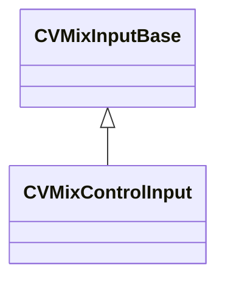

**Fields:**

| Name | Type | Annotations |
|------|------|-------------|
| `m_flDefaultValue` | float32 |  |

### CVMixControlInputArray

**Inherits from:** [CVMixInputBase](soundsystem_lowlevel.md#cvmixinputbase)

**Metadata:** `MGetKV3ClassDefaults {
	"m_name": "GameInput",
	"m_nArrayIndex": -1
}`

**Relationships:**

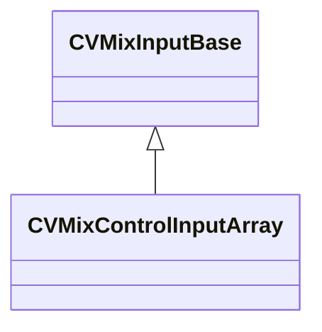

**Fields:**

| Name | Type | Annotations |
|------|------|-------------|
| `m_nArrayIndex` | int32 |  |

### CVMixControlMeter

**Inherits from:** [CVMixInputBase](soundsystem_lowlevel.md#cvmixinputbase)

**Metadata:** `MGetKV3ClassDefaults {
	"m_name": "GameInput",
	"m_nValueIndex": 0
}`

**Relationships:**

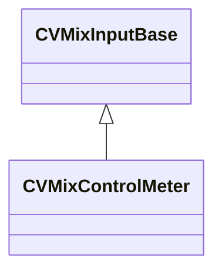

**Fields:**

| Name | Type | Annotations |
|------|------|-------------|
| `m_nValueIndex` | int32 |  |

### CVMixControlOutput

**Inherits from:** [CVMixInputBase](soundsystem_lowlevel.md#cvmixinputbase)

**Metadata:** `MGetKV3ClassDefaults {
	"m_name": "GameInput",
	"m_flDefaultValue": 0.000000
}`

**Relationships:**

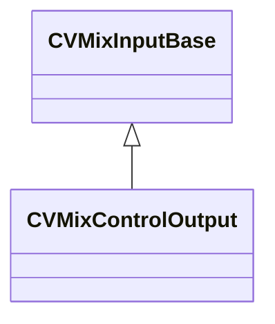

**Fields:**

| Name | Type | Annotations |
|------|------|-------------|
| `m_flDefaultValue` | float32 |  |

### CVMixConvolutionProcessorDesc

**Inherits from:** [CVMixBaseProcessorDesc](soundsystem_lowlevel.md#cvmixbaseprocessordesc)

**Metadata:** `MGetKV3ClassDefaults {
	"_class": "CVMixConvolutionProcessorDesc",
	"m_name": "",
	"m_nChannels": -1,
	"m_flxfade": 0.100000,
	"m_desc":
	{
		"m_fldbGain": -12.000000,
		"m_flPreDelayMS": 0.000000,
		"m_flWetMix": 1.000000,
		"m_fldbLow": 0.000000,
		"m_fldbMid": 0.000000,
		"m_fldbHigh": 0.000000,
		"m_flLowCutoffFreq": 1500.000000,
		"m_flHighCutoffFreq": 7500.000000
	}
}`

**Relationships:**

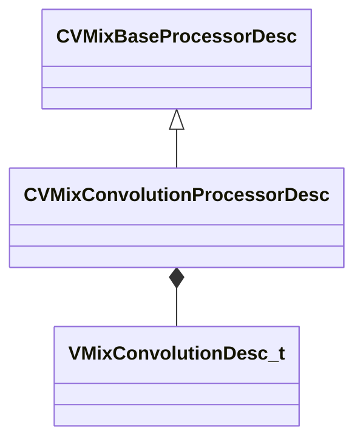

**Fields:**

| Name | Type | Annotations |
|------|------|-------------|
| `m_desc` | [VMixConvolutionDesc_t](../schemas/soundsystem_lowlevel.md#vmixconvolutiondesc_t) |  |

### CVMixCurveHeader

**Metadata:** `MGetKV3ClassDefaults {
	"m_nControlPointCount": <HIDDEN FOR DIFF>,
	"m_nControlPointStart": <HIDDEN FOR DIFF>,
}`

**Fields:**

| Name | Type | Annotations |
|------|------|-------------|
| `m_nControlPointCount` | uint32 |  |
| `m_nControlPointStart` | uint32 |  |

### CVMixDelayProcessorDesc

**Inherits from:** [CVMixBaseProcessorDesc](soundsystem_lowlevel.md#cvmixbaseprocessordesc)

**Metadata:** `MGetKV3ClassDefaults {
	"_class": "CVMixDelayProcessorDesc",
	"m_name": "",
	"m_nChannels": -1,
	"m_flxfade": 0.100000,
	"m_desc":
	{
		"m_feedbackFilter":
		{
			"m_nFilterType": "FILTER_UNKNOWN",
			"m_nFilterSlope": "FILTER_SLOPE_12dB",
			"m_bEnabled": true,
			"m_fldbGain": 0.000000,
			"m_flCutoffFreq": 1000.000000,
			"m_flQ": 0.707107
		},
		"m_bEnableFilter": false,
		"m_flDelay": 0.000000,
		"m_flDirectGain": 0.000000,
		"m_flDelayGain": 0.000000,
		"m_flFeedbackGain": 0.000000,
		"m_flWidth": 0.000000
	}
}`

**Relationships:**

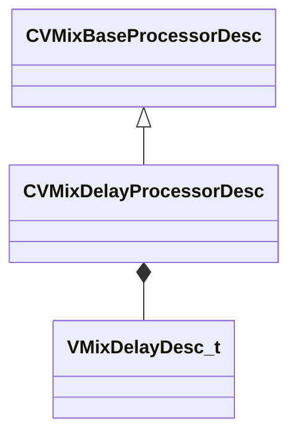

**Fields:**

| Name | Type | Annotations |
|------|------|-------------|
| `m_desc` | [VMixDelayDesc_t](../schemas/soundsystem_lowlevel.md#vmixdelaydesc_t) |  |

### CVMixDiffusorProcessorDesc

**Inherits from:** [CVMixBaseProcessorDesc](soundsystem_lowlevel.md#cvmixbaseprocessordesc)

**Metadata:** `MGetKV3ClassDefaults {
	"_class": "CVMixDiffusorProcessorDesc",
	"m_name": "",
	"m_nChannels": -1,
	"m_flxfade": 0.100000,
	"m_desc":
	{
		"m_flSize": 0.000000,
		"m_flComplexity": 0.000000,
		"m_flFeedback": 0.000000,
		"m_flOutputGain": 0.000000
	}
}`

**Relationships:**

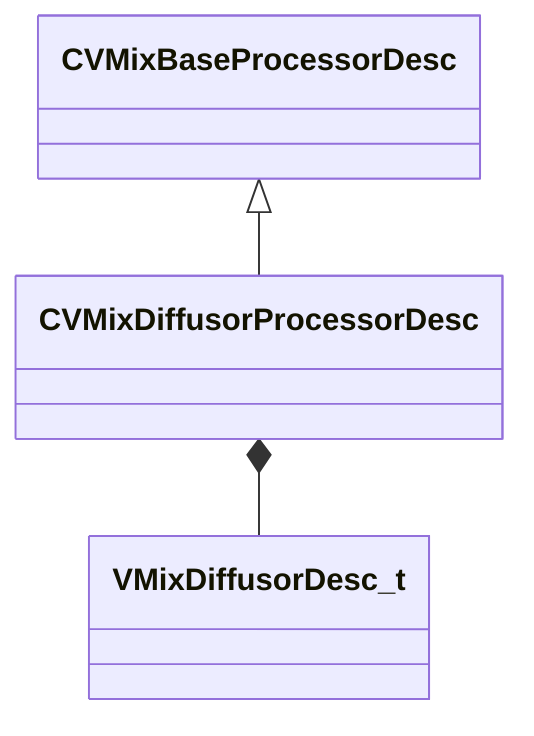

**Fields:**

| Name | Type | Annotations |
|------|------|-------------|
| `m_desc` | [VMixDiffusorDesc_t](../schemas/soundsystem_lowlevel.md#vmixdiffusordesc_t) |  |

### CVMixDualCompressorProcessorDesc

**Inherits from:** [CVMixBaseProcessorDesc](soundsystem_lowlevel.md#cvmixbaseprocessordesc)

**Metadata:** `MGetKV3ClassDefaults {
	"_class": "CVMixDualCompressorProcessorDesc",
	"m_name": "",
	"m_nChannels": -1,
	"m_flxfade": 0.100000,
	"m_desc":
	{
		"m_flRMSTimeMS": 300.000000,
		"m_fldbKneeWidth": 0.000000,
		"m_flWetMix": 1.000000,
		"m_bPeakMode": false,
		"m_bandDesc":
		{
			"m_fldbGainInput": 0.000000,
			"m_fldbGainOutput": 0.000000,
			"m_fldbThresholdBelow": -40.000000,
			"m_fldbThresholdAbove": -30.000000,
			"m_flRatioBelow": 12.000000,
			"m_flRatioAbove": 4.000000,
			"m_flAttackTimeMS": 50.000000,
			"m_flReleaseTimeMS": 200.000000,
			"m_bEnable": false,
			"m_bSolo": false
		}
	}
}`

**Relationships:**

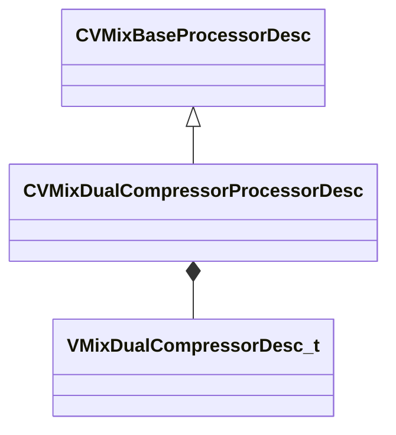

**Fields:**

| Name | Type | Annotations |
|------|------|-------------|
| `m_desc` | [VMixDualCompressorDesc_t](../schemas/soundsystem_lowlevel.md#vmixdualcompressordesc_t) |  |

### CVMixDynamics3BandProcessorDesc

**Inherits from:** [CVMixBaseProcessorDesc](soundsystem_lowlevel.md#cvmixbaseprocessordesc)

**Metadata:** `MGetKV3ClassDefaults {
	"_class": "CVMixDynamics3BandProcessorDesc",
	"m_name": "",
	"m_nChannels": -1,
	"m_flxfade": 0.100000,
	"m_desc":
	{
		"m_fldbGainOutput": 0.000000,
		"m_flRMSTimeMS": 0.000000,
		"m_fldbKneeWidth": 0.000000,
		"m_flDepth": 0.000000,
		"m_flWetMix": 0.000000,
		"m_flTimeScale": 0.000000,
		"m_flLowCutoffFreq": 0.000000,
		"m_flHighCutoffFreq": 0.000000,
		"m_bPeakMode": false,
		"m_bandDesc":
		[
			{
				"m_fldbGainInput": 0.000000,
				"m_fldbGainOutput": 0.000000,
				"m_fldbThresholdBelow": -40.000000,
				"m_fldbThresholdAbove": -30.000000,
				"m_flRatioBelow": 12.000000,
				"m_flRatioAbove": 4.000000,
				"m_flAttackTimeMS": 50.000000,
				"m_flReleaseTimeMS": 200.000000,
				"m_bEnable": false,
				"m_bSolo": false
			},
			{
				"m_fldbGainInput": 0.000000,
				"m_fldbGainOutput": 0.000000,
				"m_fldbThresholdBelow": -40.000000,
				"m_fldbThresholdAbove": -30.000000,
				"m_flRatioBelow": 12.000000,
				"m_flRatioAbove": 4.000000,
				"m_flAttackTimeMS": 50.000000,
				"m_flReleaseTimeMS": 200.000000,
				"m_bEnable": false,
				"m_bSolo": false
			},
			{
				"m_fldbGainInput": 0.000000,
				"m_fldbGainOutput": 0.000000,
				"m_fldbThresholdBelow": -40.000000,
				"m_fldbThresholdAbove": -30.000000,
				"m_flRatioBelow": 12.000000,
				"m_flRatioAbove": 4.000000,
				"m_flAttackTimeMS": 50.000000,
				"m_flReleaseTimeMS": 200.000000,
				"m_bEnable": false,
				"m_bSolo": false
			}
		]
	}
}`

**Relationships:**

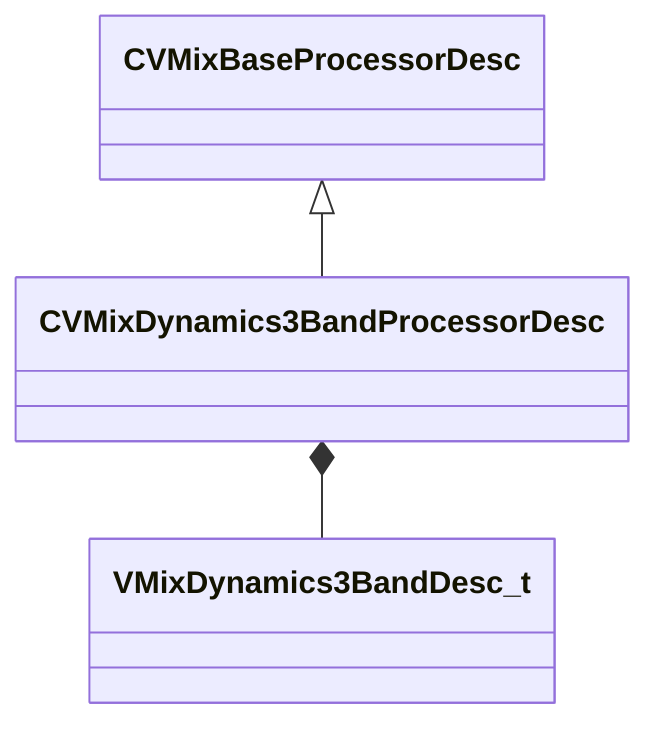

**Fields:**

| Name | Type | Annotations |
|------|------|-------------|
| `m_desc` | [VMixDynamics3BandDesc_t](../schemas/soundsystem_lowlevel.md#vmixdynamics3banddesc_t) |  |

### CVMixDynamicsCompressorProcessorDesc

**Inherits from:** [CVMixBaseProcessorDesc](soundsystem_lowlevel.md#cvmixbaseprocessordesc)

**Metadata:** `MGetKV3ClassDefaults {
	"_class": "CVMixDynamicsCompressorProcessorDesc",
	"m_name": "",
	"m_nChannels": -1,
	"m_flxfade": 0.100000,
	"m_desc":
	{
		"m_fldbOutputGain": 0.000000,
		"m_fldbCompressionThreshold": -6.000000,
		"m_fldbKneeWidth": 0.000000,
		"m_flCompressionRatio": 2.000000,
		"m_flAttackTimeMS": 100.000000,
		"m_flReleaseTimeMS": 400.000000,
		"m_flRMSTimeMS": 300.000000,
		"m_flWetMix": 1.000000,
		"m_bPeakMode": false
	}
}`

**Relationships:**

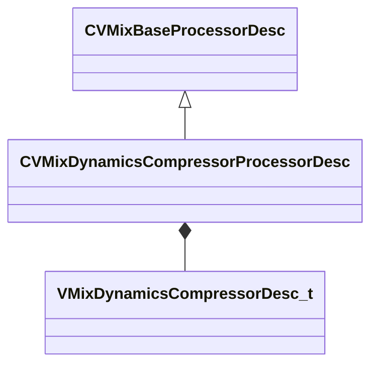

**Fields:**

| Name | Type | Annotations |
|------|------|-------------|
| `m_desc` | [VMixDynamicsCompressorDesc_t](../schemas/soundsystem_lowlevel.md#vmixdynamicscompressordesc_t) |  |

### CVMixDynamicsProcessorDesc

**Inherits from:** [CVMixBaseProcessorDesc](soundsystem_lowlevel.md#cvmixbaseprocessordesc)

**Metadata:** `MGetKV3ClassDefaults {
	"_class": "CVMixDynamicsProcessorDesc",
	"m_name": "",
	"m_nChannels": -1,
	"m_flxfade": 0.100000,
	"m_desc":
	{
		"m_fldbGain": 0.000000,
		"m_fldbNoiseGateThreshold": 0.000000,
		"m_fldbCompressionThreshold": 0.000000,
		"m_fldbLimiterThreshold": 0.000000,
		"m_fldbKneeWidth": 0.000000,
		"m_flRatio": 0.000000,
		"m_flLimiterRatio": 0.000000,
		"m_flAttackTimeMS": 0.000000,
		"m_flReleaseTimeMS": 0.000000,
		"m_flRMSTimeMS": 0.000000,
		"m_flWetMix": 0.000000,
		"m_bPeakMode": false
	}
}`

**Relationships:**

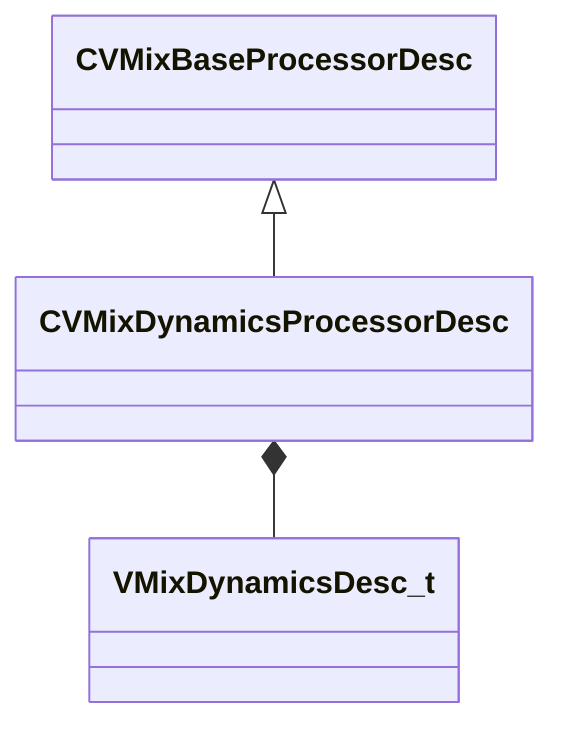

**Fields:**

| Name | Type | Annotations |
|------|------|-------------|
| `m_desc` | [VMixDynamicsDesc_t](../schemas/soundsystem_lowlevel.md#vmixdynamicsdesc_t) |  |

### CVMixEQ8ProcessorDesc

**Inherits from:** [CVMixBaseProcessorDesc](soundsystem_lowlevel.md#cvmixbaseprocessordesc)

**Metadata:** `MGetKV3ClassDefaults {
	"_class": "CVMixEQ8ProcessorDesc",
	"m_name": "",
	"m_nChannels": -1,
	"m_flxfade": 0.100000,
	"m_desc":
	{
		"m_stages":
		[
			{
				"m_nFilterType": "FILTER_UNKNOWN",
				"m_nFilterSlope": "FILTER_SLOPE_12dB",
				"m_bEnabled": true,
				"m_fldbGain": 0.000000,
				"m_flCutoffFreq": 1000.000000,
				"m_flQ": 0.707107
			},
			{
				"m_nFilterType": "FILTER_UNKNOWN",
				"m_nFilterSlope": "FILTER_SLOPE_12dB",
				"m_bEnabled": true,
				"m_fldbGain": 0.000000,
				"m_flCutoffFreq": 1000.000000,
				"m_flQ": 0.707107
			},
			{
				"m_nFilterType": "FILTER_UNKNOWN",
				"m_nFilterSlope": "FILTER_SLOPE_12dB",
				"m_bEnabled": true,
				"m_fldbGain": 0.000000,
				"m_flCutoffFreq": 1000.000000,
				"m_flQ": 0.707107
			},
			{
				"m_nFilterType": "FILTER_UNKNOWN",
				"m_nFilterSlope": "FILTER_SLOPE_12dB",
				"m_bEnabled": true,
				"m_fldbGain": 0.000000,
				"m_flCutoffFreq": 1000.000000,
				"m_flQ": 0.707107
			},
			{
				"m_nFilterType": "FILTER_UNKNOWN",
				"m_nFilterSlope": "FILTER_SLOPE_12dB",
				"m_bEnabled": true,
				"m_fldbGain": 0.000000,
				"m_flCutoffFreq": 1000.000000,
				"m_flQ": 0.707107
			},
			{
				"m_nFilterType": "FILTER_UNKNOWN",
				"m_nFilterSlope": "FILTER_SLOPE_12dB",
				"m_bEnabled": true,
				"m_fldbGain": 0.000000,
				"m_flCutoffFreq": 1000.000000,
				"m_flQ": 0.707107
			},
			{
				"m_nFilterType": "FILTER_UNKNOWN",
				"m_nFilterSlope": "FILTER_SLOPE_12dB",
				"m_bEnabled": true,
				"m_fldbGain": 0.000000,
				"m_flCutoffFreq": 1000.000000,
				"m_flQ": 0.707107
			},
			{
				"m_nFilterType": "FILTER_UNKNOWN",
				"m_nFilterSlope": "FILTER_SLOPE_12dB",
				"m_bEnabled": true,
				"m_fldbGain": 0.000000,
				"m_flCutoffFreq": 1000.000000,
				"m_flQ": 0.707107
			}
		]
	}
}`

**Relationships:**

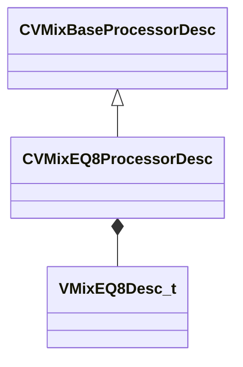

**Fields:**

| Name | Type | Annotations |
|------|------|-------------|
| `m_desc` | [VMixEQ8Desc_t](../schemas/soundsystem_lowlevel.md#vmixeq8desc_t) |  |

### CVMixEffectChainProcessorDesc

**Inherits from:** [CVMixBaseProcessorDesc](soundsystem_lowlevel.md#cvmixbaseprocessordesc)

**Metadata:** `MGetKV3ClassDefaults {
	"_class": "CVMixEffectChainProcessorDesc",
	"m_name": "",
	"m_nChannels": -1,
	"m_flxfade": 0.100000,
	"m_desc":
	{
		"m_effectName": ""
	}
}`

**Relationships:**

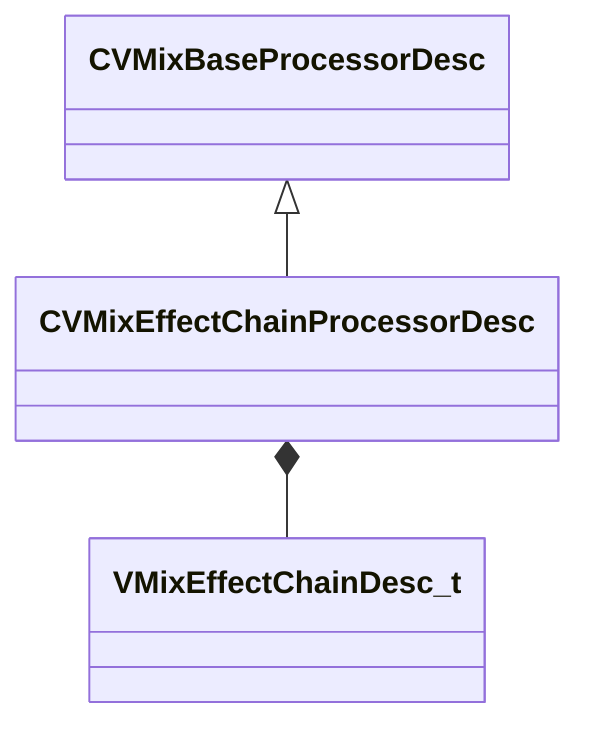

**Fields:**

| Name | Type | Annotations |
|------|------|-------------|
| `m_desc` | [VMixEffectChainDesc_t](../schemas/soundsystem_lowlevel.md#vmixeffectchaindesc_t) |  |

### CVMixEnvelopeProcessorDesc

**Inherits from:** [CVMixBaseProcessorDesc](soundsystem_lowlevel.md#cvmixbaseprocessordesc)

**Metadata:** `MGetKV3ClassDefaults {
	"_class": "CVMixEnvelopeProcessorDesc",
	"m_name": "",
	"m_nChannels": -1,
	"m_flxfade": 0.100000,
	"m_desc":
	{
		"m_flAttackTimeMS": 0.000000,
		"m_flHoldTimeMS": 0.000000,
		"m_flReleaseTimeMS": 0.000000
	}
}`

**Relationships:**

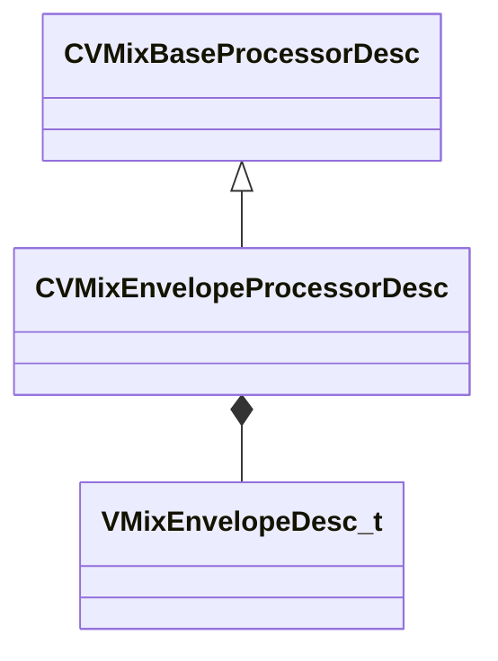

**Fields:**

| Name | Type | Annotations |
|------|------|-------------|
| `m_desc` | [VMixEnvelopeDesc_t](../schemas/soundsystem_lowlevel.md#vmixenvelopedesc_t) |  |

### CVMixFilterProcessorDesc

**Inherits from:** [CVMixBaseProcessorDesc](soundsystem_lowlevel.md#cvmixbaseprocessordesc)

**Metadata:** `MGetKV3ClassDefaults {
	"_class": "CVMixFilterProcessorDesc",
	"m_name": "",
	"m_nChannels": -1,
	"m_flxfade": 0.100000,
	"m_desc":
	{
		"m_nFilterType": "FILTER_UNKNOWN",
		"m_nFilterSlope": "FILTER_SLOPE_12dB",
		"m_bEnabled": true,
		"m_fldbGain": 0.000000,
		"m_flCutoffFreq": 1000.000000,
		"m_flQ": 0.707107
	}
}`

**Relationships:**

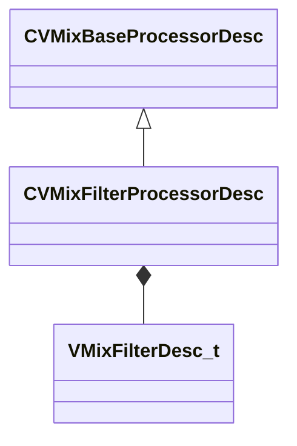

**Fields:**

| Name | Type | Annotations |
|------|------|-------------|
| `m_desc` | [VMixFilterDesc_t](../schemas/soundsystem_lowlevel.md#vmixfilterdesc_t) |  |

### CVMixFlangerProcessorDesc

**Inherits from:** [CVMixBaseProcessorDesc](soundsystem_lowlevel.md#cvmixbaseprocessordesc)

**Metadata:** `MGetKV3ClassDefaults {
	"_class": "CVMixFlangerProcessorDesc",
	"m_name": "",
	"m_nChannels": -1,
	"m_flxfade": 0.100000,
	"m_desc":
	{
		"m_bPhaseInvert": false,
		"m_flGlideTime": 0.000000,
		"m_flDelay": 0.000000,
		"m_flOutputGain": 0.000000,
		"m_flFeedbackGain": 0.000000,
		"m_flFeedforwardGain": 0.000000,
		"m_flModRate": 0.000000,
		"m_flModDepth": 0.000000,
		"m_bApplyAntialiasing": false
	}
}`

**Relationships:**

```mermaid
classDiagram
    CVMixBaseProcessorDesc <|-- CVMixFlangerProcessorDesc
    CVMixFlangerProcessorDesc *-- VMixFlangerDesc_t
```

**Fields:**

| Name | Type | Annotations |
|------|------|-------------|
| `m_desc` | [VMixFlangerDesc_t](../schemas/soundsystem_lowlevel.md#vmixflangerdesc_t) |  |

### CVMixFreeverbProcessorDesc

**Inherits from:** [CVMixBaseProcessorDesc](soundsystem_lowlevel.md#cvmixbaseprocessordesc)

**Metadata:** `MGetKV3ClassDefaults {
	"_class": "CVMixFreeverbProcessorDesc",
	"m_name": "",
	"m_nChannels": -1,
	"m_flxfade": 0.100000,
	"m_desc":
	{
		"m_flRoomSize": 0.000000,
		"m_flDamp": 0.000000,
		"m_flWidth": 0.000000,
		"m_flLateReflections": 0.000000
	}
}`

**Relationships:**

```mermaid
classDiagram
    CVMixBaseProcessorDesc <|-- CVMixFreeverbProcessorDesc
    CVMixFreeverbProcessorDesc *-- VMixFreeverbDesc_t
```

**Fields:**

| Name | Type | Annotations |
|------|------|-------------|
| `m_desc` | [VMixFreeverbDesc_t](../schemas/soundsystem_lowlevel.md#vmixfreeverbdesc_t) |  |

### CVMixGraphDescData

**Metadata:** `MGetKV3ClassDefaults {
	"Name": "",
	"m_nGraphOutputChannels": -1,
	"m_bIsMainGraph": false
}`

**Fields:**

| Name | Type | Annotations |
|------|------|-------------|
| `m_name` | CUtlString | `MKV3TransferName "Name"` |
| `m_nGraphOutputChannels` | int32 |  |
| `m_bIsMainGraph` | bool |  |

### CVMixImpulseResponseInput

**Inherits from:** [CVMixInputBase](soundsystem_lowlevel.md#cvmixinputbase)

**Metadata:** `MGetKV3ClassDefaults {
	"m_name": "GameInput"
}`

**Relationships:**

```mermaid
classDiagram
    CVMixInputBase <|-- CVMixImpulseResponseInput
```

### CVMixInputBase

**Derived by:** [CVMixControlInput](soundsystem_lowlevel.md#cvmixcontrolinput), [CVMixControlInputArray](soundsystem_lowlevel.md#cvmixcontrolinputarray), [CVMixControlMeter](soundsystem_lowlevel.md#cvmixcontrolmeter), [CVMixControlOutput](soundsystem_lowlevel.md#cvmixcontroloutput), [CVMixImpulseResponseInput](soundsystem_lowlevel.md#cvmiximpulseresponseinput), [CVMixNameInput](soundsystem_lowlevel.md#cvmixnameinput), [CVMixNameInputMeter](soundsystem_lowlevel.md#cvmixnameinputmeter), [CVMixVsndInput](soundsystem_lowlevel.md#cvmixvsndinput)

**Metadata:** `MGetKV3ClassDefaults {
	"m_name": "GameInput"
}`

**Relationships:**

```mermaid
classDiagram
    CVMixInputBase <|-- CVMixControlMeter
    CVMixInputBase <|-- CVMixVsndInput
    CVMixInputBase <|-- CVMixControlOutput
    CVMixInputBase <|-- CVMixImpulseResponseInput
    CVMixInputBase <|-- CVMixNameInput
    CVMixInputBase <|-- CVMixControlInputArray
    CVMixInputBase <|-- CVMixNameInputMeter
    CVMixInputBase <|-- CVMixControlInput
```

**Fields:**

| Name | Type | Annotations |
|------|------|-------------|
| `m_name` | CUtlString |  |

### CVMixModDelayProcessorDesc

**Inherits from:** [CVMixBaseProcessorDesc](soundsystem_lowlevel.md#cvmixbaseprocessordesc)

**Metadata:** `MGetKV3ClassDefaults {
	"_class": "CVMixModDelayProcessorDesc",
	"m_name": "",
	"m_nChannels": -1,
	"m_flxfade": 0.100000,
	"m_desc":
	{
		"m_feedbackFilter":
		{
			"m_nFilterType": "FILTER_UNKNOWN",
			"m_nFilterSlope": "FILTER_SLOPE_12dB",
			"m_bEnabled": true,
			"m_fldbGain": 0.000000,
			"m_flCutoffFreq": 1000.000000,
			"m_flQ": 0.707107
		},
		"m_bPhaseInvert": false,
		"m_flGlideTime": 0.000000,
		"m_flDelay": 0.000000,
		"m_flOutputGain": 0.000000,
		"m_flFeedbackGain": 0.000000,
		"m_flModRate": 0.000000,
		"m_flModDepth": 0.000000,
		"m_bApplyAntialiasing": false
	}
}`

**Relationships:**

```mermaid
classDiagram
    CVMixBaseProcessorDesc <|-- CVMixModDelayProcessorDesc
    CVMixModDelayProcessorDesc *-- VMixModDelayDesc_t
```

**Fields:**

| Name | Type | Annotations |
|------|------|-------------|
| `m_desc` | [VMixModDelayDesc_t](../schemas/soundsystem_lowlevel.md#vmixmoddelaydesc_t) |  |

### CVMixNameInput

**Inherits from:** [CVMixInputBase](soundsystem_lowlevel.md#cvmixinputbase)

**Metadata:** `MGetKV3ClassDefaults {
	"m_name": "GameInput",
	"m_defaultValue": ""
}`

**Relationships:**

```mermaid
classDiagram
    CVMixInputBase <|-- CVMixNameInput
```

**Fields:**

| Name | Type | Annotations |
|------|------|-------------|
| `m_defaultValue` | CUtlString |  |

### CVMixNameInputMeter

**Inherits from:** [CVMixInputBase](soundsystem_lowlevel.md#cvmixinputbase)

**Metadata:** `MGetKV3ClassDefaults {
	"m_name": "GameInput",
	"m_nValueIndex": 0
}`

**Relationships:**

```mermaid
classDiagram
    CVMixInputBase <|-- CVMixNameInputMeter
```

**Fields:**

| Name | Type | Annotations |
|------|------|-------------|
| `m_nValueIndex` | int32 |  |

### CVMixOscProcessorDesc

**Inherits from:** [CVMixBaseProcessorDesc](soundsystem_lowlevel.md#cvmixbaseprocessordesc)

**Metadata:** `MGetKV3ClassDefaults {
	"_class": "CVMixOscProcessorDesc",
	"m_name": "",
	"m_nChannels": -1,
	"m_flxfade": 0.100000,
	"m_desc":
	{
		"oscType": "LFO_SHAPE_SINE",
		"m_freq": 440.000000,
		"m_flPhase": 0.000000
	}
}`

**Relationships:**

```mermaid
classDiagram
    CVMixBaseProcessorDesc <|-- CVMixOscProcessorDesc
    CVMixOscProcessorDesc *-- VMixOscDesc_t
```

**Fields:**

| Name | Type | Annotations |
|------|------|-------------|
| `m_desc` | [VMixOscDesc_t](../schemas/soundsystem_lowlevel.md#vmixoscdesc_t) |  |

### CVMixPannerProcessorDesc

**Inherits from:** [CVMixBaseProcessorDesc](soundsystem_lowlevel.md#cvmixbaseprocessordesc)

**Metadata:** `MGetKV3ClassDefaults {
	"_class": "CVMixPannerProcessorDesc",
	"m_name": "",
	"m_nChannels": -1,
	"m_flxfade": 0.100000,
	"m_desc":
	{
		"m_type": "PANNER_TYPE_LINEAR",
		"m_flStrength": 0.000000
	}
}`

**Relationships:**

```mermaid
classDiagram
    CVMixBaseProcessorDesc <|-- CVMixPannerProcessorDesc
    CVMixPannerProcessorDesc *-- VMixPannerDesc_t
```

**Fields:**

| Name | Type | Annotations |
|------|------|-------------|
| `m_desc` | [VMixPannerDesc_t](../schemas/soundsystem_lowlevel.md#vmixpannerdesc_t) |  |

### CVMixPitchShiftProcessorDesc

**Inherits from:** [CVMixBaseProcessorDesc](soundsystem_lowlevel.md#cvmixbaseprocessordesc)

**Metadata:** `MGetKV3ClassDefaults {
	"_class": "CVMixPitchShiftProcessorDesc",
	"m_name": "",
	"m_nChannels": -1,
	"m_flxfade": 0.100000,
	"m_desc":
	{
		"m_nGrainSampleCount": 0,
		"m_flPitchShift": 0.000000,
		"m_nQuality": 0,
		"m_nProcType": 0
	}
}`

**Relationships:**

```mermaid
classDiagram
    CVMixBaseProcessorDesc <|-- CVMixPitchShiftProcessorDesc
    CVMixPitchShiftProcessorDesc *-- VMixPitchShiftDesc_t
```

**Fields:**

| Name | Type | Annotations |
|------|------|-------------|
| `m_desc` | [VMixPitchShiftDesc_t](../schemas/soundsystem_lowlevel.md#vmixpitchshiftdesc_t) |  |

### CVMixPlateReverbProcessorDesc

**Inherits from:** [CVMixBaseProcessorDesc](soundsystem_lowlevel.md#cvmixbaseprocessordesc)

**Metadata:** `MGetKV3ClassDefaults {
	"_class": "CVMixPlateReverbProcessorDesc",
	"m_name": "",
	"m_nChannels": -1,
	"m_flxfade": 0.100000,
	"m_desc":
	{
		"m_flPrefilter": 0.000000,
		"m_flInputDiffusion1": 0.000000,
		"m_flInputDiffusion2": 0.000000,
		"m_flDecay": 0.000000,
		"m_flDamp": 0.000000,
		"m_flFeedbackDiffusion1": 0.000000,
		"m_flFeedbackDiffusion2": 0.000000
	}
}`

**Relationships:**

```mermaid
classDiagram
    CVMixBaseProcessorDesc <|-- CVMixPlateReverbProcessorDesc
    CVMixPlateReverbProcessorDesc *-- VMixPlateverbDesc_t
```

**Fields:**

| Name | Type | Annotations |
|------|------|-------------|
| `m_desc` | [VMixPlateverbDesc_t](../schemas/soundsystem_lowlevel.md#vmixplateverbdesc_t) |  |

### CVMixPresetDSPProcessorDesc

**Inherits from:** [CVMixBaseProcessorDesc](soundsystem_lowlevel.md#cvmixbaseprocessordesc)

**Metadata:** `MGetKV3ClassDefaults {
	"_class": "CVMixPresetDSPProcessorDesc",
	"m_name": "",
	"m_nChannels": -1,
	"m_flxfade": 0.100000,
	"m_desc":
	{
		"m_effectName": ""
	}
}`

**Relationships:**

```mermaid
classDiagram
    CVMixBaseProcessorDesc <|-- CVMixPresetDSPProcessorDesc
    CVMixPresetDSPProcessorDesc *-- VMixPresetDSPDesc_t
```

**Fields:**

| Name | Type | Annotations |
|------|------|-------------|
| `m_desc` | [VMixPresetDSPDesc_t](../schemas/soundsystem_lowlevel.md#vmixpresetdspdesc_t) |  |

### CVMixShaperProcessorDesc

**Inherits from:** [CVMixBaseProcessorDesc](soundsystem_lowlevel.md#cvmixbaseprocessordesc)

**Metadata:** `MGetKV3ClassDefaults {
	"_class": "CVMixShaperProcessorDesc",
	"m_name": "",
	"m_nChannels": -1,
	"m_flxfade": 0.100000,
	"m_desc":
	{
		"m_nShape": 0,
		"m_fldbDrive": 0.000000,
		"m_fldbOutputGain": 0.000000,
		"m_flWetMix": 1.000000,
		"m_nOversampleFactor": 1
	}
}`

**Relationships:**

```mermaid
classDiagram
    CVMixBaseProcessorDesc <|-- CVMixShaperProcessorDesc
    CVMixShaperProcessorDesc *-- VMixShaperDesc_t
```

**Fields:**

| Name | Type | Annotations |
|------|------|-------------|
| `m_desc` | [VMixShaperDesc_t](../schemas/soundsystem_lowlevel.md#vmixshaperdesc_t) |  |

### CVMixSteamAudioDirectProcessorDesc

**Inherits from:** [CVMixBaseProcessorDesc](soundsystem_lowlevel.md#cvmixbaseprocessordesc)

**Metadata:** `MGetKV3ClassDefaults {
	"_class": "CVMixSteamAudioDirectProcessorDesc",
	"m_name": "",
	"m_nChannels": -1,
	"m_flxfade": 0.100000
}`

**Relationships:**

```mermaid
classDiagram
    CVMixBaseProcessorDesc <|-- CVMixSteamAudioDirectProcessorDesc
```

### CVMixSteamAudioHRTFProcessorDesc

**Inherits from:** [CVMixBaseProcessorDesc](soundsystem_lowlevel.md#cvmixbaseprocessordesc)

**Metadata:** `MGetKV3ClassDefaults {
	"_class": "CVMixSteamAudioHRTFProcessorDesc",
	"m_name": "",
	"m_nChannels": -1,
	"m_flxfade": 0.100000
}`

**Relationships:**

```mermaid
classDiagram
    CVMixBaseProcessorDesc <|-- CVMixSteamAudioHRTFProcessorDesc
```

### CVMixSteamAudioHybridReverbProcessorDesc

**Inherits from:** [CVMixBaseProcessorDesc](soundsystem_lowlevel.md#cvmixbaseprocessordesc)

**Metadata:** `MGetKV3ClassDefaults {
	"_class": "CVMixSteamAudioHybridReverbProcessorDesc",
	"m_name": "",
	"m_nChannels": -1,
	"m_flxfade": 0.100000
}`

**Relationships:**

```mermaid
classDiagram
    CVMixBaseProcessorDesc <|-- CVMixSteamAudioHybridReverbProcessorDesc
```

### CVMixSteamAudioPathingProcessorDesc

**Inherits from:** [CVMixBaseProcessorDesc](soundsystem_lowlevel.md#cvmixbaseprocessordesc)

**Metadata:** `MGetKV3ClassDefaults {
	"_class": "CVMixSteamAudioPathingProcessorDesc",
	"m_name": "",
	"m_nChannels": -1,
	"m_flxfade": 0.100000
}`

**Relationships:**

```mermaid
classDiagram
    CVMixBaseProcessorDesc <|-- CVMixSteamAudioPathingProcessorDesc
```

### CVMixStereoDelayProcessorDesc

**Inherits from:** [CVMixBaseProcessorDesc](soundsystem_lowlevel.md#cvmixbaseprocessordesc)

**Metadata:** `MGetKV3ClassDefaults {
	"_class": "CVMixStereoDelayProcessorDesc",
	"m_name": "",
	"m_nChannels": -1,
	"m_flxfade": 0.100000
}`

**Relationships:**

```mermaid
classDiagram
    CVMixBaseProcessorDesc <|-- CVMixStereoDelayProcessorDesc
```

### CVMixSubgraphSwitchProcessorDesc

**Inherits from:** [CVMixBaseProcessorDesc](soundsystem_lowlevel.md#cvmixbaseprocessordesc)

**Metadata:** `MGetKV3ClassDefaults {
	"_class": "CVMixSubgraphSwitchProcessorDesc",
	"m_name": "",
	"m_nChannels": -1,
	"m_flxfade": 0.100000,
	"m_desc":
	{
		"m_name": "",
		"m_effectName": "",
		"m_subgraphs":
		[
		],
		"m_interpolationMode": "SUBGRAPH_INTERPOLATION_TEMPORAL_CROSSFADE",
		"m_bOnlyTailsOnFadeOut": false,
		"m_flInterpolationTime": 0.000000
	}
}`

**Relationships:**

```mermaid
classDiagram
    CVMixBaseProcessorDesc <|-- CVMixSubgraphSwitchProcessorDesc
    CVMixSubgraphSwitchProcessorDesc *-- VMixSubgraphSwitchDesc_t
```

**Fields:**

| Name | Type | Annotations |
|------|------|-------------|
| `m_desc` | [VMixSubgraphSwitchDesc_t](../schemas/soundsystem_lowlevel.md#vmixsubgraphswitchdesc_t) |  |

### CVMixUtilityProcessorDesc

**Inherits from:** [CVMixBaseProcessorDesc](soundsystem_lowlevel.md#cvmixbaseprocessordesc)

**Metadata:** `MGetKV3ClassDefaults {
	"_class": "CVMixUtilityProcessorDesc",
	"m_name": "",
	"m_nChannels": -1,
	"m_flxfade": 0.100000,
	"m_desc":
	{
		"m_nOp": "VMIX_CHAN_STEREO",
		"m_flInputPan": 0.000000,
		"m_flOutputBalance": 0.000000,
		"m_fldbOutputGain": 0.000000,
		"m_bBassMono": false,
		"m_flBassFreq": 120.000000
	}
}`

**Relationships:**

```mermaid
classDiagram
    CVMixBaseProcessorDesc <|-- CVMixUtilityProcessorDesc
    CVMixUtilityProcessorDesc *-- VMixUtilityDesc_t
```

**Fields:**

| Name | Type | Annotations |
|------|------|-------------|
| `m_desc` | [VMixUtilityDesc_t](../schemas/soundsystem_lowlevel.md#vmixutilitydesc_t) |  |

### CVMixVocoderProcessorDesc

**Inherits from:** [CVMixBaseProcessorDesc](soundsystem_lowlevel.md#cvmixbaseprocessordesc)

**Metadata:** `MGetKV3ClassDefaults {
	"_class": "CVMixVocoderProcessorDesc",
	"m_name": "",
	"m_nChannels": -1,
	"m_flxfade": 0.100000,
	"m_desc":
	{
		"m_nBandCount": 0,
		"m_flBandwidth": 0.000000,
		"m_fldBModGain": 0.000000,
		"m_flFreqRangeStart": 0.000000,
		"m_flFreqRangeEnd": 0.000000,
		"m_fldBUnvoicedGain": 0.000000,
		"m_flAttackTimeMS": 0.000000,
		"m_flReleaseTimeMS": 0.000000,
		"m_nDebugBand": 0,
		"m_bPeakMode": false
	}
}`

**Relationships:**

```mermaid
classDiagram
    CVMixBaseProcessorDesc <|-- CVMixVocoderProcessorDesc
    CVMixVocoderProcessorDesc *-- VMixVocoderDesc_t
```

**Fields:**

| Name | Type | Annotations |
|------|------|-------------|
| `m_desc` | [VMixVocoderDesc_t](../schemas/soundsystem_lowlevel.md#vmixvocoderdesc_t) |  |

### CVMixVsndInput

**Inherits from:** [CVMixInputBase](soundsystem_lowlevel.md#cvmixinputbase)

**Metadata:** `MGetKV3ClassDefaults {
	"m_name": "GameInput",
	"m_defaultValue": "",
	"m_nProcessor": -1
}`

**Relationships:**

```mermaid
classDiagram
    CVMixInputBase <|-- CVMixVsndInput
```

**Fields:**

| Name | Type | Annotations |
|------|------|-------------|
| `m_defaultValue` | CUtlString |  |
| `m_nProcessor` | int32 |  |

### VMixAutoFilterDesc_t

**Metadata:** `MGetKV3ClassDefaults {
	"m_flEnvelopeAmount": 0.000000,
	"m_flAttackTimeMS": 5.000000,
	"m_flReleaseTimeMS": 200.000000,
	"m_filter":
	{
		"m_nFilterType": "FILTER_UNKNOWN",
		"m_nFilterSlope": "FILTER_SLOPE_12dB",
		"m_bEnabled": true,
		"m_fldbGain": 0.000000,
		"m_flCutoffFreq": 1000.000000,
		"m_flQ": 0.707107
	},
	"m_flLFOAmount": 0.000000,
	"m_flLFORate": 0.000000,
	"m_flPhase": 0.000000,
	"m_nLFOShape": "LFO_SHAPE_SINE"
}`

**Relationships:**

```mermaid
classDiagram
    VMixAutoFilterDesc_t *-- VMixFilterDesc_t
    VMixAutoFilterDesc_t *-- VMixLFOShape_t
```

**Fields:**

| Name | Type | Annotations |
|------|------|-------------|
| `m_flEnvelopeAmount` | float32 |  |
| `m_flAttackTimeMS` | float32 |  |
| `m_flReleaseTimeMS` | float32 |  |
| `m_filter` | [VMixFilterDesc_t](../schemas/soundsystem_lowlevel.md#vmixfilterdesc_t) |  |
| `m_flLFOAmount` | float32 |  |
| `m_flLFORate` | float32 |  |
| `m_flPhase` | float32 |  |
| `m_nLFOShape` | [VMixLFOShape_t](../schemas/soundsystem_lowlevel.md#vmixlfoshape_t) |  |

### VMixBoxverbDesc_t

**Metadata:** `MGetKV3ClassDefaults {
	"m_flSizeMax": 0.000000,
	"m_flSizeMin": 0.000000,
	"m_flComplexity": 0.000000,
	"m_flDiffusion": 0.000000,
	"m_flModDepth": 0.000000,
	"m_flModRate": 0.000000,
	"m_bParallel": false,
	"m_filterType":
	{
		"m_nFilterType": "FILTER_UNKNOWN",
		"m_nFilterSlope": "FILTER_SLOPE_12dB",
		"m_bEnabled": true,
		"m_fldbGain": 0.000000,
		"m_flCutoffFreq": 1000.000000,
		"m_flQ": 0.707107
	},
	"m_flWidth": 0.000000,
	"m_flHeight": 0.000000,
	"m_flDepth": 0.000000,
	"m_flFeedbackScale": 0.000000,
	"m_flFeedbackWidth": 0.000000,
	"m_flFeedbackHeight": 0.000000,
	"m_flFeedbackDepth": 0.000000,
	"m_flOutputGain": 0.000000,
	"m_flTaps": 0.000000
}`

**Relationships:**

```mermaid
classDiagram
    VMixBoxverbDesc_t *-- VMixFilterDesc_t
```

**Fields:**

| Name | Type | Annotations |
|------|------|-------------|
| `m_flSizeMax` | float32 |  |
| `m_flSizeMin` | float32 |  |
| `m_flComplexity` | float32 |  |
| `m_flDiffusion` | float32 |  |
| `m_flModDepth` | float32 |  |
| `m_flModRate` | float32 |  |
| `m_bParallel` | bool |  |
| `m_filterType` | [VMixFilterDesc_t](../schemas/soundsystem_lowlevel.md#vmixfilterdesc_t) |  |
| `m_flWidth` | float32 |  |
| `m_flHeight` | float32 |  |
| `m_flDepth` | float32 |  |
| `m_flFeedbackScale` | float32 |  |
| `m_flFeedbackWidth` | float32 |  |
| `m_flFeedbackHeight` | float32 |  |
| `m_flFeedbackDepth` | float32 |  |
| `m_flOutputGain` | float32 |  |
| `m_flTaps` | float32 |  |

### VMixChannelOperation_t

**Values:**

| Name | Value | Description |
|------|-------|-------------|
| `VMIX_CHAN_STEREO` | 0 |  |
| `VMIX_CHAN_LEFT` | 1 |  |
| `VMIX_CHAN_RIGHT` | 2 |  |
| `VMIX_CHAN_SWAP` | 3 |  |
| `VMIX_CHAN_MONO` | 4 |  |
| `VMIX_CHAN_MID_SIDE` | 5 |  |

### VMixConvolutionDesc_t

**Metadata:** `MGetKV3ClassDefaults {
	"m_fldbGain": -12.000000,
	"m_flPreDelayMS": 0.000000,
	"m_flWetMix": 1.000000,
	"m_fldbLow": 0.000000,
	"m_fldbMid": 0.000000,
	"m_fldbHigh": 0.000000,
	"m_flLowCutoffFreq": 1500.000000,
	"m_flHighCutoffFreq": 7500.000000
}`

**Fields:**

| Name | Type | Annotations |
|------|------|-------------|
| `m_fldbGain` | float32 | `MPropertyFriendlyName "gain of wet signal (dB)"` `MPropertyAttributeRange "-36 3"` |
| `m_flPreDelayMS` | float32 | `MPropertyFriendlyName "Pre-delay (ms)"` |
| `m_flWetMix` | float32 | `MPropertyFriendlyName "Dry/Wet"` |
| `m_fldbLow` | float32 | `MPropertyFriendlyName "Low EQ gain (dB)"` `MPropertyAttributeRange "-24 24"` |
| `m_fldbMid` | float32 | `MPropertyFriendlyName "Mid EQ gain (dB)"` `MPropertyAttributeRange "-24 24"` |
| `m_fldbHigh` | float32 | `MPropertyFriendlyName "High EQ gain (dB)"` `MPropertyAttributeRange "-24 24"` |
| `m_flLowCutoffFreq` | float32 | `MPropertyFriendlyName "Low Cutoff Freq (Hz)"` |
| `m_flHighCutoffFreq` | float32 | `MPropertyFriendlyName "High Cutoff Freq (Hz)"` |

### VMixDelayDesc_t

**Metadata:** `MGetKV3ClassDefaults {
	"m_feedbackFilter":
	{
		"m_nFilterType": "FILTER_UNKNOWN",
		"m_nFilterSlope": "FILTER_SLOPE_12dB",
		"m_bEnabled": true,
		"m_fldbGain": 0.000000,
		"m_flCutoffFreq": 1000.000000,
		"m_flQ": 0.707107
	},
	"m_bEnableFilter": false,
	"m_flDelay": 0.000000,
	"m_flDirectGain": 0.000000,
	"m_flDelayGain": 0.000000,
	"m_flFeedbackGain": 0.000000,
	"m_flWidth": 0.000000
}`

**Relationships:**

```mermaid
classDiagram
    VMixDelayDesc_t *-- VMixFilterDesc_t
```

**Fields:**

| Name | Type | Annotations |
|------|------|-------------|
| `m_feedbackFilter` | [VMixFilterDesc_t](../schemas/soundsystem_lowlevel.md#vmixfilterdesc_t) |  |
| `m_bEnableFilter` | bool |  |
| `m_flDelay` | float32 |  |
| `m_flDirectGain` | float32 |  |
| `m_flDelayGain` | float32 |  |
| `m_flFeedbackGain` | float32 |  |
| `m_flWidth` | float32 |  |

### VMixDiffusorDesc_t

**Metadata:** `MGetKV3ClassDefaults {
	"m_flSize": 0.000000,
	"m_flComplexity": 0.000000,
	"m_flFeedback": 0.000000,
	"m_flOutputGain": 0.000000
}`

**Fields:**

| Name | Type | Annotations |
|------|------|-------------|
| `m_flSize` | float32 |  |
| `m_flComplexity` | float32 |  |
| `m_flFeedback` | float32 |  |
| `m_flOutputGain` | float32 |  |

### VMixDualCompressorDesc_t

**Metadata:** `MGetKV3ClassDefaults {
	"m_flRMSTimeMS": 300.000000,
	"m_fldbKneeWidth": 0.000000,
	"m_flWetMix": 1.000000,
	"m_bPeakMode": false,
	"m_bandDesc":
	{
		"m_fldbGainInput": 0.000000,
		"m_fldbGainOutput": 0.000000,
		"m_fldbThresholdBelow": -40.000000,
		"m_fldbThresholdAbove": -30.000000,
		"m_flRatioBelow": 12.000000,
		"m_flRatioAbove": 4.000000,
		"m_flAttackTimeMS": 50.000000,
		"m_flReleaseTimeMS": 200.000000,
		"m_bEnable": false,
		"m_bSolo": false
	}
}`

**Relationships:**

```mermaid
classDiagram
    VMixDualCompressorDesc_t *-- VMixDynamicsBand_t
```

**Fields:**

| Name | Type | Annotations |
|------|------|-------------|
| `m_flRMSTimeMS` | float32 |  |
| `m_fldbKneeWidth` | float32 |  |
| `m_flWetMix` | float32 |  |
| `m_bPeakMode` | bool |  |
| `m_bandDesc` | [VMixDynamicsBand_t](../schemas/soundsystem_lowlevel.md#vmixdynamicsband_t) |  |

### VMixDynamics3BandDesc_t

**Metadata:** `MGetKV3ClassDefaults {
	"m_fldbGainOutput": 0.000000,
	"m_flRMSTimeMS": 0.000000,
	"m_fldbKneeWidth": 0.000000,
	"m_flDepth": 0.000000,
	"m_flWetMix": 0.000000,
	"m_flTimeScale": 0.000000,
	"m_flLowCutoffFreq": 0.000000,
	"m_flHighCutoffFreq": 0.000000,
	"m_bPeakMode": false,
	"m_bandDesc":
	[
		{
			"m_fldbGainInput": 0.000000,
			"m_fldbGainOutput": 0.000000,
			"m_fldbThresholdBelow": -40.000000,
			"m_fldbThresholdAbove": -30.000000,
			"m_flRatioBelow": 12.000000,
			"m_flRatioAbove": 4.000000,
			"m_flAttackTimeMS": 50.000000,
			"m_flReleaseTimeMS": 200.000000,
			"m_bEnable": false,
			"m_bSolo": false
		},
		{
			"m_fldbGainInput": 0.000000,
			"m_fldbGainOutput": 0.000000,
			"m_fldbThresholdBelow": -40.000000,
			"m_fldbThresholdAbove": -30.000000,
			"m_flRatioBelow": 12.000000,
			"m_flRatioAbove": 4.000000,
			"m_flAttackTimeMS": 50.000000,
			"m_flReleaseTimeMS": 200.000000,
			"m_bEnable": false,
			"m_bSolo": false
		},
		{
			"m_fldbGainInput": 0.000000,
			"m_fldbGainOutput": 0.000000,
			"m_fldbThresholdBelow": -40.000000,
			"m_fldbThresholdAbove": -30.000000,
			"m_flRatioBelow": 12.000000,
			"m_flRatioAbove": 4.000000,
			"m_flAttackTimeMS": 50.000000,
			"m_flReleaseTimeMS": 200.000000,
			"m_bEnable": false,
			"m_bSolo": false
		}
	]
}`

**Relationships:**

```mermaid
classDiagram
    VMixDynamics3BandDesc_t *-- VMixDynamicsBand_t
```

**Fields:**

| Name | Type | Annotations |
|------|------|-------------|
| `m_fldbGainOutput` | float32 |  |
| `m_flRMSTimeMS` | float32 |  |
| `m_fldbKneeWidth` | float32 |  |
| `m_flDepth` | float32 |  |
| `m_flWetMix` | float32 |  |
| `m_flTimeScale` | float32 |  |
| `m_flLowCutoffFreq` | float32 |  |
| `m_flHighCutoffFreq` | float32 |  |
| `m_bPeakMode` | bool |  |
| `m_bandDesc` | [VMixDynamicsBand_t](../schemas/soundsystem_lowlevel.md#vmixdynamicsband_t)[3] |  |

### VMixDynamicsBand_t

**Metadata:** `MGetKV3ClassDefaults {
	"m_fldbGainInput": 0.000000,
	"m_fldbGainOutput": 0.000000,
	"m_fldbThresholdBelow": -40.000000,
	"m_fldbThresholdAbove": -30.000000,
	"m_flRatioBelow": 12.000000,
	"m_flRatioAbove": 4.000000,
	"m_flAttackTimeMS": 50.000000,
	"m_flReleaseTimeMS": 200.000000,
	"m_bEnable": false,
	"m_bSolo": false
}`

**Fields:**

| Name | Type | Annotations |
|------|------|-------------|
| `m_fldbGainInput` | float32 | `MPropertyFriendlyName "Input Gain (dB)"` |
| `m_fldbGainOutput` | float32 | `MPropertyFriendlyName "Output Gain (dB)"` |
| `m_fldbThresholdBelow` | float32 | `MPropertyFriendlyName "Below Threshold(dB)"` |
| `m_fldbThresholdAbove` | float32 | `MPropertyFriendlyName "Above Threshold(dB)"` |
| `m_flRatioBelow` | float32 | `MPropertyFriendlyName "Upward Ratio"` |
| `m_flRatioAbove` | float32 | `MPropertyFriendlyName "Downward Ratio"` |
| `m_flAttackTimeMS` | float32 | `MPropertyFriendlyName "Attack time (ms)"` |
| `m_flReleaseTimeMS` | float32 | `MPropertyFriendlyName "Release time (ms)"` |
| `m_bEnable` | bool | `MPropertyFriendlyName "Enabled"` |
| `m_bSolo` | bool | `MPropertyFriendlyName "Solo"` |

### VMixDynamicsCompressorDesc_t

**Metadata:** `MGetKV3ClassDefaults {
	"m_fldbOutputGain": 0.000000,
	"m_fldbCompressionThreshold": -6.000000,
	"m_fldbKneeWidth": 0.000000,
	"m_flCompressionRatio": 2.000000,
	"m_flAttackTimeMS": 100.000000,
	"m_flReleaseTimeMS": 400.000000,
	"m_flRMSTimeMS": 300.000000,
	"m_flWetMix": 1.000000,
	"m_bPeakMode": false
}`

**Fields:**

| Name | Type | Annotations |
|------|------|-------------|
| `m_fldbOutputGain` | float32 | `MPropertyFriendlyName "Output Gain (dB)"` |
| `m_fldbCompressionThreshold` | float32 | `MPropertyFriendlyName "Threshold (dB)"` |
| `m_fldbKneeWidth` | float32 | `MPropertyFriendlyName "Knee Width (dB)"` |
| `m_flCompressionRatio` | float32 | `MPropertyFriendlyName "Compression Ratio"` |
| `m_flAttackTimeMS` | float32 | `MPropertyFriendlyName "Attack time (ms)"` |
| `m_flReleaseTimeMS` | float32 | `MPropertyFriendlyName "Release time (ms)"` |
| `m_flRMSTimeMS` | float32 | `MPropertyFriendlyName "Threshold detection time (ms)"` |
| `m_flWetMix` | float32 | `MPropertyFriendlyName "Dry/Wet"` |
| `m_bPeakMode` | bool | `MPropertyFriendlyName "Peak mode"` |

### VMixDynamicsDesc_t

**Metadata:** `MGetKV3ClassDefaults {
	"m_fldbGain": 0.000000,
	"m_fldbNoiseGateThreshold": 0.000000,
	"m_fldbCompressionThreshold": 0.000000,
	"m_fldbLimiterThreshold": 0.000000,
	"m_fldbKneeWidth": 0.000000,
	"m_flRatio": 0.000000,
	"m_flLimiterRatio": 0.000000,
	"m_flAttackTimeMS": 0.000000,
	"m_flReleaseTimeMS": 0.000000,
	"m_flRMSTimeMS": 0.000000,
	"m_flWetMix": 0.000000,
	"m_bPeakMode": false
}`

**Fields:**

| Name | Type | Annotations |
|------|------|-------------|
| `m_fldbGain` | float32 |  |
| `m_fldbNoiseGateThreshold` | float32 |  |
| `m_fldbCompressionThreshold` | float32 |  |
| `m_fldbLimiterThreshold` | float32 |  |
| `m_fldbKneeWidth` | float32 |  |
| `m_flRatio` | float32 |  |
| `m_flLimiterRatio` | float32 |  |
| `m_flAttackTimeMS` | float32 |  |
| `m_flReleaseTimeMS` | float32 |  |
| `m_flRMSTimeMS` | float32 |  |
| `m_flWetMix` | float32 |  |
| `m_bPeakMode` | bool |  |

### VMixEQ8Desc_t

**Metadata:** `MGetKV3ClassDefaults {
	"m_stages":
	[
		{
			"m_nFilterType": "FILTER_UNKNOWN",
			"m_nFilterSlope": "FILTER_SLOPE_12dB",
			"m_bEnabled": true,
			"m_fldbGain": 0.000000,
			"m_flCutoffFreq": 1000.000000,
			"m_flQ": 0.707107
		},
		{
			"m_nFilterType": "FILTER_UNKNOWN",
			"m_nFilterSlope": "FILTER_SLOPE_12dB",
			"m_bEnabled": true,
			"m_fldbGain": 0.000000,
			"m_flCutoffFreq": 1000.000000,
			"m_flQ": 0.707107
		},
		{
			"m_nFilterType": "FILTER_UNKNOWN",
			"m_nFilterSlope": "FILTER_SLOPE_12dB",
			"m_bEnabled": true,
			"m_fldbGain": 0.000000,
			"m_flCutoffFreq": 1000.000000,
			"m_flQ": 0.707107
		},
		{
			"m_nFilterType": "FILTER_UNKNOWN",
			"m_nFilterSlope": "FILTER_SLOPE_12dB",
			"m_bEnabled": true,
			"m_fldbGain": 0.000000,
			"m_flCutoffFreq": 1000.000000,
			"m_flQ": 0.707107
		},
		{
			"m_nFilterType": "FILTER_UNKNOWN",
			"m_nFilterSlope": "FILTER_SLOPE_12dB",
			"m_bEnabled": true,
			"m_fldbGain": 0.000000,
			"m_flCutoffFreq": 1000.000000,
			"m_flQ": 0.707107
		},
		{
			"m_nFilterType": "FILTER_UNKNOWN",
			"m_nFilterSlope": "FILTER_SLOPE_12dB",
			"m_bEnabled": true,
			"m_fldbGain": 0.000000,
			"m_flCutoffFreq": 1000.000000,
			"m_flQ": 0.707107
		},
		{
			"m_nFilterType": "FILTER_UNKNOWN",
			"m_nFilterSlope": "FILTER_SLOPE_12dB",
			"m_bEnabled": true,
			"m_fldbGain": 0.000000,
			"m_flCutoffFreq": 1000.000000,
			"m_flQ": 0.707107
		},
		{
			"m_nFilterType": "FILTER_UNKNOWN",
			"m_nFilterSlope": "FILTER_SLOPE_12dB",
			"m_bEnabled": true,
			"m_fldbGain": 0.000000,
			"m_flCutoffFreq": 1000.000000,
			"m_flQ": 0.707107
		}
	]
}`

**Relationships:**

```mermaid
classDiagram
    VMixEQ8Desc_t *-- VMixFilterDesc_t
```

**Fields:**

| Name | Type | Annotations |
|------|------|-------------|
| `m_stages` | [VMixFilterDesc_t](../schemas/soundsystem_lowlevel.md#vmixfilterdesc_t)[8] |  |

### VMixEffectChainDesc_t

**Metadata:** `MGetKV3ClassDefaults {
	"m_effectName": ""
}`

**Fields:**

| Name | Type | Annotations |
|------|------|-------------|
| `m_effectName` | CUtlString |  |

### VMixEnvelopeDesc_t

**Metadata:** `MGetKV3ClassDefaults {
	"m_flAttackTimeMS": 0.000000,
	"m_flHoldTimeMS": 0.000000,
	"m_flReleaseTimeMS": 0.000000
}`

**Fields:**

| Name | Type | Annotations |
|------|------|-------------|
| `m_flAttackTimeMS` | float32 |  |
| `m_flHoldTimeMS` | float32 |  |
| `m_flReleaseTimeMS` | float32 |  |

### VMixFilterDesc_t

**Metadata:** `MGetKV3ClassDefaults {
	"m_nFilterType": "FILTER_UNKNOWN",
	"m_nFilterSlope": "FILTER_SLOPE_12dB",
	"m_bEnabled": true,
	"m_fldbGain": 0.000000,
	"m_flCutoffFreq": 1000.000000,
	"m_flQ": 0.707107
}`

**Relationships:**

```mermaid
classDiagram
    VMixFilterDesc_t *-- VMixFilterType_t
    VMixFilterDesc_t *-- VMixFilterSlope_t
```

**Fields:**

| Name | Type | Annotations |
|------|------|-------------|
| `m_nFilterType` | [VMixFilterType_t](../schemas/soundsystem_lowlevel.md#vmixfiltertype_t) |  |
| `m_nFilterSlope` | [VMixFilterSlope_t](../schemas/soundsystem_lowlevel.md#vmixfilterslope_t) |  |
| `m_bEnabled` | bool |  |
| `m_fldbGain` | float32 |  |
| `m_flCutoffFreq` | float32 |  |
| `m_flQ` | float32 |  |

### VMixFilterSlope_t

**Values:**

| Name | Value | Description |
|------|-------|-------------|
| `FILTER_SLOPE_1POLE_6dB` | 0 |  |
| `FILTER_SLOPE_1POLE_12dB` | 1 |  |
| `FILTER_SLOPE_1POLE_18dB` | 2 |  |
| `FILTER_SLOPE_1POLE_24dB` | 3 |  |
| `FILTER_SLOPE_12dB` | 4 |  |
| `FILTER_SLOPE_24dB` | 5 |  |
| `FILTER_SLOPE_36dB` | 6 |  |
| `FILTER_SLOPE_48dB` | 7 |  |
| `FILTER_SLOPE_MAX` | 7 |  |

### VMixFilterType_t

**Values:**

| Name | Value | Description |
|------|-------|-------------|
| `FILTER_UNKNOWN` | -1 |  |
| `FILTER_LOWPASS` | 0 |  |
| `FILTER_HIGHPASS` | 1 |  |
| `FILTER_BANDPASS` | 2 |  |
| `FILTER_NOTCH` | 3 |  |
| `FILTER_PEAKING_EQ` | 4 |  |
| `FILTER_LOW_SHELF` | 5 |  |
| `FILTER_HIGH_SHELF` | 6 |  |
| `FILTER_ALLPASS` | 7 |  |
| `FILTER_PASSTHROUGH` | 8 |  |

### VMixFlangerDesc_t

**Metadata:** `MGetKV3ClassDefaults {
	"m_bPhaseInvert": false,
	"m_flGlideTime": 0.000000,
	"m_flDelay": 0.000000,
	"m_flOutputGain": 0.000000,
	"m_flFeedbackGain": 0.000000,
	"m_flFeedforwardGain": 0.000000,
	"m_flModRate": 0.000000,
	"m_flModDepth": 0.000000,
	"m_bApplyAntialiasing": false
}`

**Fields:**

| Name | Type | Annotations |
|------|------|-------------|
| `m_bPhaseInvert` | bool |  |
| `m_flGlideTime` | float32 |  |
| `m_flDelay` | float32 |  |
| `m_flOutputGain` | float32 |  |
| `m_flFeedbackGain` | float32 |  |
| `m_flFeedforwardGain` | float32 |  |
| `m_flModRate` | float32 |  |
| `m_flModDepth` | float32 |  |
| `m_bApplyAntialiasing` | bool |  |

### VMixFreeverbDesc_t

**Metadata:** `MGetKV3ClassDefaults {
	"m_flRoomSize": 0.000000,
	"m_flDamp": 0.000000,
	"m_flWidth": 0.000000,
	"m_flLateReflections": 0.000000
}`

**Fields:**

| Name | Type | Annotations |
|------|------|-------------|
| `m_flRoomSize` | float32 |  |
| `m_flDamp` | float32 |  |
| `m_flWidth` | float32 |  |
| `m_flLateReflections` | float32 |  |

### VMixGraphCommandID_t

**Values:**

| Name | Value | Description |
|------|-------|-------------|
| `CMD_INVALID` | -1 |  |
| `CMD_CONTROL_INPUT_STORE` | 1 |  |
| `CMD_CONTROL_INPUT_STORE_DB` | 2 |  |
| `CMD_CONTROL_TRANSIENT_INPUT_STORE` | 3 |  |
| `CMD_CONTROL_TRANSIENT_INPUT_RESET` | 4 |  |
| `CMD_CONTROL_OUTPUT_STORE` | 5 |  |
| `CMD_CONTROL_EVALUATE_CURVE` | 6 |  |
| `CMD_CONTROL_COPY` | 7 |  |
| `CMD_CONTROL_COND_COPY_IF_NEGATIVE` | 8 |  |
| `CMD_CONTROL_REMAP_LINEAR` | 9 |  |
| `CMD_CONTROL_REMAP_SINE` | 10 |  |
| `CMD_CONTROL_REMAP_LOGLINEAR` | 11 |  |
| `CMD_CONTROL_MAX` | 12 |  |
| `CMD_CONTROL_RESET_TIMER` | 13 |  |
| `CMD_CONTROL_INCREMENT_TIMER` | 14 |  |
| `CMD_CONTROL_EVAL_ENVELOPE` | 15 |  |
| `CMD_CONTROL_SINE_BLEND` | 16 |  |
| `CMD_PROCESSOR_SET_CONTROL_VALUE` | 17 |  |
| `CMD_PROCESSOR_SET_NAME_INPUT` | 18 |  |
| `CMD_PROCESSOR_SET_CONTROL_ARRAYVALUE` | 19 |  |
| `CMD_PROCESSOR_STORE_CONTROL_VALUE` | 20 |  |
| `CMD_PROCESSOR_SET_VSND_VALUE` | 21 |  |
| `CMD_SUBMIX_PROCESS` | 22 |  |
| `CMD_SUBMIX_GENERATE` | 23 |  |
| `CMD_SUBMIX_GENERATE_SIDECHAIN` | 24 |  |
| `CMD_SUBMIX_DEBUG` | 25 |  |
| `CMD_SUBMIX_MIX2x1` | 26 |  |
| `CMD_SUBMIX_OUTPUT` | 27 |  |
| `CMD_SUBMIX_OUTPUTx2` | 28 |  |
| `CMD_SUBMIX_COPY` | 29 |  |
| `CMD_SUBMIX_ACCUMULATE` | 30 |  |
| `CMD_SUBMIX_METER` | 31 |  |
| `CMD_SUBMIX_METER_SPECTRUM` | 32 |  |
| `CMD_IMPULSERESPONSE_INPUT_STORE` | 33 |  |
| `CMD_PROCESSOR_SET_IMPULSERESPONSE_VALUE` | 34 |  |
| `CMD_REMAP_VSND_TO_IMPULSERESPONSE` | 35 |  |
| `CMD_IMPULSERESPONSE_RESET` | 36 |  |
| `CMD_BLEND_VSNDS_TO_IMPULSERESPONSE` | 37 |  |
| `CMD_IMPULSERESPONSE_DELAY` | 38 |  |

### VMixLFOShape_t

**Values:**

| Name | Value | Description |
|------|-------|-------------|
| `LFO_SHAPE_SINE` | 0 |  |
| `LFO_SHAPE_SQUARE` | 1 |  |
| `LFO_SHAPE_TRI` | 2 |  |
| `LFO_SHAPE_SAW` | 3 |  |
| `LFO_SHAPE_NOISE` | 4 |  |

### VMixModDelayDesc_t

**Metadata:** `MGetKV3ClassDefaults {
	"m_feedbackFilter":
	{
		"m_nFilterType": "FILTER_UNKNOWN",
		"m_nFilterSlope": "FILTER_SLOPE_12dB",
		"m_bEnabled": true,
		"m_fldbGain": 0.000000,
		"m_flCutoffFreq": 1000.000000,
		"m_flQ": 0.707107
	},
	"m_bPhaseInvert": false,
	"m_flGlideTime": 0.000000,
	"m_flDelay": 0.000000,
	"m_flOutputGain": 0.000000,
	"m_flFeedbackGain": 0.000000,
	"m_flModRate": 0.000000,
	"m_flModDepth": 0.000000,
	"m_bApplyAntialiasing": false
}`

**Relationships:**

```mermaid
classDiagram
    VMixModDelayDesc_t *-- VMixFilterDesc_t
```

**Fields:**

| Name | Type | Annotations |
|------|------|-------------|
| `m_feedbackFilter` | [VMixFilterDesc_t](../schemas/soundsystem_lowlevel.md#vmixfilterdesc_t) |  |
| `m_bPhaseInvert` | bool |  |
| `m_flGlideTime` | float32 |  |
| `m_flDelay` | float32 |  |
| `m_flOutputGain` | float32 |  |
| `m_flFeedbackGain` | float32 |  |
| `m_flModRate` | float32 |  |
| `m_flModDepth` | float32 |  |
| `m_bApplyAntialiasing` | bool |  |

### VMixOscDesc_t

**Metadata:** `MGetKV3ClassDefaults {
	"oscType": "LFO_SHAPE_SINE",
	"m_freq": 440.000000,
	"m_flPhase": 0.000000
}`

**Relationships:**

```mermaid
classDiagram
    VMixOscDesc_t *-- VMixLFOShape_t
```

**Fields:**

| Name | Type | Annotations |
|------|------|-------------|
| `oscType` | [VMixLFOShape_t](../schemas/soundsystem_lowlevel.md#vmixlfoshape_t) | `MPropertyFriendlyName "Type"` |
| `m_freq` | float32 | `MPropertyFriendlyName "Frequency (Hz)"` `MPropertyAttributeRange "0.1 16000"` |
| `m_flPhase` | float32 | `MPropertyFriendlyName "Phase (degrees)"` `MPropertyAttributeRange "0 360"` |

### VMixPannerDesc_t

**Metadata:** `MGetKV3ClassDefaults {
	"m_type": "PANNER_TYPE_LINEAR",
	"m_flStrength": 0.000000
}`

**Relationships:**

```mermaid
classDiagram
    VMixPannerDesc_t *-- VMixPannerType_t
```

**Fields:**

| Name | Type | Annotations |
|------|------|-------------|
| `m_type` | [VMixPannerType_t](../schemas/soundsystem_lowlevel.md#vmixpannertype_t) |  |
| `m_flStrength` | float32 |  |

### VMixPannerType_t

**Values:**

| Name | Value | Description |
|------|-------|-------------|
| `PANNER_TYPE_LINEAR` | 0 |  |
| `PANNER_TYPE_EQUAL_POWER` | 1 |  |

### VMixPitchShiftDesc_t

**Metadata:** `MGetKV3ClassDefaults {
	"m_nGrainSampleCount": 0,
	"m_flPitchShift": 0.000000,
	"m_nQuality": 0,
	"m_nProcType": 0
}`

**Fields:**

| Name | Type | Annotations |
|------|------|-------------|
| `m_nGrainSampleCount` | int32 |  |
| `m_flPitchShift` | float32 |  |
| `m_nQuality` | int32 |  |
| `m_nProcType` | int32 |  |

### VMixPlateverbDesc_t

**Metadata:** `MGetKV3ClassDefaults {
	"m_flPrefilter": 0.000000,
	"m_flInputDiffusion1": 0.000000,
	"m_flInputDiffusion2": 0.000000,
	"m_flDecay": 0.000000,
	"m_flDamp": 0.000000,
	"m_flFeedbackDiffusion1": 0.000000,
	"m_flFeedbackDiffusion2": 0.000000
}`

**Fields:**

| Name | Type | Annotations |
|------|------|-------------|
| `m_flPrefilter` | float32 |  |
| `m_flInputDiffusion1` | float32 |  |
| `m_flInputDiffusion2` | float32 |  |
| `m_flDecay` | float32 |  |
| `m_flDamp` | float32 |  |
| `m_flFeedbackDiffusion1` | float32 |  |
| `m_flFeedbackDiffusion2` | float32 |  |

### VMixPresetDSPDesc_t

**Metadata:** `MGetKV3ClassDefaults {
	"m_effectName": ""
}`

**Fields:**

| Name | Type | Annotations |
|------|------|-------------|
| `m_effectName` | CUtlString |  |

### VMixShaperDesc_t

**Metadata:** `MGetKV3ClassDefaults {
	"m_nShape": 0,
	"m_fldbDrive": 0.000000,
	"m_fldbOutputGain": 0.000000,
	"m_flWetMix": 1.000000,
	"m_nOversampleFactor": 1
}`

**Fields:**

| Name | Type | Annotations |
|------|------|-------------|
| `m_nShape` | int32 | `MPropertyFriendlyName "Shape"` `MPropertyAttributeRange "0 14"` |
| `m_fldbDrive` | float32 | `MPropertyFriendlyName "Drive (dB)"` `MPropertyAttributeRange "0 36"` |
| `m_fldbOutputGain` | float32 | `MPropertyFriendlyName "Output Gain (dB)"` `MPropertyAttributeRange "-36 0"` |
| `m_flWetMix` | float32 | `MPropertyFriendlyName "Dry/Wet"` |
| `m_nOversampleFactor` | int32 | `MPropertyFriendlyName "Oversampling"` |

### VMixSubgraphSwitchDesc_t

**Metadata:** `MGetKV3ClassDefaults {
	"m_name": "",
	"m_effectName": "",
	"m_subgraphs":
	[
	],
	"m_interpolationMode": "SUBGRAPH_INTERPOLATION_TEMPORAL_CROSSFADE",
	"m_bOnlyTailsOnFadeOut": false,
	"m_flInterpolationTime": 0.000000
}`

**Relationships:**

```mermaid
classDiagram
    VMixSubgraphSwitchDesc_t *-- VMixSubgraphSwitchInterpolationType_t
```

**Fields:**

| Name | Type | Annotations |
|------|------|-------------|
| `m_name` | CUtlString |  |
| `m_effectName` | CUtlString |  |
| `m_subgraphs` | CUtlVector<CUtlString> |  |
| `m_interpolationMode` | [VMixSubgraphSwitchInterpolationType_t](../schemas/soundsystem_lowlevel.md#vmixsubgraphswitchinterpolationtype_t) |  |
| `m_bOnlyTailsOnFadeOut` | bool |  |
| `m_flInterpolationTime` | float32 |  |

### VMixSubgraphSwitchInterpolationType_t

**Values:**

| Name | Value | Description |
|------|-------|-------------|
| `SUBGRAPH_INTERPOLATION_TEMPORAL_CROSSFADE` | 0 |  |
| `SUBGRAPH_INTERPOLATION_TEMPORAL_FADE_OUT` | 1 |  |
| `SUBGRAPH_INTERPOLATION_KEEP_LAST_SUBGRAPH_RUNNING` | 2 |  |

### VMixUtilityDesc_t

**Metadata:** `MGetKV3ClassDefaults {
	"m_nOp": "VMIX_CHAN_STEREO",
	"m_flInputPan": 0.000000,
	"m_flOutputBalance": 0.000000,
	"m_fldbOutputGain": 0.000000,
	"m_bBassMono": false,
	"m_flBassFreq": 120.000000
}`

**Relationships:**

```mermaid
classDiagram
    VMixUtilityDesc_t *-- VMixChannelOperation_t
```

**Fields:**

| Name | Type | Annotations |
|------|------|-------------|
| `m_nOp` | [VMixChannelOperation_t](../schemas/soundsystem_lowlevel.md#vmixchanneloperation_t) | `MPropertyFriendlyName "Channels"` |
| `m_flInputPan` | float32 | `MPropertyFriendlyName "Input Pan"` `MPropertyAttributeRange "-1 1"` |
| `m_flOutputBalance` | float32 | `MPropertyFriendlyName "Output Balance"` `MPropertyAttributeRange "-1 1"` |
| `m_fldbOutputGain` | float32 | `MPropertyFriendlyName "Output Gain (dB)"` `MPropertyAttributeRange "-36 0"` |
| `m_bBassMono` | bool |  |
| `m_flBassFreq` | float32 |  |

### VMixVocoderDesc_t

**Metadata:** `MGetKV3ClassDefaults Could not parse KV3 Defaults`

**Fields:**

| Name | Type | Annotations |
|------|------|-------------|
| `m_nBandCount` | int32 |  |
| `m_flBandwidth` | float32 |  |
| `m_fldBModGain` | float32 |  |
| `m_flFreqRangeStart` | float32 |  |
| `m_flFreqRangeEnd` | float32 |  |
| `m_fldBUnvoicedGain` | float32 |  |
| `m_flAttackTimeMS` | float32 |  |
| `m_flReleaseTimeMS` | float32 |  |
| `m_nDebugBand` | int32 |  |
| `m_bPeakMode` | bool |  |
