[Schemas](../../schemas.md) / [soundsystem_lowlevel](../soundsystem_lowlevel.md) / CVMixBaseProcessorDesc

# CVMixBaseProcessorDesc

> Source: **Build 25000182** · 2026-08-28 · `windows-x86_64` · schema `0.10.0`

**Kind:** class · **Size:** 32 bytes (`0x20`) · **Align:** n/a (unspecified) · **Module:** soundsystem_lowlevel

**Derived by:** [CVMixAutoFilterProcessorDesc](../soundsystem_lowlevel/CVMixAutoFilterProcessorDesc.md), [CVMixBoxverb2ProcessorDesc](../soundsystem_lowlevel/CVMixBoxverb2ProcessorDesc.md), [CVMixBoxverbProcessorDesc](../soundsystem_lowlevel/CVMixBoxverbProcessorDesc.md), [CVMixConvolutionProcessorDesc](../soundsystem_lowlevel/CVMixConvolutionProcessorDesc.md), [CVMixDelayProcessorDesc](../soundsystem_lowlevel/CVMixDelayProcessorDesc.md), [CVMixDiffusorProcessorDesc](../soundsystem_lowlevel/CVMixDiffusorProcessorDesc.md), [CVMixDualCompressorProcessorDesc](../soundsystem_lowlevel/CVMixDualCompressorProcessorDesc.md), [CVMixDynamics3BandProcessorDesc](../soundsystem_lowlevel/CVMixDynamics3BandProcessorDesc.md), [CVMixDynamicsCompressorProcessorDesc](../soundsystem_lowlevel/CVMixDynamicsCompressorProcessorDesc.md), [CVMixDynamicsProcessorDesc](../soundsystem_lowlevel/CVMixDynamicsProcessorDesc.md), [CVMixEQ8ProcessorDesc](../soundsystem_lowlevel/CVMixEQ8ProcessorDesc.md), [CVMixEffectChainProcessorDesc](../soundsystem_lowlevel/CVMixEffectChainProcessorDesc.md), [CVMixEnvelopeProcessorDesc](../soundsystem_lowlevel/CVMixEnvelopeProcessorDesc.md), [CVMixFilterProcessorDesc](../soundsystem_lowlevel/CVMixFilterProcessorDesc.md), [CVMixFlangerProcessorDesc](../soundsystem_lowlevel/CVMixFlangerProcessorDesc.md), [CVMixFreeverbProcessorDesc](../soundsystem_lowlevel/CVMixFreeverbProcessorDesc.md), [CVMixModDelayProcessorDesc](../soundsystem_lowlevel/CVMixModDelayProcessorDesc.md), [CVMixOscProcessorDesc](../soundsystem_lowlevel/CVMixOscProcessorDesc.md), [CVMixPannerProcessorDesc](../soundsystem_lowlevel/CVMixPannerProcessorDesc.md), [CVMixPitchShiftProcessorDesc](../soundsystem_lowlevel/CVMixPitchShiftProcessorDesc.md), [CVMixPlateReverbProcessorDesc](../soundsystem_lowlevel/CVMixPlateReverbProcessorDesc.md), [CVMixPresetDSPProcessorDesc](../soundsystem_lowlevel/CVMixPresetDSPProcessorDesc.md), [CVMixShaperProcessorDesc](../soundsystem_lowlevel/CVMixShaperProcessorDesc.md), [CVMixSteamAudioDirectProcessorDesc](../soundsystem_lowlevel/CVMixSteamAudioDirectProcessorDesc.md), [CVMixSteamAudioHRTFProcessorDesc](../soundsystem_lowlevel/CVMixSteamAudioHRTFProcessorDesc.md), [CVMixSteamAudioHybridReverbProcessorDesc](../soundsystem_lowlevel/CVMixSteamAudioHybridReverbProcessorDesc.md), [CVMixSteamAudioPathingProcessorDesc](../soundsystem_lowlevel/CVMixSteamAudioPathingProcessorDesc.md), [CVMixStereoDelayProcessorDesc](../soundsystem_lowlevel/CVMixStereoDelayProcessorDesc.md), [CVMixSubgraphSwitchProcessorDesc](../soundsystem_lowlevel/CVMixSubgraphSwitchProcessorDesc.md), [CVMixUtilityProcessorDesc](../soundsystem_lowlevel/CVMixUtilityProcessorDesc.md), [CVMixVocoderProcessorDesc](../soundsystem_lowlevel/CVMixVocoderProcessorDesc.md)

**Relationships:**

```mermaid
classDiagram
    CVMixBaseProcessorDesc <|-- CVMixAutoFilterProcessorDesc
    CVMixBaseProcessorDesc <|-- CVMixBoxverb2ProcessorDesc
    CVMixBaseProcessorDesc <|-- CVMixBoxverbProcessorDesc
    CVMixBaseProcessorDesc <|-- CVMixConvolutionProcessorDesc
    CVMixBaseProcessorDesc <|-- CVMixDelayProcessorDesc
    CVMixBaseProcessorDesc <|-- CVMixDiffusorProcessorDesc
    CVMixBaseProcessorDesc <|-- CVMixDualCompressorProcessorDesc
    CVMixBaseProcessorDesc <|-- CVMixDynamics3BandProcessorDesc
    CVMixBaseProcessorDesc <|-- CVMixDynamicsCompressorProcessorDesc
    CVMixBaseProcessorDesc <|-- CVMixDynamicsProcessorDesc
    CVMixBaseProcessorDesc <|-- CVMixEQ8ProcessorDesc
    CVMixBaseProcessorDesc <|-- CVMixEffectChainProcessorDesc
    CVMixBaseProcessorDesc <|-- CVMixEnvelopeProcessorDesc
    CVMixBaseProcessorDesc <|-- CVMixFilterProcessorDesc
    CVMixBaseProcessorDesc <|-- CVMixFlangerProcessorDesc
    CVMixBaseProcessorDesc <|-- CVMixFreeverbProcessorDesc
    CVMixBaseProcessorDesc <|-- CVMixModDelayProcessorDesc
    CVMixBaseProcessorDesc <|-- CVMixOscProcessorDesc
    CVMixBaseProcessorDesc <|-- CVMixPannerProcessorDesc
    CVMixBaseProcessorDesc <|-- CVMixPitchShiftProcessorDesc
    CVMixBaseProcessorDesc <|-- CVMixPlateReverbProcessorDesc
    CVMixBaseProcessorDesc <|-- CVMixPresetDSPProcessorDesc
    CVMixBaseProcessorDesc <|-- CVMixShaperProcessorDesc
    CVMixBaseProcessorDesc <|-- CVMixSteamAudioDirectProcessorDesc
    CVMixBaseProcessorDesc <|-- CVMixSteamAudioHRTFProcessorDesc
    CVMixBaseProcessorDesc <|-- CVMixSteamAudioHybridReverbProcessorDesc
    CVMixBaseProcessorDesc <|-- CVMixSteamAudioPathingProcessorDesc
    CVMixBaseProcessorDesc <|-- CVMixStereoDelayProcessorDesc
    CVMixBaseProcessorDesc <|-- CVMixSubgraphSwitchProcessorDesc
    CVMixBaseProcessorDesc <|-- CVMixUtilityProcessorDesc
    CVMixBaseProcessorDesc <|-- CVMixVocoderProcessorDesc
```

## Memory layout

3 fields (3 declared here, 0 inherited). Offsets are absolute from the object base.

| Offset | Field | Type | From | Annotations |
|--------|-------|------|------|-------------|
| `0x8` | `m_name` | CUtlString |  |  |
| `0x14` | `m_nChannels` | int32 |  |  |
| `0x18` | `m_flxfade` | float32 |  |  |
