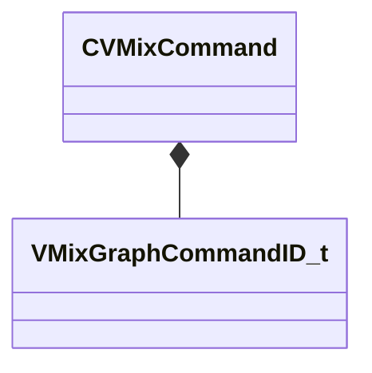

[Schemas](../../schemas.md) / [soundsystem_lowlevel](../soundsystem_lowlevel.md) / CVMixCommand

# CVMixCommand

> Source: **Build 25000182** · 2026-08-28 · `windows-x86_64` · schema `0.10.0`

**Kind:** class · **Size:** 32 bytes (`0x20`) · **Align:** 4 · **Module:** soundsystem_lowlevel

**Relationships:**

## Memory layout

8 fields (8 declared here, 0 inherited). Offsets are absolute from the object base.

| Offset | Field | Type | From | Annotations |
|--------|-------|------|------|-------------|
| `0x0` | `m_nCommand` | [VMixGraphCommandID_t](../soundsystem_lowlevel/VMixGraphCommandID_t.md) |  | `MKV3TransferName command` |
| `0x4` | `m_nParameterNameHash` | uint32 |  | `MKV3TransferName paramName` |
| `0x8` | `m_nOutputSubmix` | int32 |  | `MKV3TransferName outputSubmix` |
| `0xc` | `m_nInputSubmix0` | int32 |  | `MKV3TransferName inputSubmix0` |
| `0x10` | `m_nInputSubmix1` | int32 |  | `MKV3TransferName inputSubmix1` |
| `0x14` | `m_nProcessor` | int32 |  | `MKV3TransferName processor` |
| `0x18` | `m_nInputValue0` | int32 |  | `MKV3TransferName inputValue0` |
| `0x1c` | `m_nInputValue1` | int32 |  | `MKV3TransferName inputValue1` |

KV3 class defaults

<pre>{
	&quot;command&quot;: &quot;CMD_INVALID&quot;,
	&quot;paramName&quot;: 0,
	&quot;outputSubmix&quot;: -1,
	&quot;inputSubmix0&quot;: -1,
	&quot;inputSubmix1&quot;: -1,
	&quot;processor&quot;: -1,
	&quot;inputValue0&quot;: -1,
	&quot;inputValue1&quot;: -1
}</pre>

