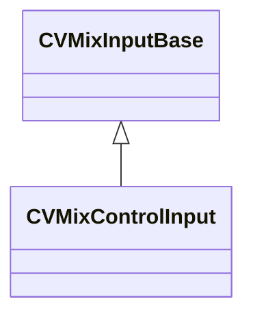

[Schemas](../../schemas.md) / [soundsystem_lowlevel](../soundsystem_lowlevel.md) / CVMixControlInput

# CVMixControlInput

> Source: **Build 25000182** · 2026-08-28 · `windows-x86_64` · schema `0.10.0`

**Kind:** class · **Size:** 24 bytes (`0x18`) · **Align:** 8 · **Module:** soundsystem_lowlevel

**Inherits from:** [CVMixInputBase](../soundsystem_lowlevel/CVMixInputBase.md)

**Relationships:**

## Memory layout

2 fields (1 declared here, 1 inherited). Offsets are absolute from the object base.

| Offset | Field | Type | From | Annotations |
|--------|-------|------|------|-------------|
| `0x0` | `m_name` | CUtlString | [CVMixInputBase](../soundsystem_lowlevel/CVMixInputBase.md) |  |
| `0x10` | `m_flDefaultValue` | float32 |  |  |

KV3 class defaults

<pre>{
	&quot;m_name&quot;: &quot;GameInput&quot;,
	&quot;m_flDefaultValue&quot;: 0.000000
}</pre>

