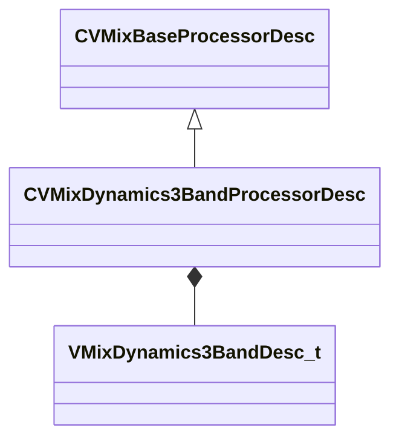

[Schemas](../../schemas.md) / [soundsystem_lowlevel](../soundsystem_lowlevel.md) / CVMixDynamics3BandProcessorDesc

# CVMixDynamics3BandProcessorDesc

> Source: **Build 25000182** · 2026-08-28 · `windows-x86_64` · schema `0.10.0`

**Kind:** class · **Size:** 176 bytes (`0xb0`) · **Align:** 8 · **Module:** soundsystem_lowlevel

**Inherits from:** [CVMixBaseProcessorDesc](../soundsystem_lowlevel/CVMixBaseProcessorDesc.md)

**Relationships:**

## Memory layout

4 fields (1 declared here, 3 inherited). Offsets are absolute from the object base.

| Offset | Field | Type | From | Annotations |
|--------|-------|------|------|-------------|
| `0x8` | `m_name` | CUtlString | [CVMixBaseProcessorDesc](../soundsystem_lowlevel/CVMixBaseProcessorDesc.md) |  |
| `0x14` | `m_nChannels` | int32 | [CVMixBaseProcessorDesc](../soundsystem_lowlevel/CVMixBaseProcessorDesc.md) |  |
| `0x18` | `m_flxfade` | float32 | [CVMixBaseProcessorDesc](../soundsystem_lowlevel/CVMixBaseProcessorDesc.md) |  |
| `0x20` | `m_desc` | [VMixDynamics3BandDesc_t](../soundsystem_lowlevel/VMixDynamics3BandDesc_t.md) |  |  |

KV3 class defaults

<pre>{
	&quot;_class&quot;: &quot;CVMixDynamics3BandProcessorDesc&quot;,
	&quot;m_name&quot;: &quot;&quot;,
	&quot;m_nChannels&quot;: -1,
	&quot;m_flxfade&quot;: 0.100000,
	&quot;m_desc&quot;:
	{
		&quot;m_fldbGainOutput&quot;: 0.000000,
		&quot;m_flRMSTimeMS&quot;: 0.000000,
		&quot;m_fldbKneeWidth&quot;: 0.000000,
		&quot;m_flDepth&quot;: 0.000000,
		&quot;m_flWetMix&quot;: 0.000000,
		&quot;m_flTimeScale&quot;: 0.000000,
		&quot;m_flLowCutoffFreq&quot;: 0.000000,
		&quot;m_flHighCutoffFreq&quot;: 0.000000,
		&quot;m_bPeakMode&quot;: false,
		&quot;m_bandDesc&quot;:
		[
			{
				&quot;m_fldbGainInput&quot;: 0.000000,
				&quot;m_fldbGainOutput&quot;: 0.000000,
				&quot;m_fldbThresholdBelow&quot;: -40.000000,
				&quot;m_fldbThresholdAbove&quot;: -30.000000,
				&quot;m_flRatioBelow&quot;: 12.000000,
				&quot;m_flRatioAbove&quot;: 4.000000,
				&quot;m_flAttackTimeMS&quot;: 50.000000,
				&quot;m_flReleaseTimeMS&quot;: 200.000000,
				&quot;m_bEnable&quot;: false,
				&quot;m_bSolo&quot;: false
			},
			{
				&quot;m_fldbGainInput&quot;: 0.000000,
				&quot;m_fldbGainOutput&quot;: 0.000000,
				&quot;m_fldbThresholdBelow&quot;: -40.000000,
				&quot;m_fldbThresholdAbove&quot;: -30.000000,
				&quot;m_flRatioBelow&quot;: 12.000000,
				&quot;m_flRatioAbove&quot;: 4.000000,
				&quot;m_flAttackTimeMS&quot;: 50.000000,
				&quot;m_flReleaseTimeMS&quot;: 200.000000,
				&quot;m_bEnable&quot;: false,
				&quot;m_bSolo&quot;: false
			},
			{
				&quot;m_fldbGainInput&quot;: 0.000000,
				&quot;m_fldbGainOutput&quot;: 0.000000,
				&quot;m_fldbThresholdBelow&quot;: -40.000000,
				&quot;m_fldbThresholdAbove&quot;: -30.000000,
				&quot;m_flRatioBelow&quot;: 12.000000,
				&quot;m_flRatioAbove&quot;: 4.000000,
				&quot;m_flAttackTimeMS&quot;: 50.000000,
				&quot;m_flReleaseTimeMS&quot;: 200.000000,
				&quot;m_bEnable&quot;: false,
				&quot;m_bSolo&quot;: false
			}
		]
	}
}</pre>

