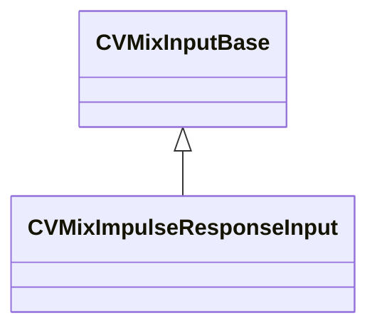

[Schemas](../../schemas.md) / [soundsystem_lowlevel](../soundsystem_lowlevel.md) / CVMixImpulseResponseInput

# CVMixImpulseResponseInput

**Kind:** class · **Size:** 16 bytes (`0x10`) · **Align:** 8 · **Module:** soundsystem_lowlevel

**Inherits from:** [CVMixInputBase](../soundsystem_lowlevel/CVMixInputBase.md)

**Relationships:**

## Memory layout

1 fields (0 declared here, 1 inherited). Offsets are absolute from the object base.

| Offset | Field | Type | From | Annotations |
|--------|-------|------|------|-------------|
| `0x0` | `m_name` | CUtlString | [CVMixInputBase](../soundsystem_lowlevel/CVMixInputBase.md) |  |

KV3 class defaults

<pre>{
	&quot;m_name&quot;: &quot;GameInput&quot;
}</pre>

