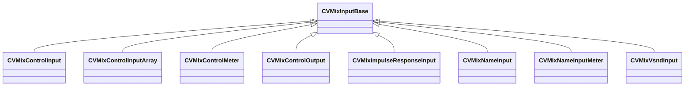

[Schemas](../../schemas.md) / [soundsystem_lowlevel](../soundsystem_lowlevel.md) / CVMixInputBase

# CVMixInputBase

**Kind:** class · **Size:** 16 bytes (`0x10`) · **Align:** 8 · **Module:** soundsystem_lowlevel

**Derived by:** [CVMixControlInput](../soundsystem_lowlevel/CVMixControlInput.md), [CVMixControlInputArray](../soundsystem_lowlevel/CVMixControlInputArray.md), [CVMixControlMeter](../soundsystem_lowlevel/CVMixControlMeter.md), [CVMixControlOutput](../soundsystem_lowlevel/CVMixControlOutput.md), [CVMixImpulseResponseInput](../soundsystem_lowlevel/CVMixImpulseResponseInput.md), [CVMixNameInput](../soundsystem_lowlevel/CVMixNameInput.md), [CVMixNameInputMeter](../soundsystem_lowlevel/CVMixNameInputMeter.md), [CVMixVsndInput](../soundsystem_lowlevel/CVMixVsndInput.md)

**Relationships:**

## Memory layout

1 fields (1 declared here, 0 inherited). Offsets are absolute from the object base.

| Offset | Field | Type | From | Annotations |
|--------|-------|------|------|-------------|
| `0x0` | `m_name` | CUtlString |  |  |

KV3 class defaults

<pre>{
	&quot;m_name&quot;: &quot;GameInput&quot;
}</pre>

