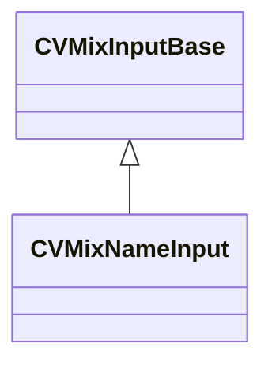

[Schemas](../../schemas.md) / [soundsystem_lowlevel](../soundsystem_lowlevel.md) / CVMixNameInput

# CVMixNameInput

**Kind:** class · **Size:** 32 bytes (`0x20`) · **Align:** 8 · **Module:** soundsystem_lowlevel

**Inherits from:** [CVMixInputBase](../soundsystem_lowlevel/CVMixInputBase.md)

**Relationships:**

## Memory layout

2 fields (1 declared here, 1 inherited). Offsets are absolute from the object base.

| Offset | Field | Type | From | Annotations |
|--------|-------|------|------|-------------|
| `0x0` | `m_name` | CUtlString | [CVMixInputBase](../soundsystem_lowlevel/CVMixInputBase.md) |  |
| `0x10` | `m_defaultValue` | CUtlString |  |  |

KV3 class defaults

<pre>{
	&quot;m_name&quot;: &quot;GameInput&quot;,
	&quot;m_defaultValue&quot;: &quot;&quot;
}</pre>

