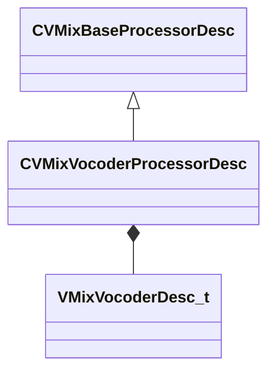

[Schemas](../../schemas.md) / [soundsystem_lowlevel](../soundsystem_lowlevel.md) / CVMixVocoderProcessorDesc

# CVMixVocoderProcessorDesc

**Kind:** class · **Size:** 72 bytes (`0x48`) · **Align:** 8 · **Module:** soundsystem_lowlevel

**Inherits from:** [CVMixBaseProcessorDesc](../soundsystem_lowlevel/CVMixBaseProcessorDesc.md)

**Relationships:**

## Memory layout

4 fields (1 declared here, 3 inherited). Offsets are absolute from the object base.

| Offset | Field | Type | From | Annotations |
|--------|-------|------|------|-------------|
| `0x8` | `m_name` | CUtlString | [CVMixBaseProcessorDesc](../soundsystem_lowlevel/CVMixBaseProcessorDesc.md) |  |
| `0x14` | `m_nChannels` | int32 | [CVMixBaseProcessorDesc](../soundsystem_lowlevel/CVMixBaseProcessorDesc.md) |  |
| `0x18` | `m_flxfade` | float32 | [CVMixBaseProcessorDesc](../soundsystem_lowlevel/CVMixBaseProcessorDesc.md) |  |
| `0x20` | `m_desc` | [VMixVocoderDesc_t](../soundsystem_lowlevel/VMixVocoderDesc_t.md) |  |  |

KV3 class defaults

<pre>{
	&quot;_class&quot;: &quot;CVMixVocoderProcessorDesc&quot;,
	&quot;m_name&quot;: &quot;&quot;,
	&quot;m_nChannels&quot;: -1,
	&quot;m_flxfade&quot;: 0.100000,
	&quot;m_desc&quot;:
	{
		&quot;m_nBandCount&quot;: 0,
		&quot;m_flBandwidth&quot;: 0.000000,
		&quot;m_fldBModGain&quot;: 0.000000,
		&quot;m_flFreqRangeStart&quot;: 0.000000,
		&quot;m_flFreqRangeEnd&quot;: 0.000000,
		&quot;m_fldBUnvoicedGain&quot;: 0.000000,
		&quot;m_flAttackTimeMS&quot;: 0.000000,
		&quot;m_flReleaseTimeMS&quot;: 0.000000,
		&quot;m_nDebugBand&quot;: 0,
		&quot;m_bPeakMode&quot;: false
	}
}</pre>

