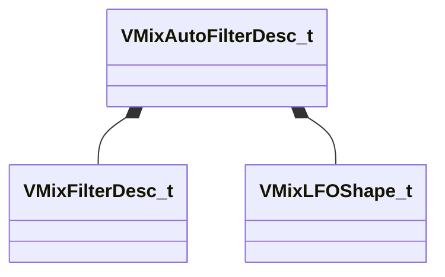

[Schemas](../../schemas.md) / [soundsystem_lowlevel](../soundsystem_lowlevel.md) / VMixAutoFilterDesc_t

# VMixAutoFilterDesc_t

> Source: **Build 25000182** · 2026-08-28 · `windows-x86_64` · schema `0.10.0`

**Kind:** class · **Size:** 44 bytes (`0x2c`) · **Align:** 4 · **Module:** soundsystem_lowlevel

**Relationships:**

## Memory layout

8 fields (8 declared here, 0 inherited). Offsets are absolute from the object base.

| Offset | Field | Type | From | Annotations |
|--------|-------|------|------|-------------|
| `0x0` | `m_flEnvelopeAmount` | float32 |  |  |
| `0x4` | `m_flAttackTimeMS` | float32 |  |  |
| `0x8` | `m_flReleaseTimeMS` | float32 |  |  |
| `0xc` | `m_filter` | [VMixFilterDesc_t](../soundsystem_lowlevel/VMixFilterDesc_t.md) |  |  |
| `0x1c` | `m_flLFOAmount` | float32 |  |  |
| `0x20` | `m_flLFORate` | float32 |  |  |
| `0x24` | `m_flPhase` | float32 |  |  |
| `0x28` | `m_nLFOShape` | [VMixLFOShape_t](../soundsystem_lowlevel/VMixLFOShape_t.md) |  |  |

KV3 class defaults

<pre>{
	&quot;m_flEnvelopeAmount&quot;: 0.000000,
	&quot;m_flAttackTimeMS&quot;: 5.000000,
	&quot;m_flReleaseTimeMS&quot;: 200.000000,
	&quot;m_filter&quot;:
	{
		&quot;m_nFilterType&quot;: &quot;FILTER_UNKNOWN&quot;,
		&quot;m_nFilterSlope&quot;: &quot;FILTER_SLOPE_12dB&quot;,
		&quot;m_bEnabled&quot;: true,
		&quot;m_fldbGain&quot;: 0.000000,
		&quot;m_flCutoffFreq&quot;: 1000.000000,
		&quot;m_flQ&quot;: 0.707107
	},
	&quot;m_flLFOAmount&quot;: 0.000000,
	&quot;m_flLFORate&quot;: 0.000000,
	&quot;m_flPhase&quot;: 0.000000,
	&quot;m_nLFOShape&quot;: &quot;LFO_SHAPE_SINE&quot;
}</pre>

