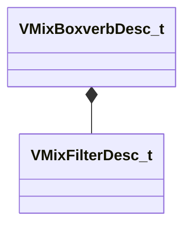

[Schemas](../../schemas.md) / [soundsystem_lowlevel](../soundsystem_lowlevel.md) / VMixBoxverbDesc_t

# VMixBoxverbDesc_t

> Source: **Build 25000182** · 2026-08-28 · `windows-x86_64` · schema `0.10.0`

**Kind:** class · **Size:** 80 bytes (`0x50`) · **Align:** 4 · **Module:** soundsystem_lowlevel

**Relationships:**

## Memory layout

17 fields (17 declared here, 0 inherited). Offsets are absolute from the object base.

| Offset | Field | Type | From | Annotations |
|--------|-------|------|------|-------------|
| `0x0` | `m_flSizeMax` | float32 |  |  |
| `0x4` | `m_flSizeMin` | float32 |  |  |
| `0x8` | `m_flComplexity` | float32 |  |  |
| `0xc` | `m_flDiffusion` | float32 |  |  |
| `0x10` | `m_flModDepth` | float32 |  |  |
| `0x14` | `m_flModRate` | float32 |  |  |
| `0x18` | `m_bParallel` | bool |  |  |
| `0x1c` | `m_filterType` | [VMixFilterDesc_t](../soundsystem_lowlevel/VMixFilterDesc_t.md) |  |  |
| `0x2c` | `m_flWidth` | float32 |  |  |
| `0x30` | `m_flHeight` | float32 |  |  |
| `0x34` | `m_flDepth` | float32 |  |  |
| `0x38` | `m_flFeedbackScale` | float32 |  |  |
| `0x3c` | `m_flFeedbackWidth` | float32 |  |  |
| `0x40` | `m_flFeedbackHeight` | float32 |  |  |
| `0x44` | `m_flFeedbackDepth` | float32 |  |  |
| `0x48` | `m_flOutputGain` | float32 |  |  |
| `0x4c` | `m_flTaps` | float32 |  |  |

KV3 class defaults

<pre>{
	&quot;m_flSizeMax&quot;: 0.000000,
	&quot;m_flSizeMin&quot;: 0.000000,
	&quot;m_flComplexity&quot;: 0.000000,
	&quot;m_flDiffusion&quot;: 0.000000,
	&quot;m_flModDepth&quot;: 0.000000,
	&quot;m_flModRate&quot;: 0.000000,
	&quot;m_bParallel&quot;: false,
	&quot;m_filterType&quot;:
	{
		&quot;m_nFilterType&quot;: &quot;FILTER_UNKNOWN&quot;,
		&quot;m_nFilterSlope&quot;: &quot;FILTER_SLOPE_12dB&quot;,
		&quot;m_bEnabled&quot;: true,
		&quot;m_fldbGain&quot;: 0.000000,
		&quot;m_flCutoffFreq&quot;: 1000.000000,
		&quot;m_flQ&quot;: 0.707107
	},
	&quot;m_flWidth&quot;: 0.000000,
	&quot;m_flHeight&quot;: 0.000000,
	&quot;m_flDepth&quot;: 0.000000,
	&quot;m_flFeedbackScale&quot;: 0.000000,
	&quot;m_flFeedbackWidth&quot;: 0.000000,
	&quot;m_flFeedbackHeight&quot;: 0.000000,
	&quot;m_flFeedbackDepth&quot;: 0.000000,
	&quot;m_flOutputGain&quot;: 0.000000,
	&quot;m_flTaps&quot;: 0.000000
}</pre>

