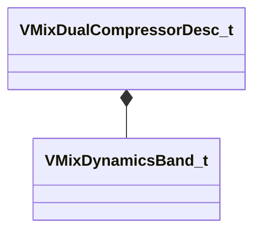

[Schemas](../../schemas.md) / [soundsystem_lowlevel](../soundsystem_lowlevel.md) / VMixDualCompressorDesc_t

# VMixDualCompressorDesc_t

> Source: **Build 25000182** · 2026-08-28 · `windows-x86_64` · schema `0.10.0`

**Kind:** class · **Size:** 52 bytes (`0x34`) · **Align:** 4 · **Module:** soundsystem_lowlevel

**Relationships:**

## Memory layout

5 fields (5 declared here, 0 inherited). Offsets are absolute from the object base.

| Offset | Field | Type | From | Annotations |
|--------|-------|------|------|-------------|
| `0x0` | `m_flRMSTimeMS` | float32 |  |  |
| `0x4` | `m_fldbKneeWidth` | float32 |  |  |
| `0x8` | `m_flWetMix` | float32 |  |  |
| `0xc` | `m_bPeakMode` | bool |  |  |
| `0x10` | `m_bandDesc` | [VMixDynamicsBand_t](../soundsystem_lowlevel/VMixDynamicsBand_t.md) |  |  |

KV3 class defaults

<pre>{
	&quot;m_flRMSTimeMS&quot;: 300.000000,
	&quot;m_fldbKneeWidth&quot;: 0.000000,
	&quot;m_flWetMix&quot;: 1.000000,
	&quot;m_bPeakMode&quot;: false,
	&quot;m_bandDesc&quot;:
	{
		&quot;m_fldbGainInput&quot;: 0.000000,
		&quot;m_fldbGainOutput&quot;: 0.000000,
		&quot;m_fldbThresholdBelow&quot;: -40.000000,
		&quot;m_fldbThresholdAbove&quot;: -30.000000,
		&quot;m_flRatioBelow&quot;: 12.000000,
		&quot;m_flRatioAbove&quot;: 4.000000,
		&quot;m_flAttackTimeMS&quot;: 50.000000,
		&quot;m_flReleaseTimeMS&quot;: 200.000000,
		&quot;m_bEnable&quot;: false,
		&quot;m_bSolo&quot;: false
	}
}</pre>

