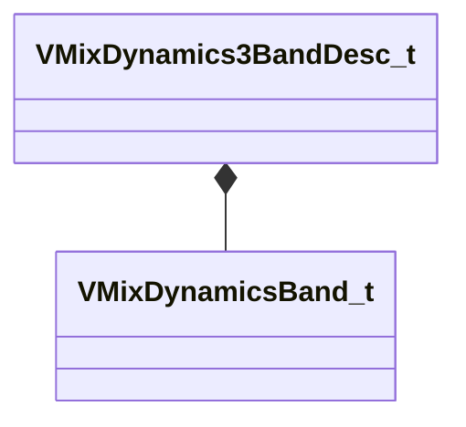

[Schemas](../../schemas.md) / [soundsystem_lowlevel](../soundsystem_lowlevel.md) / VMixDynamics3BandDesc_t

# VMixDynamics3BandDesc_t

**Kind:** class · **Size:** 144 bytes (`0x90`) · **Align:** 4 · **Module:** soundsystem_lowlevel

**Relationships:**

## Memory layout

10 fields (10 declared here, 0 inherited). Offsets are absolute from the object base.

| Offset | Field | Type | From | Annotations |
|--------|-------|------|------|-------------|
| `0x0` | `m_fldbGainOutput` | float32 |  |  |
| `0x4` | `m_flRMSTimeMS` | float32 |  |  |
| `0x8` | `m_fldbKneeWidth` | float32 |  |  |
| `0xc` | `m_flDepth` | float32 |  |  |
| `0x10` | `m_flWetMix` | float32 |  |  |
| `0x14` | `m_flTimeScale` | float32 |  |  |
| `0x18` | `m_flLowCutoffFreq` | float32 |  |  |
| `0x1c` | `m_flHighCutoffFreq` | float32 |  |  |
| `0x20` | `m_bPeakMode` | bool |  |  |
| `0x24` | `m_bandDesc` | [VMixDynamicsBand_t](../soundsystem_lowlevel/VMixDynamicsBand_t.md)[3] |  |  |

KV3 class defaults

<pre>{
	&quot;m_fldbGainOutput&quot;: 0.000000,
	&quot;m_flRMSTimeMS&quot;: 0.000000,
	&quot;m_fldbKneeWidth&quot;: 0.000000,
	&quot;m_flDepth&quot;: 0.000000,
	&quot;m_flWetMix&quot;: 0.000000,
	&quot;m_flTimeScale&quot;: 0.000000,
	&quot;m_flLowCutoffFreq&quot;: 0.000000,
	&quot;m_flHighCutoffFreq&quot;: 0.000000,
	&quot;m_bPeakMode&quot;: false,
	&quot;m_bandDesc&quot;:
	[
		{
			&quot;m_fldbGainInput&quot;: 0.000000,
			&quot;m_fldbGainOutput&quot;: 0.000000,
			&quot;m_fldbThresholdBelow&quot;: -40.000000,
			&quot;m_fldbThresholdAbove&quot;: -30.000000,
			&quot;m_flRatioBelow&quot;: 12.000000,
			&quot;m_flRatioAbove&quot;: 4.000000,
			&quot;m_flAttackTimeMS&quot;: 50.000000,
			&quot;m_flReleaseTimeMS&quot;: 200.000000,
			&quot;m_bEnable&quot;: false,
			&quot;m_bSolo&quot;: false
		},
		{
			&quot;m_fldbGainInput&quot;: 0.000000,
			&quot;m_fldbGainOutput&quot;: 0.000000,
			&quot;m_fldbThresholdBelow&quot;: -40.000000,
			&quot;m_fldbThresholdAbove&quot;: -30.000000,
			&quot;m_flRatioBelow&quot;: 12.000000,
			&quot;m_flRatioAbove&quot;: 4.000000,
			&quot;m_flAttackTimeMS&quot;: 50.000000,
			&quot;m_flReleaseTimeMS&quot;: 200.000000,
			&quot;m_bEnable&quot;: false,
			&quot;m_bSolo&quot;: false
		},
		{
			&quot;m_fldbGainInput&quot;: 0.000000,
			&quot;m_fldbGainOutput&quot;: 0.000000,
			&quot;m_fldbThresholdBelow&quot;: -40.000000,
			&quot;m_fldbThresholdAbove&quot;: -30.000000,
			&quot;m_flRatioBelow&quot;: 12.000000,
			&quot;m_flRatioAbove&quot;: 4.000000,
			&quot;m_flAttackTimeMS&quot;: 50.000000,
			&quot;m_flReleaseTimeMS&quot;: 200.000000,
			&quot;m_bEnable&quot;: false,
			&quot;m_bSolo&quot;: false
		}
	]
}</pre>

