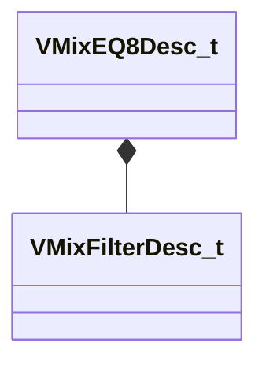

[Schemas](../../schemas.md) / [soundsystem_lowlevel](../soundsystem_lowlevel.md) / VMixEQ8Desc_t

# VMixEQ8Desc_t

> Source: **Build 25000182** · 2026-08-28 · `windows-x86_64` · schema `0.10.0`

**Kind:** class · **Size:** 128 bytes (`0x80`) · **Align:** 4 · **Module:** soundsystem_lowlevel

**Relationships:**

## Memory layout

1 field (1 declared here, 0 inherited). Offsets are absolute from the object base.

| Offset | Field | Type | From | Annotations |
|--------|-------|------|------|-------------|
| `0x0` | `m_stages` | [VMixFilterDesc_t](../soundsystem_lowlevel/VMixFilterDesc_t.md)[8] |  |  |

KV3 class defaults

<pre>{
	&quot;m_stages&quot;:
	[
		{
			&quot;m_nFilterType&quot;: &quot;FILTER_UNKNOWN&quot;,
			&quot;m_nFilterSlope&quot;: &quot;FILTER_SLOPE_12dB&quot;,
			&quot;m_bEnabled&quot;: true,
			&quot;m_fldbGain&quot;: 0.000000,
			&quot;m_flCutoffFreq&quot;: 1000.000000,
			&quot;m_flQ&quot;: 0.707107
		},
		{
			&quot;m_nFilterType&quot;: &quot;FILTER_UNKNOWN&quot;,
			&quot;m_nFilterSlope&quot;: &quot;FILTER_SLOPE_12dB&quot;,
			&quot;m_bEnabled&quot;: true,
			&quot;m_fldbGain&quot;: 0.000000,
			&quot;m_flCutoffFreq&quot;: 1000.000000,
			&quot;m_flQ&quot;: 0.707107
		},
		{
			&quot;m_nFilterType&quot;: &quot;FILTER_UNKNOWN&quot;,
			&quot;m_nFilterSlope&quot;: &quot;FILTER_SLOPE_12dB&quot;,
			&quot;m_bEnabled&quot;: true,
			&quot;m_fldbGain&quot;: 0.000000,
			&quot;m_flCutoffFreq&quot;: 1000.000000,
			&quot;m_flQ&quot;: 0.707107
		},
		{
			&quot;m_nFilterType&quot;: &quot;FILTER_UNKNOWN&quot;,
			&quot;m_nFilterSlope&quot;: &quot;FILTER_SLOPE_12dB&quot;,
			&quot;m_bEnabled&quot;: true,
			&quot;m_fldbGain&quot;: 0.000000,
			&quot;m_flCutoffFreq&quot;: 1000.000000,
			&quot;m_flQ&quot;: 0.707107
		},
		{
			&quot;m_nFilterType&quot;: &quot;FILTER_UNKNOWN&quot;,
			&quot;m_nFilterSlope&quot;: &quot;FILTER_SLOPE_12dB&quot;,
			&quot;m_bEnabled&quot;: true,
			&quot;m_fldbGain&quot;: 0.000000,
			&quot;m_flCutoffFreq&quot;: 1000.000000,
			&quot;m_flQ&quot;: 0.707107
		},
		{
			&quot;m_nFilterType&quot;: &quot;FILTER_UNKNOWN&quot;,
			&quot;m_nFilterSlope&quot;: &quot;FILTER_SLOPE_12dB&quot;,
			&quot;m_bEnabled&quot;: true,
			&quot;m_fldbGain&quot;: 0.000000,
			&quot;m_flCutoffFreq&quot;: 1000.000000,
			&quot;m_flQ&quot;: 0.707107
		},
		{
			&quot;m_nFilterType&quot;: &quot;FILTER_UNKNOWN&quot;,
			&quot;m_nFilterSlope&quot;: &quot;FILTER_SLOPE_12dB&quot;,
			&quot;m_bEnabled&quot;: true,
			&quot;m_fldbGain&quot;: 0.000000,
			&quot;m_flCutoffFreq&quot;: 1000.000000,
			&quot;m_flQ&quot;: 0.707107
		},
		{
			&quot;m_nFilterType&quot;: &quot;FILTER_UNKNOWN&quot;,
			&quot;m_nFilterSlope&quot;: &quot;FILTER_SLOPE_12dB&quot;,
			&quot;m_bEnabled&quot;: true,
			&quot;m_fldbGain&quot;: 0.000000,
			&quot;m_flCutoffFreq&quot;: 1000.000000,
			&quot;m_flQ&quot;: 0.707107
		}
	]
}</pre>

