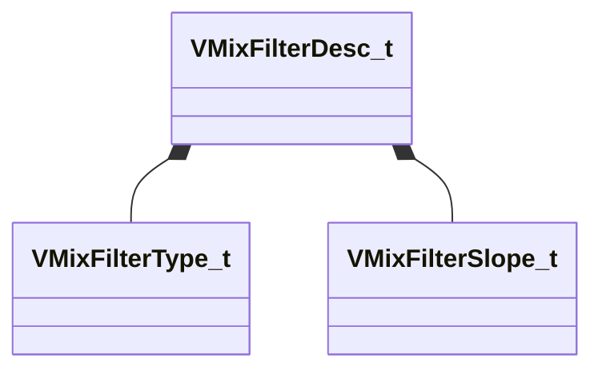

[Schemas](../../schemas.md) / [soundsystem_lowlevel](../soundsystem_lowlevel.md) / VMixFilterDesc_t

# VMixFilterDesc_t

> Source: **Build 25000182** · 2026-08-28 · `windows-x86_64` · schema `0.10.0`

**Kind:** class · **Size:** 16 bytes (`0x10`) · **Align:** 4 · **Module:** soundsystem_lowlevel

**Relationships:**

## Memory layout

6 fields (6 declared here, 0 inherited). Offsets are absolute from the object base.

| Offset | Field | Type | From | Annotations |
|--------|-------|------|------|-------------|
| `0x0` | `m_nFilterType` | [VMixFilterType_t](../soundsystem_lowlevel/VMixFilterType_t.md) |  |  |
| `0x2` | `m_nFilterSlope` | [VMixFilterSlope_t](../soundsystem_lowlevel/VMixFilterSlope_t.md) |  |  |
| `0x3` | `m_bEnabled` | bool |  |  |
| `0x4` | `m_fldbGain` | float32 |  |  |
| `0x8` | `m_flCutoffFreq` | float32 |  |  |
| `0xc` | `m_flQ` | float32 |  |  |

KV3 class defaults

<pre>{
	&quot;m_nFilterType&quot;: &quot;FILTER_UNKNOWN&quot;,
	&quot;m_nFilterSlope&quot;: &quot;FILTER_SLOPE_12dB&quot;,
	&quot;m_bEnabled&quot;: true,
	&quot;m_fldbGain&quot;: 0.000000,
	&quot;m_flCutoffFreq&quot;: 1000.000000,
	&quot;m_flQ&quot;: 0.707107
}</pre>

