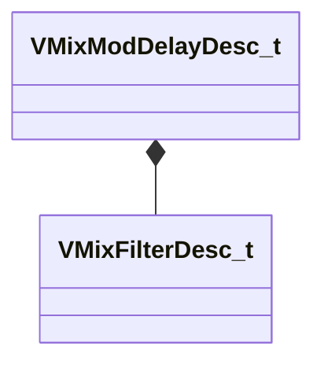

[Schemas](../../schemas.md) / [soundsystem_lowlevel](../soundsystem_lowlevel.md) / VMixModDelayDesc_t

# VMixModDelayDesc_t

> Source: **Build 25000182** · 2026-08-28 · `windows-x86_64` · schema `0.10.0`

**Kind:** class · **Size:** 48 bytes (`0x30`) · **Align:** 4 · **Module:** soundsystem_lowlevel

**Relationships:**

## Memory layout

9 fields (9 declared here, 0 inherited). Offsets are absolute from the object base.

| Offset | Field | Type | From | Annotations |
|--------|-------|------|------|-------------|
| `0x0` | `m_feedbackFilter` | [VMixFilterDesc_t](../soundsystem_lowlevel/VMixFilterDesc_t.md) |  |  |
| `0x10` | `m_bPhaseInvert` | bool |  |  |
| `0x14` | `m_flGlideTime` | float32 |  |  |
| `0x18` | `m_flDelay` | float32 |  |  |
| `0x1c` | `m_flOutputGain` | float32 |  |  |
| `0x20` | `m_flFeedbackGain` | float32 |  |  |
| `0x24` | `m_flModRate` | float32 |  |  |
| `0x28` | `m_flModDepth` | float32 |  |  |
| `0x2c` | `m_bApplyAntialiasing` | bool |  |  |

KV3 class defaults

<pre>{
	&quot;m_feedbackFilter&quot;:
	{
		&quot;m_nFilterType&quot;: &quot;FILTER_UNKNOWN&quot;,
		&quot;m_nFilterSlope&quot;: &quot;FILTER_SLOPE_12dB&quot;,
		&quot;m_bEnabled&quot;: true,
		&quot;m_fldbGain&quot;: 0.000000,
		&quot;m_flCutoffFreq&quot;: 1000.000000,
		&quot;m_flQ&quot;: 0.707107
	},
	&quot;m_bPhaseInvert&quot;: false,
	&quot;m_flGlideTime&quot;: 0.000000,
	&quot;m_flDelay&quot;: 0.000000,
	&quot;m_flOutputGain&quot;: 0.000000,
	&quot;m_flFeedbackGain&quot;: 0.000000,
	&quot;m_flModRate&quot;: 0.000000,
	&quot;m_flModDepth&quot;: 0.000000,
	&quot;m_bApplyAntialiasing&quot;: false
}</pre>

