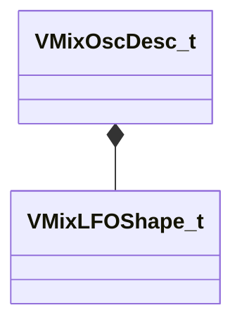

[Schemas](../../schemas.md) / [soundsystem_lowlevel](../soundsystem_lowlevel.md) / VMixOscDesc_t

# VMixOscDesc_t

**Kind:** class · **Size:** 12 bytes (`0xc`) · **Align:** 4 · **Module:** soundsystem_lowlevel

**Relationships:**

## Memory layout

3 fields (3 declared here, 0 inherited). Offsets are absolute from the object base.

| Offset | Field | Type | From | Annotations |
|--------|-------|------|------|-------------|
| `0x0` | `oscType` | [VMixLFOShape_t](../!GlobalTypes/VMixLFOShape_t.md) |  | `MPropertyFriendlyName Type` |
| `0x4` | `m_freq` | float32 |  | `MPropertyAttributeRange 0.1 16000` `MPropertyFriendlyName Frequency (Hz)` |
| `0x8` | `m_flPhase` | float32 |  | `MPropertyAttributeRange 0 360` `MPropertyFriendlyName Phase (degrees)` |

KV3 class defaults

<pre>{
	&quot;oscType&quot;: &quot;LFO_SHAPE_SINE&quot;,
	&quot;m_freq&quot;: 440.000000,
	&quot;m_flPhase&quot;: 0.000000
}</pre>

