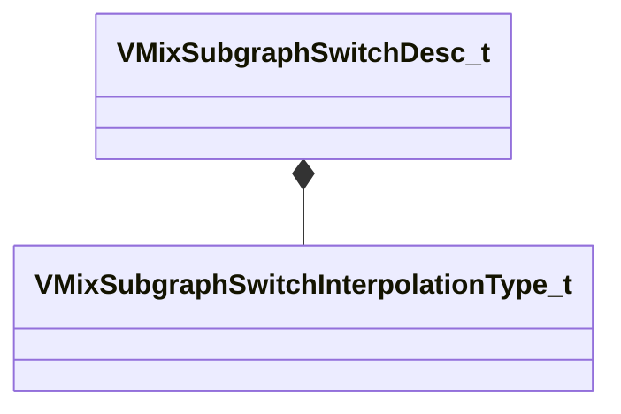

[Schemas](../../schemas.md) / [soundsystem_lowlevel](../soundsystem_lowlevel.md) / VMixSubgraphSwitchDesc_t

# VMixSubgraphSwitchDesc_t

**Kind:** class · **Size:** 56 bytes (`0x38`) · **Align:** 8 · **Module:** soundsystem_lowlevel

**Relationships:**

## Memory layout

6 fields (6 declared here, 0 inherited). Offsets are absolute from the object base.

| Offset | Field | Type | From | Annotations |
|--------|-------|------|------|-------------|
| `0x0` | `m_name` | CUtlString |  |  |
| `0x8` | `m_effectName` | CUtlString |  |  |
| `0x10` | `m_subgraphs` | CUtlVector< CUtlString > |  |  |
| `0x28` | `m_interpolationMode` | [VMixSubgraphSwitchInterpolationType_t](../soundsystem_lowlevel/VMixSubgraphSwitchInterpolationType_t.md) |  |  |
| `0x2c` | `m_bOnlyTailsOnFadeOut` | bool |  |  |
| `0x30` | `m_flInterpolationTime` | float32 |  |  |

KV3 class defaults

<pre>{
	&quot;m_name&quot;: &quot;&quot;,
	&quot;m_effectName&quot;: &quot;&quot;,
	&quot;m_subgraphs&quot;:
	[
	],
	&quot;m_interpolationMode&quot;: &quot;SUBGRAPH_INTERPOLATION_TEMPORAL_CROSSFADE&quot;,
	&quot;m_bOnlyTailsOnFadeOut&quot;: false,
	&quot;m_flInterpolationTime&quot;: 0.000000
}</pre>

