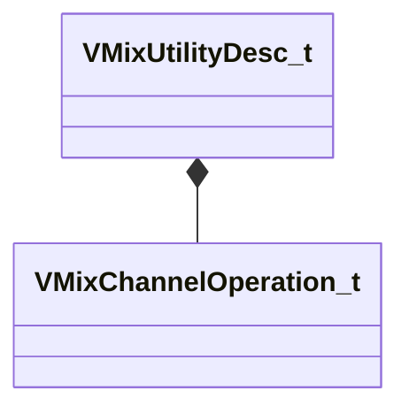

[Schemas](../../schemas.md) / [soundsystem_lowlevel](../soundsystem_lowlevel.md) / VMixUtilityDesc_t

# VMixUtilityDesc_t

> Source: **Build 25000182** · 2026-08-28 · `windows-x86_64` · schema `0.10.0`

**Kind:** class · **Size:** 24 bytes (`0x18`) · **Align:** 4 · **Module:** soundsystem_lowlevel

**Relationships:**

## Memory layout

6 fields (6 declared here, 0 inherited). Offsets are absolute from the object base.

| Offset | Field | Type | From | Annotations |
|--------|-------|------|------|-------------|
| `0x0` | `m_nOp` | [VMixChannelOperation_t](../soundsystem_lowlevel/VMixChannelOperation_t.md) |  | `MPropertyFriendlyName Channels` |
| `0x4` | `m_flInputPan` | float32 |  | `MPropertyAttributeRange -1 1` `MPropertyFriendlyName Input Pan` |
| `0x8` | `m_flOutputBalance` | float32 |  | `MPropertyAttributeRange -1 1` `MPropertyFriendlyName Output Balance` |
| `0xc` | `m_fldbOutputGain` | float32 |  | `MPropertyAttributeRange -36 0` `MPropertyFriendlyName Output Gain (dB)` |
| `0x10` | `m_bBassMono` | bool |  |  |
| `0x14` | `m_flBassFreq` | float32 |  |  |

KV3 class defaults

<pre>{
	&quot;m_nOp&quot;: &quot;VMIX_CHAN_STEREO&quot;,
	&quot;m_flInputPan&quot;: 0.000000,
	&quot;m_flOutputBalance&quot;: 0.000000,
	&quot;m_fldbOutputGain&quot;: 0.000000,
	&quot;m_bBassMono&quot;: false,
	&quot;m_flBassFreq&quot;: 120.000000
}</pre>

