# Module: soundsystem_voicecontainers

[📊 View UML Diagram](../diagrams/soundsystem_voicecontainers.md)

| Name | Kind | Bases | Fields |
|------|------|-------|--------|
| [CAudioEmphasisSample](#caudioemphasissample) | class |  | 2 |
| [CAudioMorphData](#caudiomorphdata) | class |  | 6 |
| [CAudioPhonemeTag](#caudiophonemetag) | class |  | 3 |
| [CAudioSentence](#caudiosentence) | class |  | 4 |
| [CSoundContainerReference](#csoundcontainerreference) | class |  | 4 |
| [CSoundContainerReferenceArray](#csoundcontainerreferencearray) | class |  | 3 |
| [CSoundInfoHeader](#csoundinfoheader) | class |  | 0 |
| [CVSound](#cvsound) | class |  | 11 |
| [CVSoundFormat_t](#cvsoundformat_t) | enum |  | 4 |
| [CVoiceContainerAmpedDecayingSineWave](#cvoicecontainerampeddecayingsinewave) | class | CVoiceContainerDecayingSineWave | 1 |
| [CVoiceContainerAnalysisBase](#cvoicecontaineranalysisbase) | class |  | 2 |
| [CVoiceContainerAsyncGenerator](#cvoicecontainerasyncgenerator) | class | CVoiceContainerGenerator | 0 |
| [CVoiceContainerBase](#cvoicecontainerbase) | class |  | 2 |
| [CVoiceContainerBlender](#cvoicecontainerblender) | class | CVoiceContainerBase | 3 |
| [CVoiceContainerDecayingSineWave](#cvoicecontainerdecayingsinewave) | class | CVoiceContainerGenerator | 2 |
| [CVoiceContainerDefault](#cvoicecontainerdefault) | class | CVoiceContainerBase | 0 |
| [CVoiceContainerEnum](#cvoicecontainerenum) | class | CVoiceContainerBase | 3 |
| [CVoiceContainerEnvelope](#cvoicecontainerenvelope) | class | CVoiceContainerDefault | 2 |
| [CVoiceContainerEnvelopeAnalyzer](#cvoicecontainerenvelopeanalyzer) | class | CVoiceContainerAnalysisBase | 3 |
| [CVoiceContainerGenerator](#cvoicecontainergenerator) | class | CVoiceContainerBase | 0 |
| [CVoiceContainerGranulator](#cvoicecontainergranulator) | class | CVoiceContainerAsyncGenerator | 6 |
| [CVoiceContainerLoopTrigger](#cvoicecontainerlooptrigger) | class | CVoiceContainerBase | 5 |
| [CVoiceContainerLoopXFade](#cvoicecontainerloopxfade) | class | CVoiceContainerBase | 8 |
| [CVoiceContainerMultiBlender](#cvoicecontainermultiblender) | class | CVoiceContainerBase | 3 |
| [CVoiceContainerNull](#cvoicecontainernull) | class | CVoiceContainerGenerator | 0 |
| [CVoiceContainerParameterBlender](#cvoicecontainerparameterblender) | class | CVoiceContainerBase | 8 |
| [CVoiceContainerRandomSampler](#cvoicecontainerrandomsampler) | class | CVoiceContainerAsyncGenerator | 6 |
| [CVoiceContainerRealtimeFMSineWave](#cvoicecontainerrealtimefmsinewave) | class | CVoiceContainerGenerator | 3 |
| [CVoiceContainerSelector](#cvoicecontainerselector) | class | CVoiceContainerBase | 3 |
| [CVoiceContainerSet](#cvoicecontainerset) | class | CVoiceContainerBase | 1 |
| [CVoiceContainerSetElement](#cvoicecontainersetelement) | class |  | 2 |
| [CVoiceContainerShapedNoise](#cvoicecontainershapednoise) | class | CVoiceContainerGenerator | 9 |
| [CVoiceContainerStaticAdditiveSynth](#cvoicecontainerstaticadditivesynth) | class | CVoiceContainerAsyncGenerator | 1 |
| [CVoiceContainerStaticAdditiveSynth::CGainScalePerInstance](#cvoicecontainerstaticadditivesynthcgainscaleperinstance) | class |  | 4 |
| [CVoiceContainerStaticAdditiveSynth::CHarmonic](#cvoicecontainerstaticadditivesynthcharmonic) | class |  | 7 |
| [CVoiceContainerStaticAdditiveSynth::CTone](#cvoicecontainerstaticadditivesynthctone) | class |  | 3 |
| [CVoiceContainerSwitch](#cvoicecontainerswitch) | class | CVoiceContainerBase | 1 |
| [CVoiceContainerTapePlayer](#cvoicecontainertapeplayer) | class | CVoiceContainerAsyncGenerator | 4 |
| [EMidiNote](#emidinote) | enum |  | 13 |
| [EMode_t](#emode_t) | enum |  | 2 |
| [EWaveform](#ewaveform) | enum |  | 5 |
| [PlayBackMode_t](#playbackmode_t) | enum |  | 5 |

---

### CAudioEmphasisSample

**Metadata:** `MGetKV3ClassDefaults {
	"m_flTime": 0.000000,
	"m_flValue": 0.000000
}`

**Fields:**

| Name | Type | Annotations |
|------|------|-------------|
| `m_flTime` | float32 |  |
| `m_flValue` | float32 |  |

### CAudioMorphData

**Metadata:** `MGetKV3ClassDefaults {
	"m_times":
	[
	],
	"m_nameHashCodes":
	[
	],
	"m_nameStrings":
	[
	],
	"m_samples":
	[
	],
	"m_flEaseIn": 0.200000,
	"m_flEaseOut": 0.200000
}`

**Fields:**

| Name | Type | Annotations |
|------|------|-------------|
| `m_times` | CUtlVector<float32> |  |
| `m_nameHashCodes` | CUtlVector<uint32> |  |
| `m_nameStrings` | CUtlVector<CUtlString> |  |
| `m_samples` | CUtlVector<CUtlVector<float32>> |  |
| `m_flEaseIn` | float32 |  |
| `m_flEaseOut` | float32 |  |

### CAudioPhonemeTag

**Metadata:** `MGetKV3ClassDefaults {
	"m_flStartTime": 0.000000,
	"m_flEndTime": 0.000000,
	"m_nPhonemeCode": 0
}`

**Fields:**

| Name | Type | Annotations |
|------|------|-------------|
| `m_flStartTime` | float32 |  |
| `m_flEndTime` | float32 |  |
| `m_nPhonemeCode` | int32 |  |

### CAudioSentence

**Metadata:** `MGetKV3ClassDefaults {
	"m_bShouldVoiceDuck": false,
	"m_RunTimePhonemes":
	[
	],
	"m_EmphasisSamples":
	[
	],
	"m_morphData":
	{
		"m_times":
		[
		],
		"m_nameHashCodes":
		[
		],
		"m_nameStrings":
		[
		],
		"m_samples":
		[
		],
		"m_flEaseIn": 0.200000,
		"m_flEaseOut": 0.200000
	}
}`

**Relationships:**

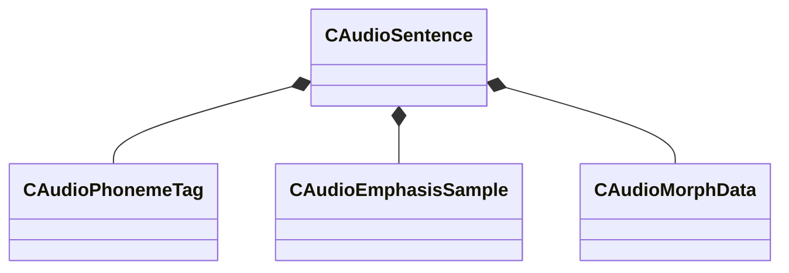

**Fields:**

| Name | Type | Annotations |
|------|------|-------------|
| `m_bShouldVoiceDuck` | bool |  |
| `m_RunTimePhonemes` | CUtlVector<[CAudioPhonemeTag](../schemas/soundsystem_voicecontainers.md#caudiophonemetag)> |  |
| `m_EmphasisSamples` | CUtlVector<[CAudioEmphasisSample](../schemas/soundsystem_voicecontainers.md#caudioemphasissample)> |  |
| `m_morphData` | [CAudioMorphData](../schemas/soundsystem_voicecontainers.md#caudiomorphdata) |  |

### CSoundContainerReference

**Metadata:** `MGetKV3ClassDefaults {
	"m_namespace": "",
	"m_bUseReference": true,
	"m_sound": "",
	"m_pSound": null
}`, `MPropertyFriendlyName "Sound"`, `MPropertyDescription "Reference to a vsnd file or another container."`

**Relationships:**

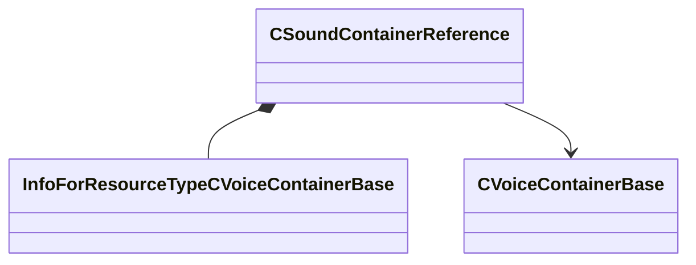

**Fields:**

| Name | Type | Annotations |
|------|------|-------------|
| `m_namespace` | CUtlString |  |
| `m_bUseReference` | bool | `MPropertyFriendlyName "Use Vsnd File"` |
| `m_sound` | CStrongHandle<[InfoForResourceTypeCVoiceContainerBase](../schemas/resourcesystem.md#infoforresourcetypecvoicecontainerbase)> | `MPropertySuppressExpr "m_bUseReference == 0"` `MPropertyFriendlyName "Vsnd File"` |
| `m_pSound` | [CVoiceContainerBase](../schemas/soundsystem_voicecontainers.md#cvoicecontainerbase)* | `MPropertySuppressExpr "m_bUseReference == 1"` `MPropertyFriendlyName "Vsnd Container"` |

### CSoundContainerReferenceArray

**Metadata:** `MGetKV3ClassDefaults {
	"m_bUseReference": true,
	"m_sounds":
	[
	],
	"m_pSounds":
	[
	]
}`, `MPropertyFriendlyName "Sound Array "`, `MPropertyDescription "Reference to list of vsnd files or other containers."`

**Relationships:**

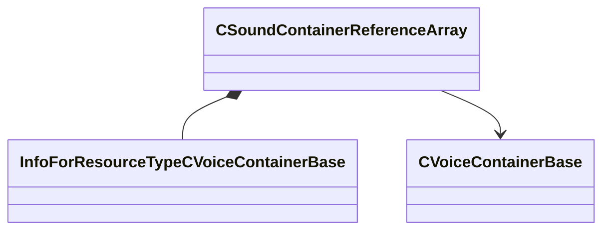

**Fields:**

| Name | Type | Annotations |
|------|------|-------------|
| `m_bUseReference` | bool | `MPropertyFriendlyName "Use Vsnd File"` |
| `m_sounds` | CUtlVector<CStrongHandle<[InfoForResourceTypeCVoiceContainerBase](../schemas/resourcesystem.md#infoforresourcetypecvoicecontainerbase)>> | `MPropertySuppressExpr "m_bUseReference == 0"` `MPropertyFriendlyName "Vsnd File"` |
| `m_pSounds` | CUtlVector<[CVoiceContainerBase](../schemas/soundsystem_voicecontainers.md#cvoicecontainerbase)*> | `MPropertySuppressExpr "m_bUseReference == 1"` `MPropertyFriendlyName "Vsnd Container"` |

### CSoundInfoHeader

**Metadata:** `MGetKV3ClassDefaults {
}`

### CVSound

**Metadata:** `MGetKV3ClassDefaults {
	"m_nRate": 0,
	"m_nFormat": "PCM16",
	"m_nChannels": 0,
	"m_nLoopStart": 0,
	"m_nSampleCount": 0,
	"m_flDuration": 0.000000,
	"m_Sentences":
	[
	],
	"m_nStreamingSize": 0,
	"m_nSeekTable":
	[
	],
	"m_nLoopEnd": 0,
	"m_encodedHeader": "[BINARY BLOB]"
}`

**Relationships:**

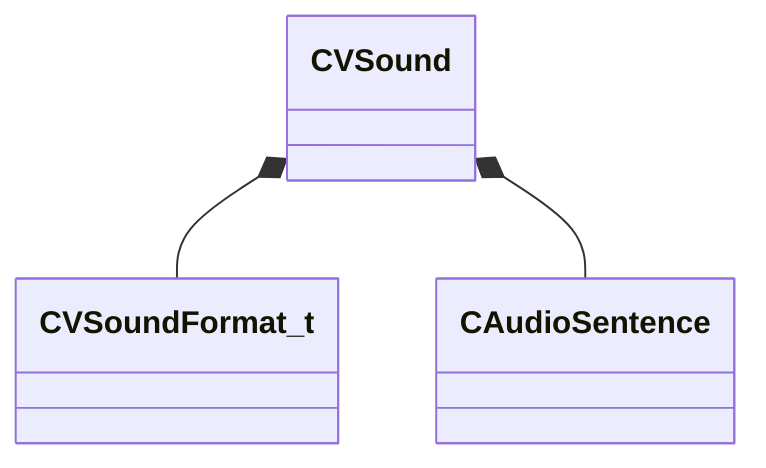

**Fields:**

| Name | Type | Annotations |
|------|------|-------------|
| `m_nRate` | int32 |  |
| `m_nFormat` | [CVSoundFormat_t](../schemas/soundsystem_voicecontainers.md#cvsoundformat_t) |  |
| `m_nChannels` | uint32 |  |
| `m_nLoopStart` | int32 |  |
| `m_nSampleCount` | uint32 |  |
| `m_flDuration` | float32 |  |
| `m_Sentences` | CUtlVector<[CAudioSentence](../schemas/soundsystem_voicecontainers.md#caudiosentence)> |  |
| `m_nStreamingSize` | uint32 |  |
| `m_nSeekTable` | CUtlVector<int32> |  |
| `m_nLoopEnd` | int32 |  |
| `m_encodedHeader` | CUtlBinaryBlock | `MFgdFromSchemaCompletelySkipField` |

### CVSoundFormat_t

**Values:**

| Name | Value | Description |
|------|-------|-------------|
| `PCM16` | 0 |  |
| `PCM8` | 1 |  |
| `MP3` | 2 |  |
| `ADPCM` | 3 |  |

### CVoiceContainerAmpedDecayingSineWave

**Inherits from:** [CVoiceContainerDecayingSineWave](soundsystem_voicecontainers.md#cvoicecontainerdecayingsinewave)

**Metadata:** `MGetKV3ClassDefaults {
	"_class": "CVoiceContainerAmpedDecayingSineWave",
	"m_vSound":
	{
		"m_nRate": 0,
		"m_nFormat": "PCM16",
		"m_nChannels": 0,
		"m_nLoopStart": 0,
		"m_nSampleCount": 0,
		"m_flDuration": 0.000000,
		"m_Sentences":
		[
		],
		"m_nStreamingSize": 0,
		"m_nSeekTable":
		[
		],
		"m_nLoopEnd": 0,
		"m_encodedHeader": "[BINARY BLOB]"
	},
	"m_pEnvelopeAnalyzer": null,
	"m_flFrequency": 0.000000,
	"m_flDecayTime": 0.000000,
	"m_flGainAmount": 0.000000
}`, `MPropertyFriendlyName "TESTBED: Amped Decaying Sine Wave Container"`, `MPropertyDescription "Bytecode instruction"`

**Relationships:**

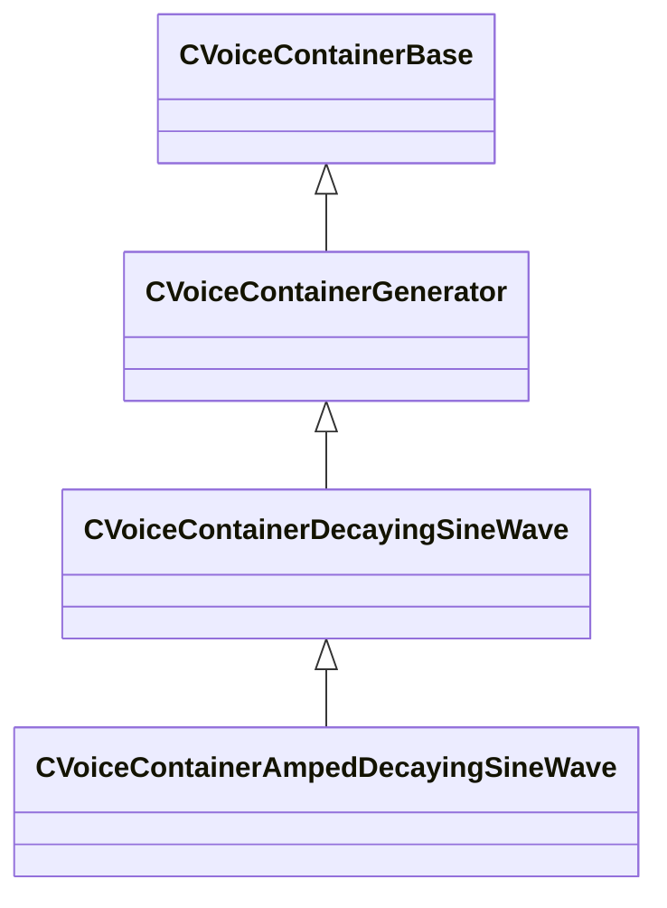

**Fields:**

| Name | Type | Annotations |
|------|------|-------------|
| `m_flGainAmount` | float32 | `MPropertyFriendlyName "Attenuation Amount (dB)"` `MPropertyDescription "The amount of attenuation ."` |

### CVoiceContainerAnalysisBase

**Derived by:** [CVoiceContainerEnvelopeAnalyzer](soundsystem_voicecontainers.md#cvoicecontainerenvelopeanalyzer)

**Metadata:** `MGetKV3ClassDefaults {
	"_class": "CVoiceContainerAnalysisBase",
	"m_bRegenerateCurveOnCompile": false,
	"m_curve":
	{
		"m_spline":
		[
		],
		"m_tangents":
		[
		],
		"m_vDomainMins":
		[
			0.000000,
			0.000000
		],
		"m_vDomainMaxs":
		[
			0.000000,
			0.000000
		]
	}
}`, `MVDataNodeType 1`, `MPropertyPolymorphicClass`, `MPropertyFriendlyName "Analysis Container"`, `MPropertyDescription "Does Not Play Sound, member of CVoiceContainerDefaultDefault"`

**Relationships:**

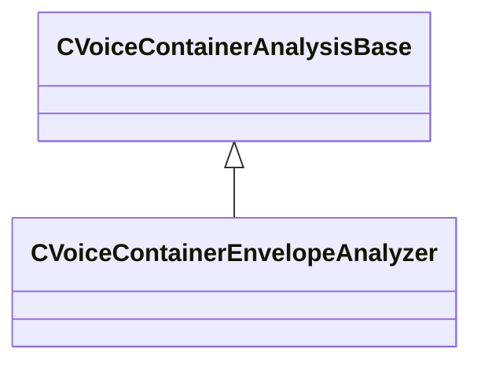

**Fields:**

| Name | Type | Annotations |
|------|------|-------------|
| `m_bRegenerateCurveOnCompile` | bool | `MPropertyFriendlyName "Regenerate curve on compile"` |
| `m_curve` | CPiecewiseCurve | `MPropertyFriendlyName "Envelope Curve"` |

### CVoiceContainerAsyncGenerator

**Inherits from:** [CVoiceContainerGenerator](soundsystem_voicecontainers.md#cvoicecontainergenerator)

**Derived by:** [CVoiceContainerGranulator](soundsystem_voicecontainers.md#cvoicecontainergranulator), [CVoiceContainerRandomSampler](soundsystem_voicecontainers.md#cvoicecontainerrandomsampler), [CVoiceContainerStaticAdditiveSynth](soundsystem_voicecontainers.md#cvoicecontainerstaticadditivesynth), [CVoiceContainerTapePlayer](soundsystem_voicecontainers.md#cvoicecontainertapeplayer)

**Metadata:** `MGetKV3ClassDefaults Could not parse KV3 Defaults`

**Relationships:**

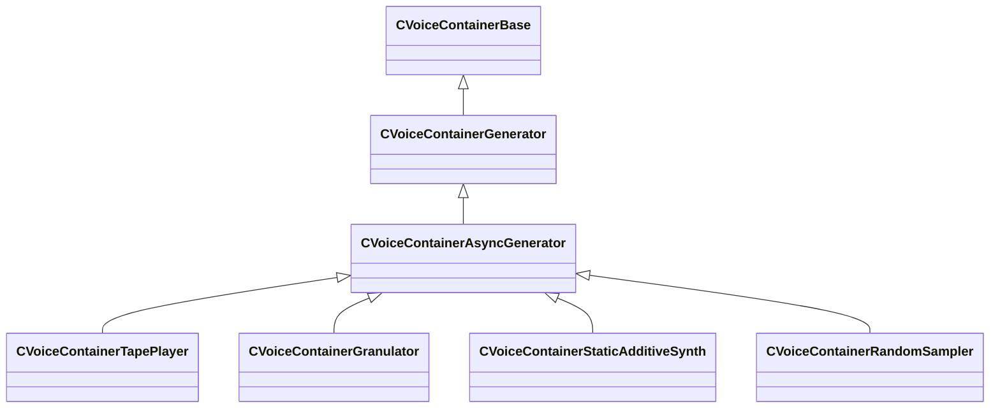

### CVoiceContainerBase

**Derived by:** [CVoiceContainerBlender](soundsystem_voicecontainers.md#cvoicecontainerblender), [CVoiceContainerDefault](soundsystem_voicecontainers.md#cvoicecontainerdefault), [CVoiceContainerEnum](soundsystem_voicecontainers.md#cvoicecontainerenum), [CVoiceContainerGenerator](soundsystem_voicecontainers.md#cvoicecontainergenerator), [CVoiceContainerLoopTrigger](soundsystem_voicecontainers.md#cvoicecontainerlooptrigger), [CVoiceContainerLoopXFade](soundsystem_voicecontainers.md#cvoicecontainerloopxfade), [CVoiceContainerMultiBlender](soundsystem_voicecontainers.md#cvoicecontainermultiblender), [CVoiceContainerParameterBlender](soundsystem_voicecontainers.md#cvoicecontainerparameterblender), [CVoiceContainerSelector](soundsystem_voicecontainers.md#cvoicecontainerselector), [CVoiceContainerSet](soundsystem_voicecontainers.md#cvoicecontainerset), [CVoiceContainerSwitch](soundsystem_voicecontainers.md#cvoicecontainerswitch)

**Metadata:** `MGetKV3ClassDefaults Could not parse KV3 Defaults`, `MVDataRoot`, `MVDataNodeType 1`, `MPropertyPolymorphicClass`, `MVDataFileExtension "vsnd"`, `MPropertyFriendlyName "VSND Container"`, `MPropertyDescription "Voice Container Base"`

**Relationships:**

```mermaid
classDiagram
    CVoiceContainerBase <|-- CVoiceContainerLoopTrigger
    CVoiceContainerBase <|-- CVoiceContainerEnum
    CVoiceContainerBase <|-- CVoiceContainerSwitch
    CVoiceContainerBase <|-- CVoiceContainerSelector
    CVoiceContainerBase <|-- CVoiceContainerMultiBlender
    CVoiceContainerBase <|-- CVoiceContainerParameterBlender
    CVoiceContainerBase <|-- CVoiceContainerSet
    CVoiceContainerBase <|-- CVoiceContainerGenerator
    CVoiceContainerBase <|-- CVoiceContainerLoopXFade
    CVoiceContainerBase <|-- CVoiceContainerDefault
    CVoiceContainerBase <|-- CVoiceContainerBlender
    CVoiceContainerBase *-- CVSound
    CVoiceContainerBase --> CVoiceContainerAnalysisBase
```

**Fields:**

| Name | Type | Annotations |
|------|------|-------------|
| `m_vSound` | [CVSound](../schemas/soundsystem_voicecontainers.md#cvsound) | `MPropertySuppressField` |
| `m_pEnvelopeAnalyzer` | [CVoiceContainerAnalysisBase](../schemas/soundsystem_voicecontainers.md#cvoicecontaineranalysisbase)* | `MPropertySuppressExpr "true"` |

### CVoiceContainerBlender

**Inherits from:** [CVoiceContainerBase](soundsystem_voicecontainers.md#cvoicecontainerbase)

**Metadata:** `MGetKV3ClassDefaults {
	"_class": "CVoiceContainerBlender",
	"m_vSound":
	{
		"m_nRate": 0,
		"m_nFormat": "PCM16",
		"m_nChannels": 0,
		"m_nLoopStart": 0,
		"m_nSampleCount": 0,
		"m_flDuration": 0.000000,
		"m_Sentences":
		[
		],
		"m_nStreamingSize": 0,
		"m_nSeekTable":
		[
		],
		"m_nLoopEnd": 0,
		"m_encodedHeader": "[BINARY BLOB]"
	},
	"m_pEnvelopeAnalyzer": null,
	"m_firstSound":
	{
		"m_namespace": "",
		"m_bUseReference": true,
		"m_sound": "",
		"m_pSound": null
	},
	"m_secondSound":
	{
		"m_namespace": "",
		"m_bUseReference": true,
		"m_sound": "",
		"m_pSound": null
	},
	"m_flBlendFactor": 0.000000
}`, `MPropertyFriendlyName "Blender"`, `MPropertyDescription "Blends two containers."`

**Relationships:**

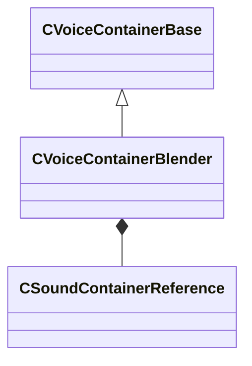

**Fields:**

| Name | Type | Annotations |
|------|------|-------------|
| `m_firstSound` | [CSoundContainerReference](../schemas/soundsystem_voicecontainers.md#csoundcontainerreference) |  |
| `m_secondSound` | [CSoundContainerReference](../schemas/soundsystem_voicecontainers.md#csoundcontainerreference) |  |
| `m_flBlendFactor` | float32 |  |

### CVoiceContainerDecayingSineWave

**Inherits from:** [CVoiceContainerGenerator](soundsystem_voicecontainers.md#cvoicecontainergenerator)

**Derived by:** [CVoiceContainerAmpedDecayingSineWave](soundsystem_voicecontainers.md#cvoicecontainerampeddecayingsinewave)

**Metadata:** `MGetKV3ClassDefaults {
	"_class": "CVoiceContainerDecayingSineWave",
	"m_vSound":
	{
		"m_nRate": 0,
		"m_nFormat": "PCM16",
		"m_nChannels": 0,
		"m_nLoopStart": 0,
		"m_nSampleCount": 0,
		"m_flDuration": 0.000000,
		"m_Sentences":
		[
		],
		"m_nStreamingSize": 0,
		"m_nSeekTable":
		[
		],
		"m_nLoopEnd": 0,
		"m_encodedHeader": "[BINARY BLOB]"
	},
	"m_pEnvelopeAnalyzer": null,
	"m_flFrequency": 0.000000,
	"m_flDecayTime": 0.000000
}`, `MPropertyFriendlyName "TESTBED: Decaying Sine Wave Container"`, `MPropertyDescription "Only text params, renders in real time"`

**Relationships:**


**Fields:**

| Name | Type | Annotations |
|------|------|-------------|
| `m_flFrequency` | float32 | `MPropertyFriendlyName "Frequency (Hz)"` `MPropertyDescription "The frequency of this sine tone."` |
| `m_flDecayTime` | float32 | `MPropertyFriendlyName "Decay Time (Seconds)"` `MPropertyDescription "The frequency of this sine tone."` |

### CVoiceContainerDefault

**Inherits from:** [CVoiceContainerBase](soundsystem_voicecontainers.md#cvoicecontainerbase)

**Derived by:** [CVoiceContainerEnvelope](soundsystem_voicecontainers.md#cvoicecontainerenvelope)

**Metadata:** `MGetKV3ClassDefaults {
	"_class": "CVoiceContainerDefault",
	"m_vSound":
	{
		"m_nRate": 0,
		"m_nFormat": "PCM16",
		"m_nChannels": 0,
		"m_nLoopStart": 0,
		"m_nSampleCount": 0,
		"m_flDuration": 0.000000,
		"m_Sentences":
		[
		],
		"m_nStreamingSize": 0,
		"m_nSeekTable":
		[
		],
		"m_nLoopEnd": 0,
		"m_encodedHeader": "[BINARY BLOB]"
	},
	"m_pEnvelopeAnalyzer": null
}`, `MPropertyFriendlyName "Default Container"`, `MPropertyDescription "Voice Container Default"`

**Relationships:**

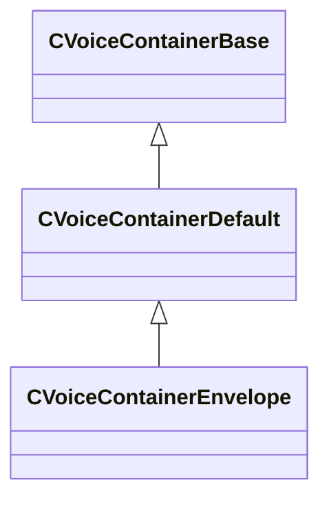

### CVoiceContainerEnum

**Inherits from:** [CVoiceContainerBase](soundsystem_voicecontainers.md#cvoicecontainerbase)

**Metadata:** `MGetKV3ClassDefaults {
	"_class": "CVoiceContainerEnum",
	"m_vSound":
	{
		"m_nRate": 0,
		"m_nFormat": "PCM16",
		"m_nChannels": 0,
		"m_nLoopStart": 0,
		"m_nSampleCount": 0,
		"m_flDuration": 0.000000,
		"m_Sentences":
		[
		],
		"m_nStreamingSize": 0,
		"m_nSeekTable":
		[
		],
		"m_nLoopEnd": 0,
		"m_encodedHeader": "[BINARY BLOB]"
	},
	"m_pEnvelopeAnalyzer": null,
	"m_soundsToPlay":
	{
		"m_bUseReference": true,
		"m_sounds":
		[
		],
		"m_pSounds":
		[
		]
	},
	"m_iSelection": 0,
	"m_flCrossfadeTime": 0.100000
}`, `MPropertyFriendlyName "VSND Enum"`, `MPropertyDescription "Switches between a selection of vsnds based on a provided index."`

**Relationships:**

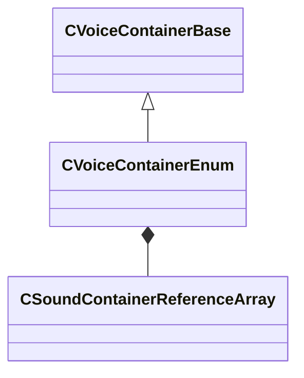

**Fields:**

| Name | Type | Annotations |
|------|------|-------------|
| `m_soundsToPlay` | [CSoundContainerReferenceArray](../schemas/soundsystem_voicecontainers.md#csoundcontainerreferencearray) | `MPropertyFriendlyName "Sounds To Play"` |
| `m_iSelection` | int32 | `MPropertyFriendlyName "Index"` |
| `m_flCrossfadeTime` | float32 | `MPropertyFriendlyName "Crossfade Time"` |

### CVoiceContainerEnvelope

**Inherits from:** [CVoiceContainerDefault](soundsystem_voicecontainers.md#cvoicecontainerdefault)

**Metadata:** `MGetKV3ClassDefaults {
	"_class": "CVoiceContainerEnvelope",
	"m_vSound":
	{
		"m_nRate": 0,
		"m_nFormat": "PCM16",
		"m_nChannels": 0,
		"m_nLoopStart": 0,
		"m_nSampleCount": 0,
		"m_flDuration": 0.000000,
		"m_Sentences":
		[
		],
		"m_nStreamingSize": 0,
		"m_nSeekTable":
		[
		],
		"m_nLoopEnd": 0,
		"m_encodedHeader": "[BINARY BLOB]"
	},
	"m_pEnvelopeAnalyzer": null,
	"m_sound": "",
	"m_analysisContainer": null
}`, `MPropertyFriendlyName "Envelope VSND"`, `MPropertyDescription "Plays sound with envelope."`

**Relationships:**

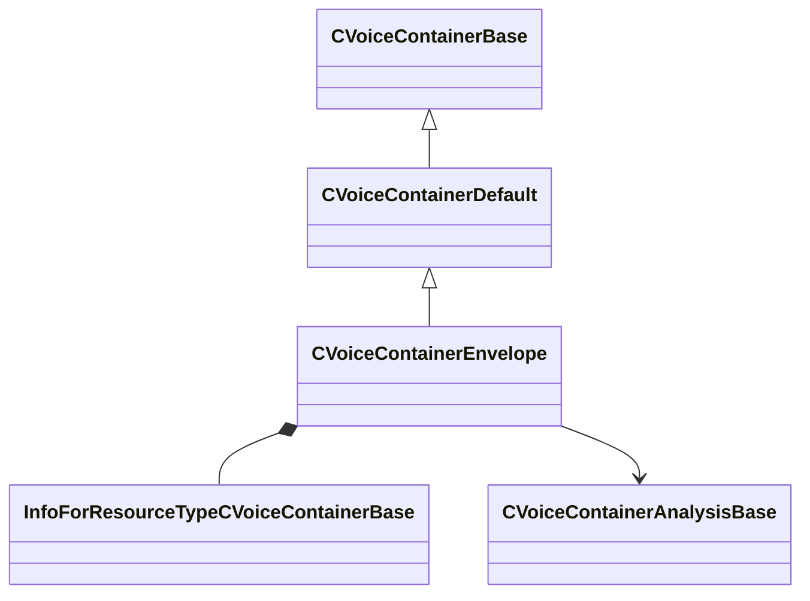

**Fields:**

| Name | Type | Annotations |
|------|------|-------------|
| `m_sound` | CStrongHandle<[InfoForResourceTypeCVoiceContainerBase](../schemas/resourcesystem.md#infoforresourcetypecvoicecontainerbase)> | `MPropertyFriendlyName "Vsnd File"` |
| `m_analysisContainer` | [CVoiceContainerAnalysisBase](../schemas/soundsystem_voicecontainers.md#cvoicecontaineranalysisbase)* | `MPropertyFriendlyName "Container Analyzers"` |

### CVoiceContainerEnvelopeAnalyzer

**Inherits from:** [CVoiceContainerAnalysisBase](soundsystem_voicecontainers.md#cvoicecontaineranalysisbase)

**Metadata:** `MGetKV3ClassDefaults {
	"_class": "CVoiceContainerEnvelopeAnalyzer",
	"m_bRegenerateCurveOnCompile": false,
	"m_curve":
	{
		"m_spline":
		[
		],
		"m_tangents":
		[
		],
		"m_vDomainMins":
		[
			0.000000,
			0.000000
		],
		"m_vDomainMaxs":
		[
			0.000000,
			0.000000
		]
	},
	"m_mode": "Peak",
	"m_fAnalysisWindowMs": 200.000000,
	"m_flThreshold": 0.000000
}`, `MPropertyFriendlyName "Envelope Analyzer"`, `MPropertyDescription "Generates an Envelope Curve on compile"`

**Relationships:**

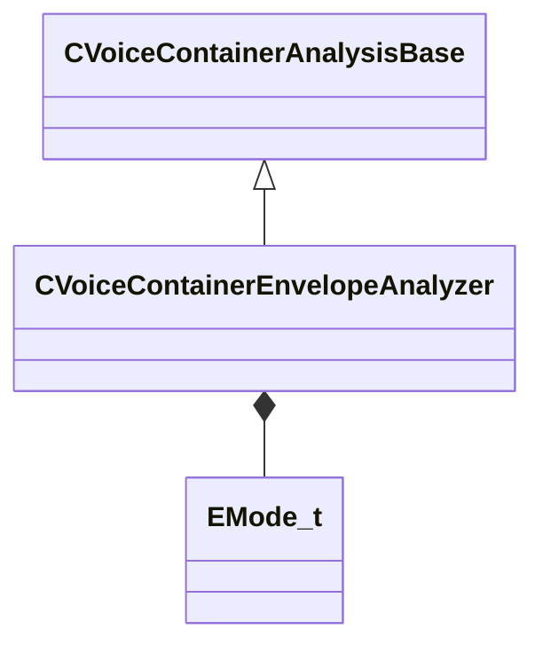

**Fields:**

| Name | Type | Annotations |
|------|------|-------------|
| `m_mode` | [EMode_t](../schemas/soundsystem_voicecontainers.md#emode_t) | `MPropertyFriendlyName "Envelope Mode"` |
| `m_fAnalysisWindowMs` | float32 | `MPropertyFriendlyName "Analysis Window"` |
| `m_flThreshold` | float32 | `MPropertyFriendlyName "Threshold"` |

### CVoiceContainerGenerator

**Inherits from:** [CVoiceContainerBase](soundsystem_voicecontainers.md#cvoicecontainerbase)

**Derived by:** [CVoiceContainerAsyncGenerator](soundsystem_voicecontainers.md#cvoicecontainerasyncgenerator), [CVoiceContainerDecayingSineWave](soundsystem_voicecontainers.md#cvoicecontainerdecayingsinewave), [CVoiceContainerNull](soundsystem_voicecontainers.md#cvoicecontainernull), [CVoiceContainerRealtimeFMSineWave](soundsystem_voicecontainers.md#cvoicecontainerrealtimefmsinewave), [CVoiceContainerShapedNoise](soundsystem_voicecontainers.md#cvoicecontainershapednoise)

**Metadata:** `MGetKV3ClassDefaults Could not parse KV3 Defaults`

**Relationships:**

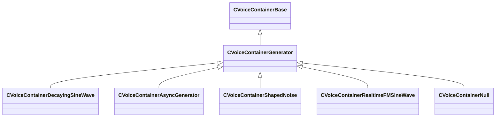

### CVoiceContainerGranulator

**Inherits from:** [CVoiceContainerAsyncGenerator](soundsystem_voicecontainers.md#cvoicecontainerasyncgenerator)

**Metadata:** `MGetKV3ClassDefaults {
	"_class": "CVoiceContainerGranulator",
	"m_vSound":
	{
		"m_nRate": 0,
		"m_nFormat": "PCM16",
		"m_nChannels": 0,
		"m_nLoopStart": 0,
		"m_nSampleCount": 0,
		"m_flDuration": 0.000000,
		"m_Sentences":
		[
		],
		"m_nStreamingSize": 0,
		"m_nSeekTable":
		[
		],
		"m_nLoopEnd": 0,
		"m_encodedHeader": "[BINARY BLOB]"
	},
	"m_pEnvelopeAnalyzer": null,
	"m_flGrainLength": 0.100000,
	"m_flGrainCrossfadeAmount": 0.100000,
	"m_flStartJitter": 0.000000,
	"m_flPlaybackJitter": 0.000000,
	"m_bShouldWraparound": false,
	"m_sourceAudio": ""
}`, `MPropertyFriendlyName "Granulator Container"`

**Relationships:**

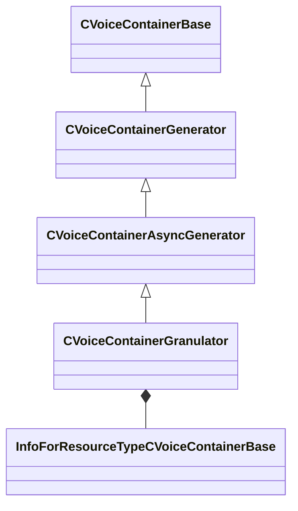

**Fields:**

| Name | Type | Annotations |
|------|------|-------------|
| `m_flGrainLength` | float32 |  |
| `m_flGrainCrossfadeAmount` | float32 |  |
| `m_flStartJitter` | float32 |  |
| `m_flPlaybackJitter` | float32 |  |
| `m_bShouldWraparound` | bool |  |
| `m_sourceAudio` | CStrongHandle<[InfoForResourceTypeCVoiceContainerBase](../schemas/resourcesystem.md#infoforresourcetypecvoicecontainerbase)> |  |

### CVoiceContainerLoopTrigger

**Inherits from:** [CVoiceContainerBase](soundsystem_voicecontainers.md#cvoicecontainerbase)

**Metadata:** `MGetKV3ClassDefaults {
	"_class": "CVoiceContainerLoopTrigger",
	"m_vSound":
	{
		"m_nRate": 0,
		"m_nFormat": "PCM16",
		"m_nChannels": 0,
		"m_nLoopStart": 0,
		"m_nSampleCount": 0,
		"m_flDuration": 0.000000,
		"m_Sentences":
		[
		],
		"m_nStreamingSize": 0,
		"m_nSeekTable":
		[
		],
		"m_nLoopEnd": 0,
		"m_encodedHeader": "[BINARY BLOB]"
	},
	"m_pEnvelopeAnalyzer": null,
	"m_sound":
	{
		"m_namespace": "",
		"m_bUseReference": true,
		"m_sound": "",
		"m_pSound": null
	},
	"m_flRetriggerTimeMin": 1.000000,
	"m_flRetriggerTimeMax": 1.000000,
	"m_flFadeTime": 0.500000,
	"m_bCrossFade": false
}`, `MPropertyFriendlyName "LoopTrigger"`, `MPropertyDescription "Continuously retriggers a sound and optionally fades to the new instance."`

**Relationships:**

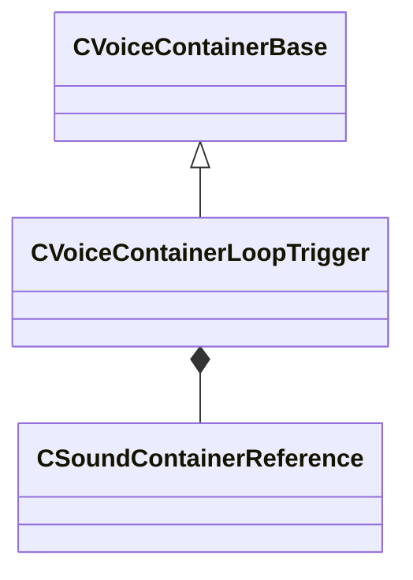

**Fields:**

| Name | Type | Annotations |
|------|------|-------------|
| `m_sound` | [CSoundContainerReference](../schemas/soundsystem_voicecontainers.md#csoundcontainerreference) | `MPropertyFriendlyName "Vsnd Reference"` |
| `m_flRetriggerTimeMin` | float32 |  |
| `m_flRetriggerTimeMax` | float32 |  |
| `m_flFadeTime` | float32 |  |
| `m_bCrossFade` | bool |  |

### CVoiceContainerLoopXFade

**Inherits from:** [CVoiceContainerBase](soundsystem_voicecontainers.md#cvoicecontainerbase)

**Metadata:** `MGetKV3ClassDefaults {
	"_class": "CVoiceContainerLoopXFade",
	"m_vSound":
	{
		"m_nRate": 0,
		"m_nFormat": "PCM16",
		"m_nChannels": 0,
		"m_nLoopStart": 0,
		"m_nSampleCount": 0,
		"m_flDuration": 0.000000,
		"m_Sentences":
		[
		],
		"m_nStreamingSize": 0,
		"m_nSeekTable":
		[
		],
		"m_nLoopEnd": 0,
		"m_encodedHeader": "[BINARY BLOB]"
	},
	"m_pEnvelopeAnalyzer": null,
	"m_sound":
	{
		"m_namespace": "",
		"m_bUseReference": true,
		"m_sound": "",
		"m_pSound": null
	},
	"m_flLoopEnd": 0.000000,
	"m_flLoopStart": 0.000000,
	"m_flFadeOut": 0.000000,
	"m_flFadeIn": 0.000000,
	"m_bPlayHead": false,
	"m_bPlayTail": false,
	"m_bEqualPow": false
}`, `MPropertyFriendlyName "Loop XFade"`, `MPropertyDescription "Sample accurate looping with xfade capabilities."`

**Relationships:**

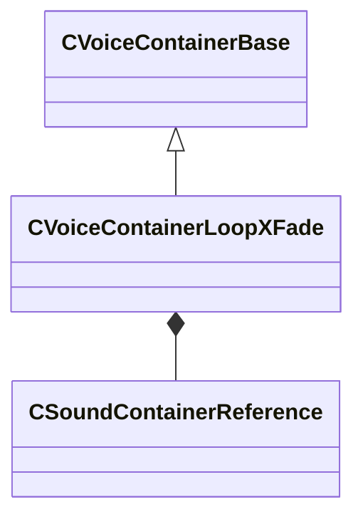

**Fields:**

| Name | Type | Annotations |
|------|------|-------------|
| `m_sound` | [CSoundContainerReference](../schemas/soundsystem_voicecontainers.md#csoundcontainerreference) | `MPropertyFriendlyName "Vsnd Reference"` |
| `m_flLoopEnd` | float32 |  |
| `m_flLoopStart` | float32 |  |
| `m_flFadeOut` | float32 |  |
| `m_flFadeIn` | float32 |  |
| `m_bPlayHead` | bool |  |
| `m_bPlayTail` | bool |  |
| `m_bEqualPow` | bool |  |

### CVoiceContainerMultiBlender

**Inherits from:** [CVoiceContainerBase](soundsystem_voicecontainers.md#cvoicecontainerbase)

**Metadata:** `MGetKV3ClassDefaults {
	"_class": "CVoiceContainerMultiBlender",
	"m_vSound":
	{
		"m_nRate": 0,
		"m_nFormat": "PCM16",
		"m_nChannels": 0,
		"m_nLoopStart": 0,
		"m_nSampleCount": 0,
		"m_flDuration": 0.000000,
		"m_Sentences":
		[
		],
		"m_nStreamingSize": 0,
		"m_nSeekTable":
		[
		],
		"m_nLoopEnd": 0,
		"m_encodedHeader": "[BINARY BLOB]"
	},
	"m_pEnvelopeAnalyzer": null,
	"m_soundsToPlay":
	{
		"m_bUseReference": true,
		"m_sounds":
		[
		],
		"m_pSounds":
		[
		]
	},
	"m_flBlendFactor": 0.000000,
	"m_flCrossover": 1.000000
}`, `MPropertyFriendlyName "Multi Blender"`, `MPropertyDescription "Blends any number of containers"`

**Relationships:**

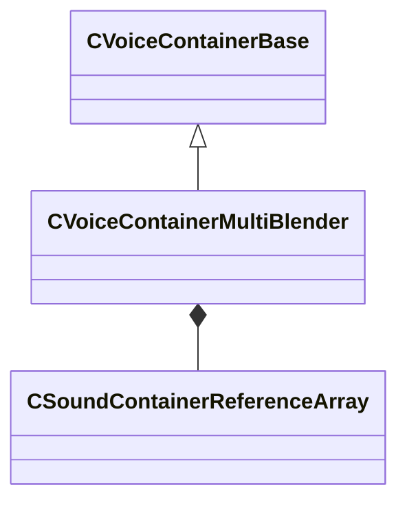

**Fields:**

| Name | Type | Annotations |
|------|------|-------------|
| `m_soundsToPlay` | [CSoundContainerReferenceArray](../schemas/soundsystem_voicecontainers.md#csoundcontainerreferencearray) | `MPropertyFriendlyName "Sounds To Blend"` |
| `m_flBlendFactor` | float32 | `MPropertyFriendlyName "Blend Amount (0.0 = 100% first sound, 1.0 = 100% last sound)"` |
| `m_flCrossover` | float32 | `MPropertyFriendlyName "Crossfade Amount (0.0 = no crossfade, 1.0 = constant crossfading)"` |

### CVoiceContainerNull

**Inherits from:** [CVoiceContainerGenerator](soundsystem_voicecontainers.md#cvoicecontainergenerator)

**Metadata:** `MGetKV3ClassDefaults {
	"_class": "CVoiceContainerNull",
	"m_vSound":
	{
		"m_nRate": 0,
		"m_nFormat": "PCM16",
		"m_nChannels": 0,
		"m_nLoopStart": 0,
		"m_nSampleCount": 0,
		"m_flDuration": 0.000000,
		"m_Sentences":
		[
		],
		"m_nStreamingSize": 0,
		"m_nSeekTable":
		[
		],
		"m_nLoopEnd": 0,
		"m_encodedHeader": "[BINARY BLOB]"
	},
	"m_pEnvelopeAnalyzer": null
}`, `MPropertyFriendlyName "Null Container"`, `MPropertyDescription "Plays a single channel of silence."`

**Relationships:**

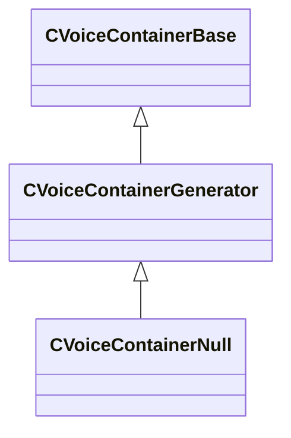

### CVoiceContainerParameterBlender

**Inherits from:** [CVoiceContainerBase](soundsystem_voicecontainers.md#cvoicecontainerbase)

**Metadata:** `MGetKV3ClassDefaults {
	"_class": "CVoiceContainerParameterBlender",
	"m_vSound":
	{
		"m_nRate": 0,
		"m_nFormat": "PCM16",
		"m_nChannels": 0,
		"m_nLoopStart": 0,
		"m_nSampleCount": 0,
		"m_flDuration": 0.000000,
		"m_Sentences":
		[
		],
		"m_nStreamingSize": 0,
		"m_nSeekTable":
		[
		],
		"m_nLoopEnd": 0,
		"m_encodedHeader": "[BINARY BLOB]"
	},
	"m_pEnvelopeAnalyzer": null,
	"m_firstSound":
	{
		"m_namespace": "",
		"m_bUseReference": true,
		"m_sound": "",
		"m_pSound": null
	},
	"m_secondSound":
	{
		"m_namespace": "",
		"m_bUseReference": true,
		"m_sound": "",
		"m_pSound": null
	},
	"m_bEnableOcclusionBlend": false,
	"m_curve1":
	{
		"m_spline":
		[
		],
		"m_tangents":
		[
		],
		"m_vDomainMins":
		[
			0.000000,
			0.000000
		],
		"m_vDomainMaxs":
		[
			0.000000,
			0.000000
		]
	},
	"m_curve2":
	{
		"m_spline":
		[
		],
		"m_tangents":
		[
		],
		"m_vDomainMins":
		[
			0.000000,
			0.000000
		],
		"m_vDomainMaxs":
		[
			0.000000,
			0.000000
		]
	},
	"m_bEnableDistanceBlend": false,
	"m_curve3":
	{
		"m_spline":
		[
		],
		"m_tangents":
		[
		],
		"m_vDomainMins":
		[
			0.000000,
			0.000000
		],
		"m_vDomainMaxs":
		[
			0.000000,
			0.000000
		]
	},
	"m_curve4":
	{
		"m_spline":
		[
		],
		"m_tangents":
		[
		],
		"m_vDomainMins":
		[
			0.000000,
			0.000000
		],
		"m_vDomainMaxs":
		[
			0.000000,
			0.000000
		]
	}
}`, `MPropertyFriendlyName "Parameter Blender"`, `MPropertyDescription "Blends two containers according to parameter curves."`

**Relationships:**

```mermaid
classDiagram
    CVoiceContainerBase <|-- CVoiceContainerParameterBlender
    CVoiceContainerParameterBlender *-- CSoundContainerReference
```

**Fields:**

| Name | Type | Annotations |
|------|------|-------------|
| `m_firstSound` | [CSoundContainerReference](../schemas/soundsystem_voicecontainers.md#csoundcontainerreference) | `MPropertyFriendlyName "First Sound"` |
| `m_secondSound` | [CSoundContainerReference](../schemas/soundsystem_voicecontainers.md#csoundcontainerreference) | `MPropertyFriendlyName "Second Sound"` |
| `m_bEnableOcclusionBlend` | bool | `MPropertyStartGroup "Occlusion"` `MPropertyFriendlyName "Enable Occlusion Blend"` |
| `m_curve1` | CPiecewiseCurve | `MPropertySuppressExpr "m_bEnableOcclusionBlend == false"` `MPropertyFriendlyName "First Curve"` |
| `m_curve2` | CPiecewiseCurve | `MPropertySuppressExpr "m_bEnableOcclusionBlend == false"` `MPropertyFriendlyName "Second Curve"` |
| `m_bEnableDistanceBlend` | bool | `MPropertyStartGroup "Distance"` `MPropertyFriendlyName "Enable Distance Blend"` |
| `m_curve3` | CPiecewiseCurve | `MPropertySuppressExpr "m_bEnableDistanceBlend == false"` `MPropertyFriendlyName "First Curve"` |
| `m_curve4` | CPiecewiseCurve | `MPropertySuppressExpr "m_bEnableDistanceBlend == false"` `MPropertyFriendlyName "Second Curve"` |

### CVoiceContainerRandomSampler

**Inherits from:** [CVoiceContainerAsyncGenerator](soundsystem_voicecontainers.md#cvoicecontainerasyncgenerator)

**Metadata:** `MGetKV3ClassDefaults {
	"_class": "CVoiceContainerRandomSampler",
	"m_vSound":
	{
		"m_nRate": 0,
		"m_nFormat": "PCM16",
		"m_nChannels": 0,
		"m_nLoopStart": 0,
		"m_nSampleCount": 0,
		"m_flDuration": 0.000000,
		"m_Sentences":
		[
		],
		"m_nStreamingSize": 0,
		"m_nSeekTable":
		[
		],
		"m_nLoopEnd": 0,
		"m_encodedHeader": "[BINARY BLOB]"
	},
	"m_pEnvelopeAnalyzer": null,
	"m_flAmplitude": 0.800000,
	"m_flAmplitudeJitter": 0.100000,
	"m_flTimeJitter": 0.200000,
	"m_flMaxLength": -1.000000,
	"m_nNumDelayVariations": 0,
	"m_grainResources":
	[
	]
}`, `MPropertyFriendlyName "Random Smapler Container"`, `MPropertyDescription "Trash Synth"`

**Relationships:**

```mermaid
classDiagram
    CVoiceContainerAsyncGenerator <|-- CVoiceContainerRandomSampler
    CVoiceContainerGenerator <|-- CVoiceContainerAsyncGenerator
    CVoiceContainerBase <|-- CVoiceContainerGenerator
    CVoiceContainerRandomSampler *-- InfoForResourceTypeCVoiceContainerBase
```

**Fields:**

| Name | Type | Annotations |
|------|------|-------------|
| `m_flAmplitude` | float32 |  |
| `m_flAmplitudeJitter` | float32 |  |
| `m_flTimeJitter` | float32 |  |
| `m_flMaxLength` | float32 |  |
| `m_nNumDelayVariations` | int32 |  |
| `m_grainResources` | CUtlVector<CStrongHandle<[InfoForResourceTypeCVoiceContainerBase](../schemas/resourcesystem.md#infoforresourcetypecvoicecontainerbase)>> |  |

### CVoiceContainerRealtimeFMSineWave

**Inherits from:** [CVoiceContainerGenerator](soundsystem_voicecontainers.md#cvoicecontainergenerator)

**Metadata:** `MGetKV3ClassDefaults {
	"_class": "CVoiceContainerRealtimeFMSineWave",
	"m_vSound":
	{
		"m_nRate": 0,
		"m_nFormat": "PCM16",
		"m_nChannels": 0,
		"m_nLoopStart": 0,
		"m_nSampleCount": 0,
		"m_flDuration": 0.000000,
		"m_Sentences":
		[
		],
		"m_nStreamingSize": 0,
		"m_nSeekTable":
		[
		],
		"m_nLoopEnd": 0,
		"m_encodedHeader": "[BINARY BLOB]"
	},
	"m_pEnvelopeAnalyzer": null,
	"m_flCarrierFrequency": 0.000000,
	"m_flModulatorFrequency": 0.000000,
	"m_flModulatorAmount": 0.000000
}`, `MPropertyFriendlyName "TESTBED: FM Synth Container"`, `MPropertyDescription "Real time FM Synthesis"`

**Relationships:**

```mermaid
classDiagram
    CVoiceContainerGenerator <|-- CVoiceContainerRealtimeFMSineWave
    CVoiceContainerBase <|-- CVoiceContainerGenerator
```

**Fields:**

| Name | Type | Annotations |
|------|------|-------------|
| `m_flCarrierFrequency` | float32 | `MPropertyFriendlyName "Frequency (Hz)"` `MPropertyDescription "The frequency of this sine tone."` |
| `m_flModulatorFrequency` | float32 | `MPropertyFriendlyName "Mod Frequency (Hz)"` `MPropertyDescription "The frequency of the sine tone modulating this sine tone."` |
| `m_flModulatorAmount` | float32 | `MPropertyFriendlyName "Mod Amount (Hz)"` `MPropertyDescription "The amount the modulating sine tone modulates this sine tone."` |

### CVoiceContainerSelector

**Inherits from:** [CVoiceContainerBase](soundsystem_voicecontainers.md#cvoicecontainerbase)

**Metadata:** `MGetKV3ClassDefaults {
	"_class": "CVoiceContainerSelector",
	"m_vSound":
	{
		"m_nRate": 0,
		"m_nFormat": "PCM16",
		"m_nChannels": 0,
		"m_nLoopStart": 0,
		"m_nSampleCount": 0,
		"m_flDuration": 0.000000,
		"m_Sentences":
		[
		],
		"m_nStreamingSize": 0,
		"m_nSeekTable":
		[
		],
		"m_nLoopEnd": 0,
		"m_encodedHeader": "[BINARY BLOB]"
	},
	"m_pEnvelopeAnalyzer": null,
	"m_mode": "Random",
	"m_soundsToPlay":
	{
		"m_bUseReference": true,
		"m_sounds":
		[
		],
		"m_pSounds":
		[
		]
	},
	"m_fProbabilityWeights":
	[
	]
}`, `MPropertyFriendlyName "Selector"`, `MPropertyDescription "Plays a selected vsnd on playback."`

**Relationships:**

```mermaid
classDiagram
    CVoiceContainerBase <|-- CVoiceContainerSelector
    CVoiceContainerSelector *-- PlayBackMode_t
    CVoiceContainerSelector *-- CSoundContainerReferenceArray
```

**Fields:**

| Name | Type | Annotations |
|------|------|-------------|
| `m_mode` | [PlayBackMode_t](../schemas/soundsystem_voicecontainers.md#playbackmode_t) | `MPropertyFriendlyName "Playback Mode"` |
| `m_soundsToPlay` | [CSoundContainerReferenceArray](../schemas/soundsystem_voicecontainers.md#csoundcontainerreferencearray) | `MPropertyFriendlyName "Sounds To play"` |
| `m_fProbabilityWeights` | CUtlVector<float32> | `MPropertyFriendlyName "Relative Weights"` |

### CVoiceContainerSet

**Inherits from:** [CVoiceContainerBase](soundsystem_voicecontainers.md#cvoicecontainerbase)

**Metadata:** `MGetKV3ClassDefaults {
	"_class": "CVoiceContainerSet",
	"m_vSound":
	{
		"m_nRate": 0,
		"m_nFormat": "PCM16",
		"m_nChannels": 0,
		"m_nLoopStart": 0,
		"m_nSampleCount": 0,
		"m_flDuration": 0.000000,
		"m_Sentences":
		[
		],
		"m_nStreamingSize": 0,
		"m_nSeekTable":
		[
		],
		"m_nLoopEnd": 0,
		"m_encodedHeader": "[BINARY BLOB]"
	},
	"m_pEnvelopeAnalyzer": null,
	"m_soundsToPlay":
	[
	]
}`, `MPropertyFriendlyName "Container Set"`, `MPropertyDescription "An array of containers that are played all at once."`

**Relationships:**

```mermaid
classDiagram
    CVoiceContainerBase <|-- CVoiceContainerSet
    CVoiceContainerSet *-- CVoiceContainerSetElement
```

**Fields:**

| Name | Type | Annotations |
|------|------|-------------|
| `m_soundsToPlay` | CUtlVector<[CVoiceContainerSetElement](../schemas/soundsystem_voicecontainers.md#cvoicecontainersetelement)> | `MPropertyFriendlyName "Container List"` |

### CVoiceContainerSetElement

**Metadata:** `MGetKV3ClassDefaults {
	"m_sound":
	{
		"m_namespace": "",
		"m_bUseReference": true,
		"m_sound": "",
		"m_pSound": null
	},
	"m_flVolumeDB": 0.000000
}`

**Relationships:**

```mermaid
classDiagram
    CVoiceContainerSetElement *-- CSoundContainerReference
```

**Fields:**

| Name | Type | Annotations |
|------|------|-------------|
| `m_sound` | [CSoundContainerReference](../schemas/soundsystem_voicecontainers.md#csoundcontainerreference) |  |
| `m_flVolumeDB` | float32 | `MPropertyFriendlyName "Volume (in Decibels)"` |

### CVoiceContainerShapedNoise

**Inherits from:** [CVoiceContainerGenerator](soundsystem_voicecontainers.md#cvoicecontainergenerator)

**Metadata:** `MGetKV3ClassDefaults {
	"_class": "CVoiceContainerShapedNoise",
	"m_vSound":
	{
		"m_nRate": 0,
		"m_nFormat": "PCM16",
		"m_nChannels": 0,
		"m_nLoopStart": 0,
		"m_nSampleCount": 0,
		"m_flDuration": 0.000000,
		"m_Sentences":
		[
		],
		"m_nStreamingSize": 0,
		"m_nSeekTable":
		[
		],
		"m_nLoopEnd": 0,
		"m_encodedHeader": "[BINARY BLOB]"
	},
	"m_pEnvelopeAnalyzer": null,
	"m_bUseCurveForFrequency": false,
	"m_flFrequency": 440.000000,
	"m_frequencySweep":
	{
		"m_spline":
		[
		],
		"m_tangents":
		[
		],
		"m_vDomainMins":
		[
			0.000000,
			0.000000
		],
		"m_vDomainMaxs":
		[
			0.000000,
			0.000000
		]
	},
	"m_bUseCurveForResonance": false,
	"m_flResonance": 4.000000,
	"m_resonanceSweep":
	{
		"m_spline":
		[
		],
		"m_tangents":
		[
		],
		"m_vDomainMins":
		[
			0.000000,
			0.000000
		],
		"m_vDomainMaxs":
		[
			0.000000,
			0.000000
		]
	},
	"m_bUseCurveForAmplitude": false,
	"m_flGainInDecibels": 1.000000,
	"m_gainSweep":
	{
		"m_spline":
		[
		],
		"m_tangents":
		[
		],
		"m_vDomainMins":
		[
			0.000000,
			0.000000
		],
		"m_vDomainMaxs":
		[
			0.000000,
			0.000000
		]
	}
}`, `MPropertyFriendlyName "Wind Generator Container"`, `MPropertyDescription "This is a synth meant to generate whoosh noises."`

**Relationships:**

```mermaid
classDiagram
    CVoiceContainerGenerator <|-- CVoiceContainerShapedNoise
    CVoiceContainerBase <|-- CVoiceContainerGenerator
```

**Fields:**

| Name | Type | Annotations |
|------|------|-------------|
| `m_bUseCurveForFrequency` | bool |  |
| `m_flFrequency` | float32 | `MPropertySuppressExpr "m_bUseCurveForFrequency == 1"` |
| `m_frequencySweep` | CPiecewiseCurve | `MPropertySuppressExpr "m_bUseCurveForFrequency == 0"` `MPropertyFriendlyName "Frequency Sweep"` |
| `m_bUseCurveForResonance` | bool |  |
| `m_flResonance` | float32 | `MPropertySuppressExpr "m_bUseCurveForResonance == 1"` |
| `m_resonanceSweep` | CPiecewiseCurve | `MPropertySuppressExpr "m_bUseCurveForResonance == 0"` `MPropertyFriendlyName "Resonance Sweep"` |
| `m_bUseCurveForAmplitude` | bool |  |
| `m_flGainInDecibels` | float32 | `MPropertySuppressExpr "m_bUseCurveForAmplitude == 1"` |
| `m_gainSweep` | CPiecewiseCurve | `MPropertySuppressExpr "m_bUseCurveForAmplitude == 0"` `MPropertyFriendlyName "Gain Sweep (in Decibels)"` |

### CVoiceContainerStaticAdditiveSynth

**Inherits from:** [CVoiceContainerAsyncGenerator](soundsystem_voicecontainers.md#cvoicecontainerasyncgenerator)

**Metadata:** `MGetKV3ClassDefaults {
	"_class": "CVoiceContainerStaticAdditiveSynth",
	"m_vSound":
	{
		"m_nRate": 0,
		"m_nFormat": "PCM16",
		"m_nChannels": 0,
		"m_nLoopStart": 0,
		"m_nSampleCount": 0,
		"m_flDuration": 0.000000,
		"m_Sentences":
		[
		],
		"m_nStreamingSize": 0,
		"m_nSeekTable":
		[
		],
		"m_nLoopEnd": 0,
		"m_encodedHeader": "[BINARY BLOB]"
	},
	"m_pEnvelopeAnalyzer": null,
	"m_tones":
	[
	]
}`, `MPropertyFriendlyName "Additive Synth Container"`, `MPropertyDescription "This is a static additive synth that can scale components of the synth based on how many instances are running."`

**Relationships:**

```mermaid
classDiagram
    CVoiceContainerAsyncGenerator <|-- CVoiceContainerStaticAdditiveSynth
    CVoiceContainerGenerator <|-- CVoiceContainerAsyncGenerator
    CVoiceContainerBase <|-- CVoiceContainerGenerator
```

**Fields:**

| Name | Type | Annotations |
|------|------|-------------|
| `m_tones` | CUtlVector<[CVoiceContainerStaticAdditiveSynth](../schemas/soundsystem_voicecontainers.md#cvoicecontainerstaticadditivesynth)::CTone> |  |

### CVoiceContainerStaticAdditiveSynth::CGainScalePerInstance

**Metadata:** `MGetKV3ClassDefaults {
	"m_flMinVolume": 1.000000,
	"m_nInstancesAtMinVolume": 1,
	"m_flMaxVolume": 1.000000,
	"m_nInstancesAtMaxVolume": 1
}`

**Fields:**

| Name | Type | Annotations |
|------|------|-------------|
| `m_flMinVolume` | float32 | `MPropertyFriendlyName "Quietest Volume"` |
| `m_nInstancesAtMinVolume` | int32 | `MPropertyFriendlyName "# Instances Playing Until We Get Louder Than Quietest Volume"` |
| `m_flMaxVolume` | float32 | `MPropertyFriendlyName "Loudest Volume"` |
| `m_nInstancesAtMaxVolume` | int32 | `MPropertyFriendlyName "# Instances Playing Required To Reach Loudest Volume"` |

### CVoiceContainerStaticAdditiveSynth::CHarmonic

**Metadata:** `MGetKV3ClassDefaults {
	"m_nWaveform": "Sine",
	"m_nFundamental": "A",
	"m_nOctave": 4,
	"m_flCents": 0.000000,
	"m_flPhase": 0.000000,
	"m_curve":
	{
		"m_spline":
		[
		],
		"m_tangents":
		[
		],
		"m_vDomainMins":
		[
			0.000000,
			0.000000
		],
		"m_vDomainMaxs":
		[
			0.000000,
			0.000000
		]
	},
	"m_volumeScaling":
	{
		"m_flMinVolume": 1.000000,
		"m_nInstancesAtMinVolume": 1,
		"m_flMaxVolume": 1.000000,
		"m_nInstancesAtMaxVolume": 1
	}
}`

**Relationships:**

```mermaid
classDiagram
    "CVoiceContainerStaticAdditiveSynth::CHarmonic" *-- EWaveform
    "CVoiceContainerStaticAdditiveSynth::CHarmonic" *-- EMidiNote
    "CVoiceContainerStaticAdditiveSynth::CHarmonic" *-- CVoiceContainerStaticAdditiveSynth
```

**Fields:**

| Name | Type | Annotations |
|------|------|-------------|
| `m_nWaveform` | [EWaveform](../schemas/soundsystem_voicecontainers.md#ewaveform) | `MPropertyFriendlyName "Waveform"` |
| `m_nFundamental` | [EMidiNote](../schemas/soundsystem_voicecontainers.md#emidinote) | `MPropertyFriendlyName "Note"` |
| `m_nOctave` | int32 | `MPropertyFriendlyName "Octave"` |
| `m_flCents` | float32 | `MPropertyFriendlyName "Cents To Detune ( -100:100 )"` |
| `m_flPhase` | float32 | `MPropertyFriendlyName "Phase ( 0 - 1 )"` |
| `m_curve` | CPiecewiseCurve | `MPropertyFriendlyName "Envelope (Relative to Tone Envelope)"` |
| `m_volumeScaling` | [CVoiceContainerStaticAdditiveSynth](../schemas/soundsystem_voicecontainers.md#cvoicecontainerstaticadditivesynth)::CGainScalePerInstance |  |

### CVoiceContainerStaticAdditiveSynth::CTone

**Metadata:** `MGetKV3ClassDefaults {
	"m_harmonics":
	[
	],
	"m_curve":
	{
		"m_spline":
		[
		],
		"m_tangents":
		[
		],
		"m_vDomainMins":
		[
			0.000000,
			0.000000
		],
		"m_vDomainMaxs":
		[
			0.000000,
			0.000000
		]
	},
	"m_bSyncInstances": false
}`

**Relationships:**

```mermaid
classDiagram
    "CVoiceContainerStaticAdditiveSynth::CTone" *-- CVoiceContainerStaticAdditiveSynth
```

**Fields:**

| Name | Type | Annotations |
|------|------|-------------|
| `m_harmonics` | CUtlVector<[CVoiceContainerStaticAdditiveSynth](../schemas/soundsystem_voicecontainers.md#cvoicecontainerstaticadditivesynth)::CHarmonic> | `MPropertyFriendlyName "Harmonics"` |
| `m_curve` | CPiecewiseCurve | `MPropertyFriendlyName "Envelope"` |
| `m_bSyncInstances` | bool | `MPropertyFriendlyName "Play All Instances In Sync"` |

### CVoiceContainerSwitch

**Inherits from:** [CVoiceContainerBase](soundsystem_voicecontainers.md#cvoicecontainerbase)

**Metadata:** `MGetKV3ClassDefaults {
	"_class": "CVoiceContainerSwitch",
	"m_vSound":
	{
		"m_nRate": 0,
		"m_nFormat": "PCM16",
		"m_nChannels": 0,
		"m_nLoopStart": 0,
		"m_nSampleCount": 0,
		"m_flDuration": 0.000000,
		"m_Sentences":
		[
		],
		"m_nStreamingSize": 0,
		"m_nSeekTable":
		[
		],
		"m_nLoopEnd": 0,
		"m_encodedHeader": "[BINARY BLOB]"
	},
	"m_pEnvelopeAnalyzer": null,
	"m_soundsToPlay":
	[
	]
}`, `MPropertyFriendlyName "Container Switch"`, `MPropertyDescription "An array of containers"`

**Relationships:**

```mermaid
classDiagram
    CVoiceContainerBase <|-- CVoiceContainerSwitch
    CVoiceContainerSwitch *-- CSoundContainerReference
```

**Fields:**

| Name | Type | Annotations |
|------|------|-------------|
| `m_soundsToPlay` | CUtlVector<[CSoundContainerReference](../schemas/soundsystem_voicecontainers.md#csoundcontainerreference)> | `MPropertyFriendlyName "Container List"` |

### CVoiceContainerTapePlayer

**Inherits from:** [CVoiceContainerAsyncGenerator](soundsystem_voicecontainers.md#cvoicecontainerasyncgenerator)

**Metadata:** `MGetKV3ClassDefaults {
	"_class": "CVoiceContainerTapePlayer",
	"m_vSound":
	{
		"m_nRate": 0,
		"m_nFormat": "PCM16",
		"m_nChannels": 0,
		"m_nLoopStart": 0,
		"m_nSampleCount": 0,
		"m_flDuration": 0.000000,
		"m_Sentences":
		[
		],
		"m_nStreamingSize": 0,
		"m_nSeekTable":
		[
		],
		"m_nLoopEnd": 0,
		"m_encodedHeader": "[BINARY BLOB]"
	},
	"m_pEnvelopeAnalyzer": null,
	"m_bShouldWraparound": false,
	"m_sourceAudio": "",
	"m_flTapeSpeedAttackTime": 0.300000,
	"m_flTapeSpeedReleaseTime": 0.700000
}`, `MPropertyFriendlyName "Tape Player"`

**Relationships:**

```mermaid
classDiagram
    CVoiceContainerAsyncGenerator <|-- CVoiceContainerTapePlayer
    CVoiceContainerGenerator <|-- CVoiceContainerAsyncGenerator
    CVoiceContainerBase <|-- CVoiceContainerGenerator
    CVoiceContainerTapePlayer *-- InfoForResourceTypeCVoiceContainerBase
```

**Fields:**

| Name | Type | Annotations |
|------|------|-------------|
| `m_bShouldWraparound` | bool |  |
| `m_sourceAudio` | CStrongHandle<[InfoForResourceTypeCVoiceContainerBase](../schemas/resourcesystem.md#infoforresourcetypecvoicecontainerbase)> |  |
| `m_flTapeSpeedAttackTime` | float32 |  |
| `m_flTapeSpeedReleaseTime` | float32 |  |

### EMidiNote

**Values:**

| Name | Value | Description |
|------|-------|-------------|
| `C` | 0 |  |
| `C_Sharp` | 1 |  |
| `D` | 2 |  |
| `D_Sharp` | 3 |  |
| `E` | 4 |  |
| `F` | 5 |  |
| `F_Sharp` | 6 |  |
| `G` | 7 |  |
| `G_Sharp` | 8 |  |
| `A` | 9 |  |
| `A_Sharp` | 10 |  |
| `B` | 11 |  |
| `Count` | 12 |  |

### EMode_t

**Values:**

| Name | Value | Description |
|------|-------|-------------|
| `Peak` | 0 | Peak |
| `RMS` | 1 | RMS |

### EWaveform

**Values:**

| Name | Value | Description |
|------|-------|-------------|
| `Sine` | 0 |  |
| `Square` | 1 |  |
| `Saw` | 2 |  |
| `Triangle` | 3 |  |
| `Noise` | 4 |  |

### PlayBackMode_t

**Values:**

| Name | Value | Description |
|------|-------|-------------|
| `Random` | 0 | Random |
| `RandomNoRepeats` | 1 | Random No Repeats |
| `RandomAvoidLast` | 2 | Random Avoid Last |
| `Sequential` | 3 | Sequential |
| `RandomWeights` | 4 | Random With Weights |
