# Module: soundsystem_voicecontainers

[📊 View UML Diagram](../diagrams/soundsystem_voicecontainers.md)

| Name | Kind | Bases | Fields |
|------|------|-------|--------|
| [CAudioEmphasisSample](#caudioemphasissample) | class |  | 2 |
| [CAudioMorphData](#caudiomorphdata) | class |  | 6 |
| [CAudioPhonemeTag](#caudiophonemetag) | class |  | 3 |
| [CAudioSentence](#caudiosentence) | class |  | 4 |
| [CRandomPannerControls](#crandompannercontrols) | class |  | 5 |
| [CSoundContainerReference](#csoundcontainerreference) | class |  | 4 |
| [CSoundContainerReferenceArray](#csoundcontainerreferencearray) | class |  | 3 |
| [CSoundInfoHeader](#csoundinfoheader) | class |  | 0 |
| [CVSound](#cvsound) | class |  | 9 |
| [CVoiceContainerAmpedDecayingSineWave](#cvoicecontainerampeddecayingsinewave) | class | CVoiceContainerDecayingSineWave | 1 |
| [CVoiceContainerAnalysisBase](#cvoicecontaineranalysisbase) | class |  | 1 |
| [CVoiceContainerAsyncGenerator](#cvoicecontainerasyncgenerator) | class | CVoiceContainerGenerator | 0 |
| [CVoiceContainerBase](#cvoicecontainerbase) | class |  | 2 |
| [CVoiceContainerBlender](#cvoicecontainerblender) | class | CVoiceContainerBase | 3 |
| [CVoiceContainerDecayingSineWave](#cvoicecontainerdecayingsinewave) | class | CVoiceContainerGenerator | 2 |
| [CVoiceContainerDefault](#cvoicecontainerdefault) | class | CVoiceContainerBase | 0 |
| [CVoiceContainerEnum](#cvoicecontainerenum) | class | CVoiceContainerBase | 3 |
| [CVoiceContainerEnvelopeAnalyzer](#cvoicecontainerenvelopeanalyzer) | class | CVoiceContainerAnalysisBase | 3 |
| [CVoiceContainerGenerator](#cvoicecontainergenerator) | class | CVoiceContainerBase | 0 |
| [CVoiceContainerGranulator](#cvoicecontainergranulator) | class | CVoiceContainerAsyncGenerator | 6 |
| [CVoiceContainerLoopTrigger](#cvoicecontainerlooptrigger) | class | CVoiceContainerBase | 5 |
| [CVoiceContainerLoopTriggerWithRandomPanner](#cvoicecontainerlooptriggerwithrandompanner) | class | CVoiceContainerLoopTrigger | 1 |
| [CVoiceContainerLoopXFade](#cvoicecontainerloopxfade) | class | CVoiceContainerBase | 8 |
| [CVoiceContainerMultiBlender](#cvoicecontainermultiblender) | class | CVoiceContainerBase | 3 |
| [CVoiceContainerNull](#cvoicecontainernull) | class | CVoiceContainerGenerator | 0 |
| [CVoiceContainerParameterBlender](#cvoicecontainerparameterblender) | class | CVoiceContainerBase | 8 |
| [CVoiceContainerRandomSampler](#cvoicecontainerrandomsampler) | class | CVoiceContainerAsyncGenerator | 6 |
| [CVoiceContainerRealtimeFMSineWave](#cvoicecontainerrealtimefmsinewave) | class | CVoiceContainerGenerator | 3 |
| [CVoiceContainerSelector](#cvoicecontainerselector) | class | CVoiceContainerBase | 3 |
| [CVoiceContainerSet](#cvoicecontainerset) | class | CVoiceContainerBase | 1 |
| [CVoiceContainerSetElement](#cvoicecontainersetelement) | class |  | 2 |
| [CVoiceContainerShapedNoise](#cvoicecontainershapednoise) | class | CVoiceContainerGenerator | 9 |
| [CVoiceContainerStaticAdditiveSynth](#cvoicecontainerstaticadditivesynth) | class | CVoiceContainerAsyncGenerator | 1 |
| [CVoiceContainerStaticAdditiveSynth::CGainScalePerInstance](#cvoicecontainerstaticadditivesynthcgainscaleperinstance) | class |  | 4 |
| [CVoiceContainerStaticAdditiveSynth::CHarmonic](#cvoicecontainerstaticadditivesynthcharmonic) | class |  | 7 |
| [CVoiceContainerStaticAdditiveSynth::CTone](#cvoicecontainerstaticadditivesynthctone) | class |  | 3 |
| [CVoiceContainerSwitch](#cvoicecontainerswitch) | class | CVoiceContainerBase | 1 |
| [CVoiceContainerTapePlayer](#cvoicecontainertapeplayer) | class | CVoiceContainerAsyncGenerator | 4 |
| [CVoiceContainerVsndRadioButton](#cvoicecontainervsndradiobutton) | class | CVoiceContainerBase | 17 |
| [CVoiceContainerVsndTrigger](#cvoicecontainervsndtrigger) | class | CVoiceContainerBase | 17 |
| [CVsndRadioButtonSlot](#cvsndradiobuttonslot) | class |  | 10 |
| [CVsndTriggerSlot](#cvsndtriggerslot) | class |  | 9 |

---

### CAudioEmphasisSample

**Metadata:** `MGetKV3ClassDefaults`

**Fields:**

| Name | Type | Annotations |
|------|------|-------------|
| `m_flTime` | float32 |  |
| `m_flValue` | float32 |  |

### CAudioMorphData

**Metadata:** `MGetKV3ClassDefaults`

**Fields:**

| Name | Type | Annotations |
|------|------|-------------|
| `m_times` | CUtlVector< float32 > |  |
| `m_nameHashCodes` | CUtlVector< uint32 > |  |
| `m_nameStrings` | CUtlVector< CUtlString > |  |
| `m_samples` | CUtlVector< CUtlVector< float32 > > |  |
| `m_flEaseIn` | float32 |  |
| `m_flEaseOut` | float32 |  |

### CAudioPhonemeTag

**Metadata:** `MGetKV3ClassDefaults`

**Fields:**

| Name | Type | Annotations |
|------|------|-------------|
| `m_flStartTime` | float32 |  |
| `m_flEndTime` | float32 |  |
| `m_nPhonemeCode` | int32 |  |

### CAudioSentence

**Metadata:** `MGetKV3ClassDefaults`

**Relationships:**

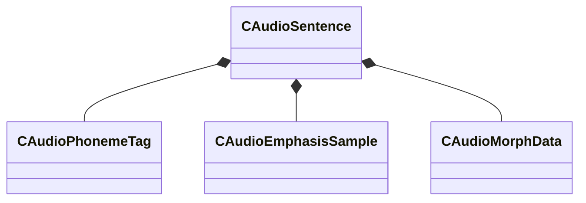
```mermaid
classDiagram
    CAudioSentence *-- CAudioPhonemeTag
    CAudioSentence *-- CAudioEmphasisSample
    CAudioSentence *-- CAudioMorphData
```

**Fields:**

| Name | Type | Annotations |
|------|------|-------------|
| `m_bShouldVoiceDuck` | bool |  |
| `m_RunTimePhonemes` | CUtlVector< [CAudioPhonemeTag](../schemas/soundsystem_voicecontainers.md#caudiophonemetag) > |  |
| `m_EmphasisSamples` | CUtlVector< [CAudioEmphasisSample](../schemas/soundsystem_voicecontainers.md#caudioemphasissample) > |  |
| `m_morphData` | [CAudioMorphData](../schemas/soundsystem_voicecontainers.md#caudiomorphdata) |  |

### CRandomPannerControls

**Metadata:** `MGetKV3ClassDefaults`, `MPropertyDescription Sets a control input every time it's instantiated`, `MPropertyFriendlyName Random Panner Control`

**Fields:**

| Name | Type | Annotations |
|------|------|-------------|
| `m_panningControlInputName` | CUtlString | `MPropertyFriendlyName Panning Control Input Name` |
| `m_volumeControlInputName` | CUtlString | `MPropertyFriendlyName Volume Control Input Name` |
| `m_flMinVolume` | float32 | `MPropertyFriendlyName Minimum Random Volume DB` |
| `m_flMaxVolume` | float32 | `MPropertyFriendlyName Maximum Random Volume DB` |
| `m_strVectorStackParam` | CUtlString | `MPropertyFriendlyName Forward Vector Stack Parameter Name` |

### CSoundContainerReference

**Metadata:** `MGetKV3ClassDefaults`, `MPropertyDescription Reference to a vsnd file or another container.`, `MPropertyFriendlyName Sound`

**Relationships:**

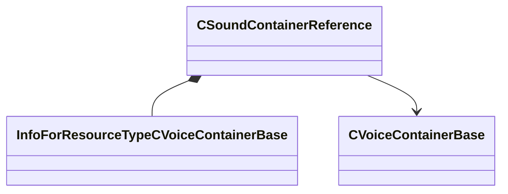
```mermaid
classDiagram
    CSoundContainerReference *-- InfoForResourceTypeCVoiceContainerBase
    CSoundContainerReference --> CVoiceContainerBase
```

**Fields:**

| Name | Type | Annotations |
|------|------|-------------|
| `m_namespace` | CUtlString |  |
| `m_bUseReference` | bool | `MPropertyFriendlyName Use Vsnd File` |
| `m_sound` | CStrongHandle< [InfoForResourceTypeCVoiceContainerBase](../schemas/resourcesystem.md#infoforresourcetypecvoicecontainerbase) > | `MPropertyFriendlyName Vsnd File` `MPropertySuppressExpr` |
| `m_pSound` | [CVoiceContainerBase](../schemas/soundsystem_voicecontainers.md#cvoicecontainerbase)* | `MPropertyFriendlyName Vsnd Container` `MPropertySuppressExpr` |

### CSoundContainerReferenceArray

**Metadata:** `MGetKV3ClassDefaults`, `MPropertyDescription Reference to list of vsnd files or other containers.`, `MPropertyFriendlyName Sound Array `

**Relationships:**

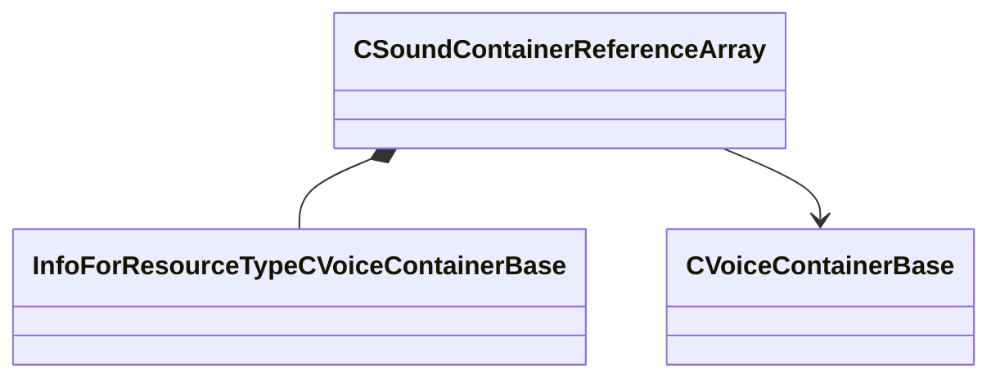
```mermaid
classDiagram
    CSoundContainerReferenceArray *-- InfoForResourceTypeCVoiceContainerBase
    CSoundContainerReferenceArray --> CVoiceContainerBase
```

**Fields:**

| Name | Type | Annotations |
|------|------|-------------|
| `m_bUseReference` | bool | `MPropertyFriendlyName Use Vsnd File` |
| `m_sounds` | CUtlVector< CStrongHandle< [InfoForResourceTypeCVoiceContainerBase](../schemas/resourcesystem.md#infoforresourcetypecvoicecontainerbase) > > | `MPropertyFriendlyName Vsnd File` `MPropertySuppressExpr` |
| `m_pSounds` | CUtlVector< [CVoiceContainerBase](../schemas/soundsystem_voicecontainers.md#cvoicecontainerbase)* > | `MPropertyFriendlyName Vsnd Container` `MPropertySuppressExpr` |

### CSoundInfoHeader

**Metadata:** `MGetKV3ClassDefaults`

### CVSound

**Metadata:** `MGetKV3ClassDefaults`

**Relationships:**

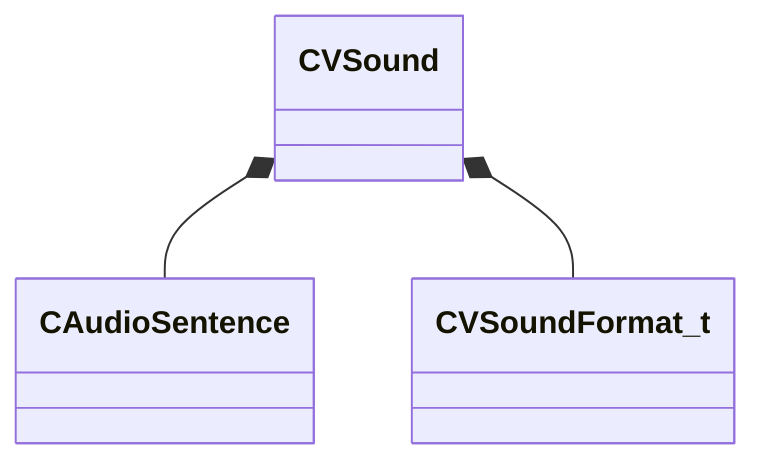
```mermaid
classDiagram
    CVSound *-- CAudioSentence
    CVSound *-- CVSoundFormat_t
```

**Fields:**

| Name | Type | Annotations |
|------|------|-------------|
| `m_Sentences` | CUtlLeanVector< [CAudioSentence](../schemas/soundsystem_voicecontainers.md#caudiosentence) > |  |
| `m_nRate` | int32 |  |
| `m_nFormat` | [CVSoundFormat_t](../schemas/!GlobalTypes.md#cvsoundformat_t) |  |
| `m_nChannels` | uint32 |  |
| `m_nLoopStart` | int32 |  |
| `m_nSampleCount` | uint32 |  |
| `m_flDuration` | float32 |  |
| `m_nStreamingSize` | uint32 |  |
| `m_nLoopEnd` | int32 |  |

### CVoiceContainerAmpedDecayingSineWave

**Inherits from:** [CVoiceContainerDecayingSineWave](soundsystem_voicecontainers.md#cvoicecontainerdecayingsinewave)

**Metadata:** `MGetKV3ClassDefaults`, `MPropertyDescription Bytecode instruction`, `MPropertyFriendlyName TESTBED: Amped Decaying Sine Wave Container`

**Relationships:**

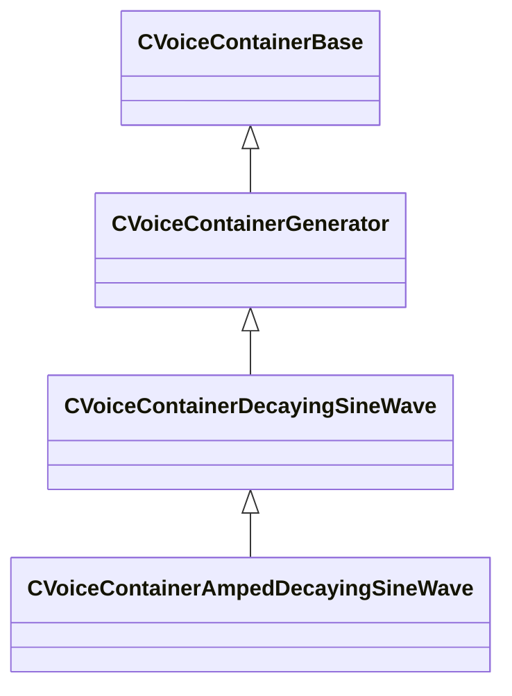
```mermaid
classDiagram
    CVoiceContainerDecayingSineWave <|-- CVoiceContainerAmpedDecayingSineWave
    CVoiceContainerGenerator <|-- CVoiceContainerDecayingSineWave
    CVoiceContainerBase <|-- CVoiceContainerGenerator
```

**Fields:**

| Name | Type | Annotations |
|------|------|-------------|
| `m_flGainAmount` | float32 | `MPropertyDescription The amount of attenuation .` `MPropertyFriendlyName Attenuation Amount (dB)` |

### CVoiceContainerAnalysisBase

**Derived by:** [CVoiceContainerEnvelopeAnalyzer](soundsystem_voicecontainers.md#cvoicecontainerenvelopeanalyzer)

**Metadata:** `MGetKV3ClassDefaults`, `MPropertyDescription Does Not Play Sound, member of CVoiceContainerDefaultDefault`, `MPropertyFriendlyName Analysis Container`, `MPropertyPolymorphicClass`, `MVDataNodeType 1`

**Relationships:**

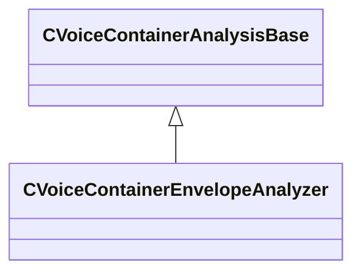
```mermaid
classDiagram
    CVoiceContainerAnalysisBase <|-- CVoiceContainerEnvelopeAnalyzer
```

**Fields:**

| Name | Type | Annotations |
|------|------|-------------|
| `m_curve` | CPiecewiseCurve | `MPropertyFriendlyName Envelope Curve` |

### CVoiceContainerAsyncGenerator

**Inherits from:** [CVoiceContainerGenerator](soundsystem_voicecontainers.md#cvoicecontainergenerator)

**Derived by:** [CVoiceContainerGranulator](soundsystem_voicecontainers.md#cvoicecontainergranulator), [CVoiceContainerRandomSampler](soundsystem_voicecontainers.md#cvoicecontainerrandomsampler), [CVoiceContainerStaticAdditiveSynth](soundsystem_voicecontainers.md#cvoicecontainerstaticadditivesynth), [CVoiceContainerTapePlayer](soundsystem_voicecontainers.md#cvoicecontainertapeplayer)

**Metadata:** `MGetKV3ClassDefaults`

**Relationships:**

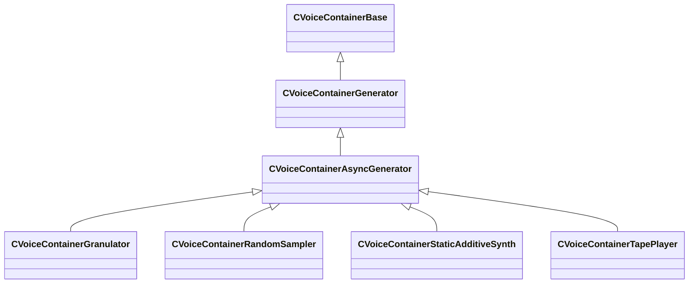
```mermaid
classDiagram
    CVoiceContainerGenerator <|-- CVoiceContainerAsyncGenerator
    CVoiceContainerBase <|-- CVoiceContainerGenerator
    CVoiceContainerAsyncGenerator <|-- CVoiceContainerGranulator
    CVoiceContainerAsyncGenerator <|-- CVoiceContainerRandomSampler
    CVoiceContainerAsyncGenerator <|-- CVoiceContainerStaticAdditiveSynth
    CVoiceContainerAsyncGenerator <|-- CVoiceContainerTapePlayer
```

### CVoiceContainerBase

**Derived by:** [CVoiceContainerBlender](soundsystem_voicecontainers.md#cvoicecontainerblender), [CVoiceContainerDefault](soundsystem_voicecontainers.md#cvoicecontainerdefault), [CVoiceContainerEnum](soundsystem_voicecontainers.md#cvoicecontainerenum), [CVoiceContainerGenerator](soundsystem_voicecontainers.md#cvoicecontainergenerator), [CVoiceContainerLoopTrigger](soundsystem_voicecontainers.md#cvoicecontainerlooptrigger), [CVoiceContainerLoopXFade](soundsystem_voicecontainers.md#cvoicecontainerloopxfade), [CVoiceContainerMultiBlender](soundsystem_voicecontainers.md#cvoicecontainermultiblender), [CVoiceContainerParameterBlender](soundsystem_voicecontainers.md#cvoicecontainerparameterblender), [CVoiceContainerSelector](soundsystem_voicecontainers.md#cvoicecontainerselector), [CVoiceContainerSet](soundsystem_voicecontainers.md#cvoicecontainerset), [CVoiceContainerSwitch](soundsystem_voicecontainers.md#cvoicecontainerswitch), [CVoiceContainerVMixSnd](soundsystem.md#cvoicecontainervmixsnd), [CVoiceContainerVsndRadioButton](soundsystem_voicecontainers.md#cvoicecontainervsndradiobutton), [CVoiceContainerVsndTrigger](soundsystem_voicecontainers.md#cvoicecontainervsndtrigger)

**Metadata:** `MGetKV3ClassDefaults`, `MPropertyDescription Voice Container Base`, `MPropertyFriendlyName VSND Container`, `MPropertyPolymorphicClass`, `MVDataFileExtension`, `MVDataNodeType 1`, `MVDataRoot`, `MVDataSingleton`

**Relationships:**

```mermaid
classDiagram
    CVoiceContainerBase <|-- CVoiceContainerBlender
    CVoiceContainerBase <|-- CVoiceContainerDefault
    CVoiceContainerBase <|-- CVoiceContainerEnum
    CVoiceContainerBase <|-- CVoiceContainerGenerator
    CVoiceContainerBase <|-- CVoiceContainerLoopTrigger
    CVoiceContainerBase <|-- CVoiceContainerLoopXFade
    CVoiceContainerBase <|-- CVoiceContainerMultiBlender
    CVoiceContainerBase <|-- CVoiceContainerParameterBlender
    CVoiceContainerBase <|-- CVoiceContainerSelector
    CVoiceContainerBase <|-- CVoiceContainerSet
    CVoiceContainerBase <|-- CVoiceContainerSwitch
    CVoiceContainerBase <|-- CVoiceContainerVMixSnd
    CVoiceContainerBase <|-- CVoiceContainerVsndRadioButton
    CVoiceContainerBase <|-- CVoiceContainerVsndTrigger
    CVoiceContainerBase *-- CVSound
    CVoiceContainerBase --> CVoiceContainerAnalysisBase
```

**Fields:**

| Name | Type | Annotations |
|------|------|-------------|
| `m_vSound` | [CVSound](../schemas/soundsystem_voicecontainers.md#cvsound) | `MPropertySuppressField` |
| `m_pEnvelopeAnalyzer` | [CVoiceContainerAnalysisBase](../schemas/soundsystem_voicecontainers.md#cvoicecontaineranalysisbase)* | `MPropertySuppressExpr` |

### CVoiceContainerBlender

**Inherits from:** [CVoiceContainerBase](soundsystem_voicecontainers.md#cvoicecontainerbase)

**Metadata:** `MGetKV3ClassDefaults`, `MPropertyDescription Blends two containers.`, `MPropertyFriendlyName Blender`

**Relationships:**

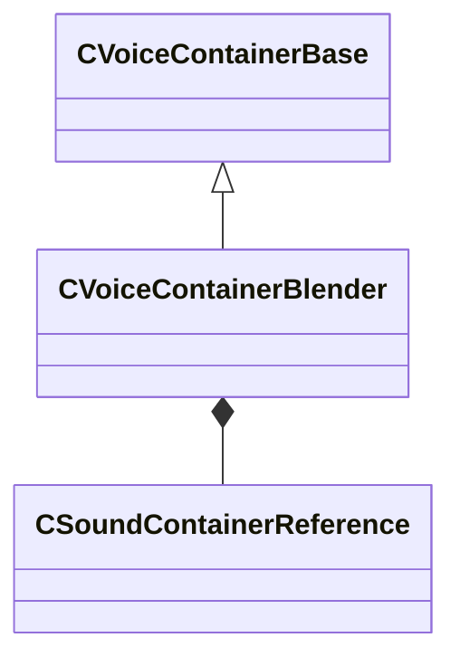
```mermaid
classDiagram
    CVoiceContainerBase <|-- CVoiceContainerBlender
    CVoiceContainerBlender *-- CSoundContainerReference
```

**Fields:**

| Name | Type | Annotations |
|------|------|-------------|
| `m_firstSound` | [CSoundContainerReference](../schemas/soundsystem_voicecontainers.md#csoundcontainerreference) |  |
| `m_secondSound` | [CSoundContainerReference](../schemas/soundsystem_voicecontainers.md#csoundcontainerreference) |  |
| `m_flBlendFactor` | float32 |  |

### CVoiceContainerDecayingSineWave

**Inherits from:** [CVoiceContainerGenerator](soundsystem_voicecontainers.md#cvoicecontainergenerator)

**Derived by:** [CVoiceContainerAmpedDecayingSineWave](soundsystem_voicecontainers.md#cvoicecontainerampeddecayingsinewave)

**Metadata:** `MGetKV3ClassDefaults`, `MPropertyDescription Only text params, renders in real time`, `MPropertyFriendlyName TESTBED: Decaying Sine Wave Container`

**Relationships:**

```mermaid
classDiagram
    CVoiceContainerGenerator <|-- CVoiceContainerDecayingSineWave
    CVoiceContainerBase <|-- CVoiceContainerGenerator
    CVoiceContainerDecayingSineWave <|-- CVoiceContainerAmpedDecayingSineWave
```

**Fields:**

| Name | Type | Annotations |
|------|------|-------------|
| `m_flFrequency` | float32 | `MPropertyDescription The frequency of this sine tone.` `MPropertyFriendlyName Frequency (Hz)` |
| `m_flDecayTime` | float32 | `MPropertyDescription The frequency of this sine tone.` `MPropertyFriendlyName Decay Time (Seconds)` |

### CVoiceContainerDefault

**Inherits from:** [CVoiceContainerBase](soundsystem_voicecontainers.md#cvoicecontainerbase)

**Metadata:** `MGetKV3ClassDefaults`, `MPropertyDescription Voice Container Default`, `MPropertyFriendlyName Default Container`

**Relationships:**

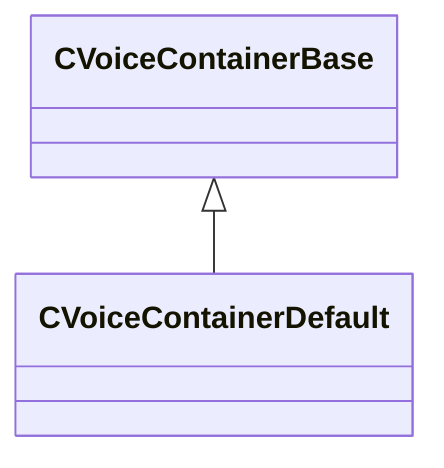
```mermaid
classDiagram
    CVoiceContainerBase <|-- CVoiceContainerDefault
```

### CVoiceContainerEnum

**Inherits from:** [CVoiceContainerBase](soundsystem_voicecontainers.md#cvoicecontainerbase)

**Metadata:** `MGetKV3ClassDefaults`, `MPropertyDescription Switches between a selection of vsnds based on a provided index.`, `MPropertyFriendlyName VSND Enum`

**Relationships:**

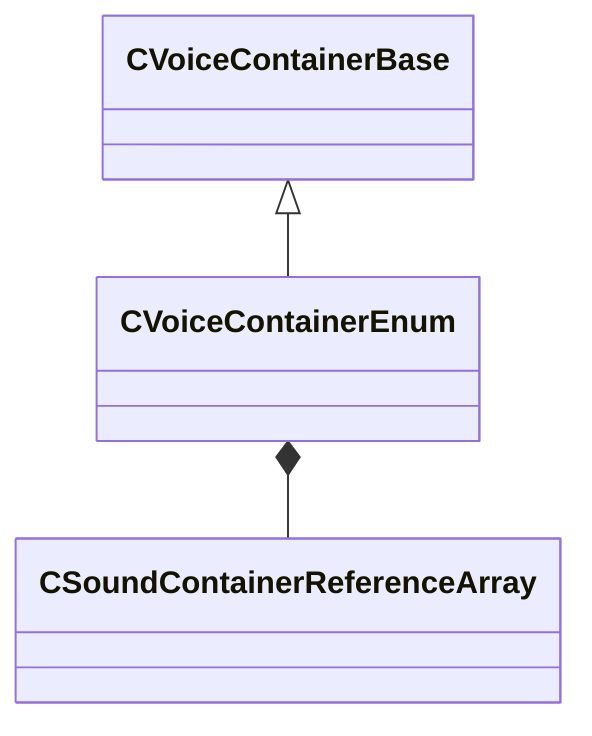
```mermaid
classDiagram
    CVoiceContainerBase <|-- CVoiceContainerEnum
    CVoiceContainerEnum *-- CSoundContainerReferenceArray
```

**Fields:**

| Name | Type | Annotations |
|------|------|-------------|
| `m_soundsToPlay` | [CSoundContainerReferenceArray](../schemas/soundsystem_voicecontainers.md#csoundcontainerreferencearray) | `MPropertyFriendlyName Sounds To Play` |
| `m_iSelection` | int32 | `MPropertyFriendlyName Index` |
| `m_flCrossfadeTime` | float32 | `MPropertyFriendlyName Crossfade Time` |

### CVoiceContainerEnvelopeAnalyzer

**Inherits from:** [CVoiceContainerAnalysisBase](soundsystem_voicecontainers.md#cvoicecontaineranalysisbase)

**Metadata:** `MGetKV3ClassDefaults`, `MPropertyDescription Generates an Envelope Curve on compile`, `MPropertyFriendlyName Envelope Analyzer`

**Relationships:**

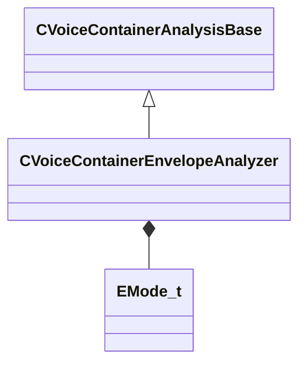
```mermaid
classDiagram
    CVoiceContainerAnalysisBase <|-- CVoiceContainerEnvelopeAnalyzer
    CVoiceContainerEnvelopeAnalyzer *-- EMode_t
```

**Fields:**

| Name | Type | Annotations |
|------|------|-------------|
| `m_mode` | [EMode_t](../schemas/!GlobalTypes.md#emode_t) | `MPropertyFriendlyName Envelope Mode` |
| `m_fAnalysisWindowMs` | float32 | `MPropertyFriendlyName Analysis Window` |
| `m_flThreshold` | float32 | `MPropertyFriendlyName Threshold` |

### CVoiceContainerGenerator

**Inherits from:** [CVoiceContainerBase](soundsystem_voicecontainers.md#cvoicecontainerbase)

**Derived by:** [CVoiceContainerAsyncGenerator](soundsystem_voicecontainers.md#cvoicecontainerasyncgenerator), [CVoiceContainerDecayingSineWave](soundsystem_voicecontainers.md#cvoicecontainerdecayingsinewave), [CVoiceContainerNull](soundsystem_voicecontainers.md#cvoicecontainernull), [CVoiceContainerRealtimeFMSineWave](soundsystem_voicecontainers.md#cvoicecontainerrealtimefmsinewave), [CVoiceContainerShapedNoise](soundsystem_voicecontainers.md#cvoicecontainershapednoise)

**Metadata:** `MGetKV3ClassDefaults`

**Relationships:**

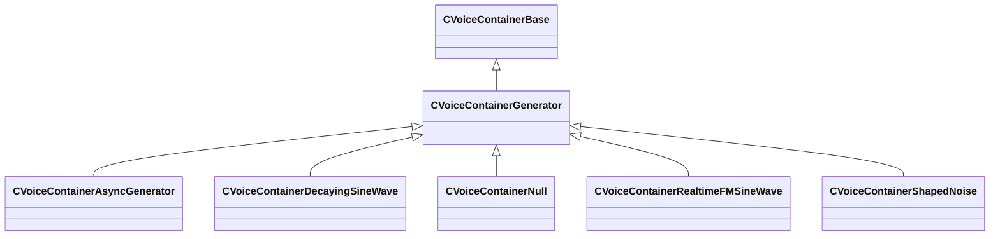
```mermaid
classDiagram
    CVoiceContainerBase <|-- CVoiceContainerGenerator
    CVoiceContainerGenerator <|-- CVoiceContainerAsyncGenerator
    CVoiceContainerGenerator <|-- CVoiceContainerDecayingSineWave
    CVoiceContainerGenerator <|-- CVoiceContainerNull
    CVoiceContainerGenerator <|-- CVoiceContainerRealtimeFMSineWave
    CVoiceContainerGenerator <|-- CVoiceContainerShapedNoise
```

### CVoiceContainerGranulator

**Inherits from:** [CVoiceContainerAsyncGenerator](soundsystem_voicecontainers.md#cvoicecontainerasyncgenerator)

**Metadata:** `MGetKV3ClassDefaults`, `MPropertyFriendlyName Granulator Container`

**Relationships:**

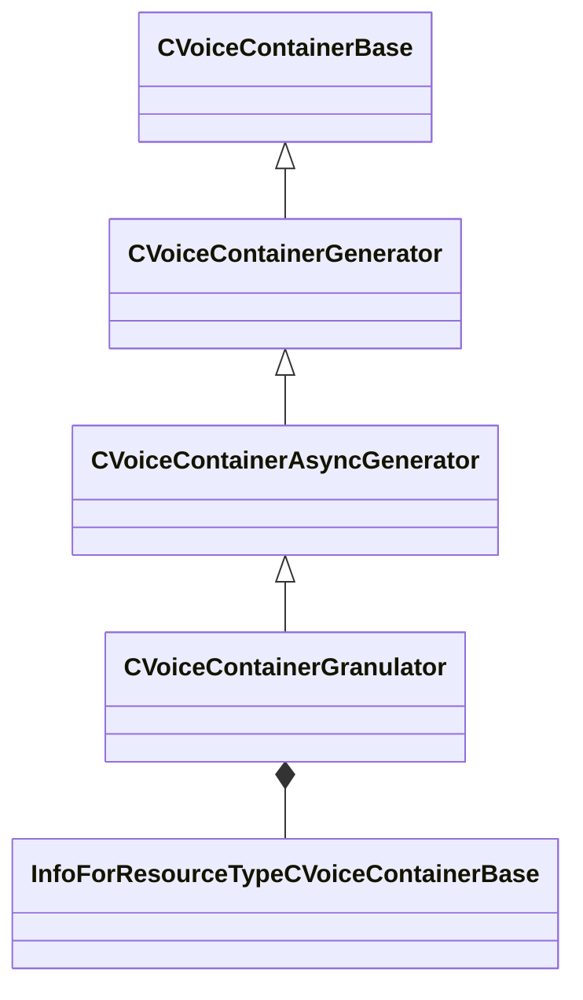
```mermaid
classDiagram
    CVoiceContainerAsyncGenerator <|-- CVoiceContainerGranulator
    CVoiceContainerGenerator <|-- CVoiceContainerAsyncGenerator
    CVoiceContainerBase <|-- CVoiceContainerGenerator
    CVoiceContainerGranulator *-- InfoForResourceTypeCVoiceContainerBase
```

**Fields:**

| Name | Type | Annotations |
|------|------|-------------|
| `m_flGrainLength` | float32 |  |
| `m_flGrainCrossfadeAmount` | float32 |  |
| `m_flStartJitter` | float32 |  |
| `m_flPlaybackJitter` | float32 |  |
| `m_bShouldWraparound` | bool |  |
| `m_sourceAudio` | CStrongHandle< [InfoForResourceTypeCVoiceContainerBase](../schemas/resourcesystem.md#infoforresourcetypecvoicecontainerbase) > |  |

### CVoiceContainerLoopTrigger

**Inherits from:** [CVoiceContainerBase](soundsystem_voicecontainers.md#cvoicecontainerbase)

**Derived by:** [CVoiceContainerLoopTriggerWithRandomPanner](soundsystem_voicecontainers.md#cvoicecontainerlooptriggerwithrandompanner)

**Metadata:** `MGetKV3ClassDefaults`, `MPropertyDescription Continuously retriggers a sound and optionally fades to the new instance.`, `MPropertyFriendlyName LoopTrigger`

**Relationships:**

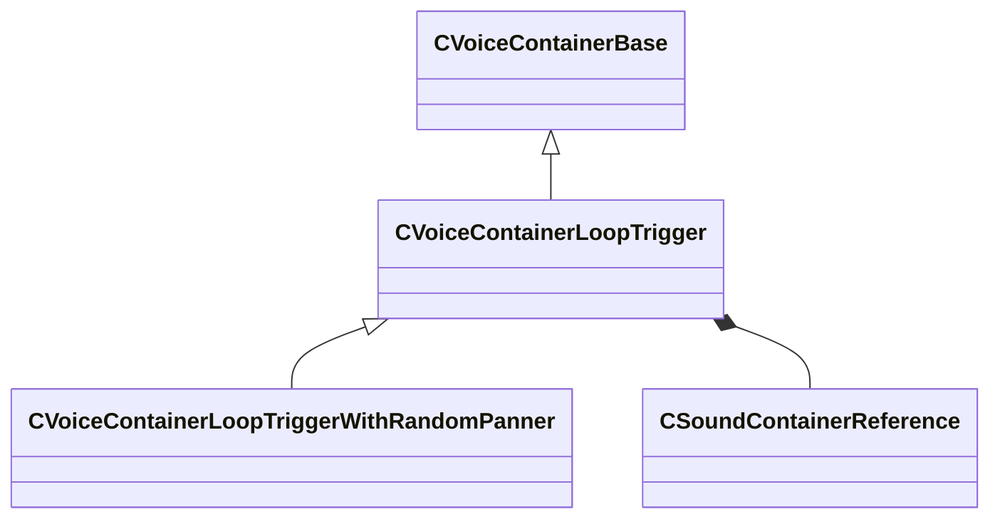
```mermaid
classDiagram
    CVoiceContainerBase <|-- CVoiceContainerLoopTrigger
    CVoiceContainerLoopTrigger <|-- CVoiceContainerLoopTriggerWithRandomPanner
    CVoiceContainerLoopTrigger *-- CSoundContainerReference
```

**Fields:**

| Name | Type | Annotations |
|------|------|-------------|
| `m_flRetriggerTimeMin` | float32 |  |
| `m_flRetriggerTimeMax` | float32 |  |
| `m_flFadeTime` | float32 |  |
| `m_bCrossFade` | bool |  |
| `m_sound` | [CSoundContainerReference](../schemas/soundsystem_voicecontainers.md#csoundcontainerreference) | `MPropertyFriendlyName Vsnd Reference` |

### CVoiceContainerLoopTriggerWithRandomPanner

**Inherits from:** [CVoiceContainerLoopTrigger](soundsystem_voicecontainers.md#cvoicecontainerlooptrigger)

**Metadata:** `MGetKV3ClassDefaults`, `MPropertyDescription Continuously retriggers a sound and optionally fades to the new instance. Sends a new Random panning value to a control input on each retrigger`, `MPropertyFriendlyName LoopTriggerWithRandomPanner`

**Relationships:**

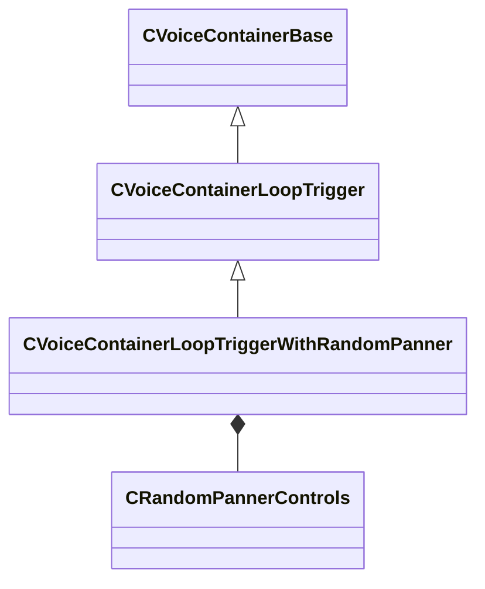
```mermaid
classDiagram
    CVoiceContainerLoopTrigger <|-- CVoiceContainerLoopTriggerWithRandomPanner
    CVoiceContainerBase <|-- CVoiceContainerLoopTrigger
    CVoiceContainerLoopTriggerWithRandomPanner *-- CRandomPannerControls
```

**Fields:**

| Name | Type | Annotations |
|------|------|-------------|
| `m_randomPannerControls` | [CRandomPannerControls](../schemas/soundsystem_voicecontainers.md#crandompannercontrols) | `MPropertyFriendlyName Random Panner Control` |

### CVoiceContainerLoopXFade

**Inherits from:** [CVoiceContainerBase](soundsystem_voicecontainers.md#cvoicecontainerbase)

**Metadata:** `MGetKV3ClassDefaults`, `MPropertyDescription Sample accurate looping with xfade capabilities.`, `MPropertyFriendlyName Loop XFade`

**Relationships:**

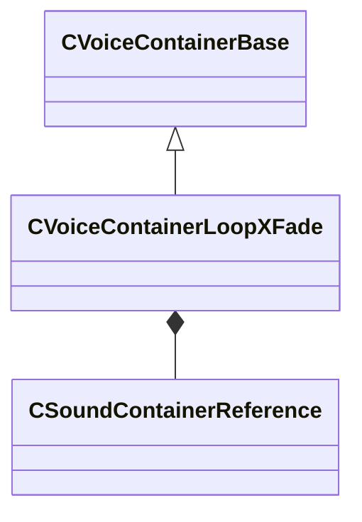
```mermaid
classDiagram
    CVoiceContainerBase <|-- CVoiceContainerLoopXFade
    CVoiceContainerLoopXFade *-- CSoundContainerReference
```

**Fields:**

| Name | Type | Annotations |
|------|------|-------------|
| `m_sound` | [CSoundContainerReference](../schemas/soundsystem_voicecontainers.md#csoundcontainerreference) | `MPropertyFriendlyName Vsnd Reference` |
| `m_flLoopEnd` | float32 |  |
| `m_flLoopStart` | float32 |  |
| `m_flFadeOut` | float32 |  |
| `m_flFadeIn` | float32 |  |
| `m_bPlayHead` | bool |  |
| `m_bPlayTail` | bool |  |
| `m_bEqualPow` | bool |  |

### CVoiceContainerMultiBlender

**Inherits from:** [CVoiceContainerBase](soundsystem_voicecontainers.md#cvoicecontainerbase)

**Metadata:** `MGetKV3ClassDefaults`, `MPropertyDescription Blends any number of containers`, `MPropertyFriendlyName Multi Blender`

**Relationships:**

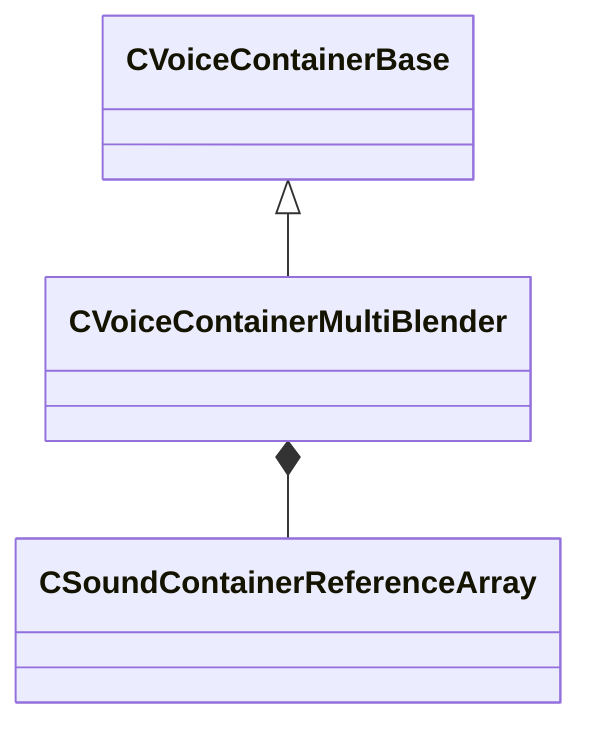
```mermaid
classDiagram
    CVoiceContainerBase <|-- CVoiceContainerMultiBlender
    CVoiceContainerMultiBlender *-- CSoundContainerReferenceArray
```

**Fields:**

| Name | Type | Annotations |
|------|------|-------------|
| `m_soundsToPlay` | [CSoundContainerReferenceArray](../schemas/soundsystem_voicecontainers.md#csoundcontainerreferencearray) | `MPropertyFriendlyName Sounds To Blend` |
| `m_flBlendFactor` | float32 | `MPropertyFriendlyName Blend Amount (0.0 = 100% first sound, 1.0 = 100% last sound)` |
| `m_flCrossover` | float32 | `MPropertyFriendlyName Crossfade Amount (0.0 = no crossfade, 1.0 = constant crossfading)` |

### CVoiceContainerNull

**Inherits from:** [CVoiceContainerGenerator](soundsystem_voicecontainers.md#cvoicecontainergenerator)

**Metadata:** `MGetKV3ClassDefaults`, `MPropertyDescription Plays a single channel of silence.`, `MPropertyFriendlyName Null Container`

**Relationships:**

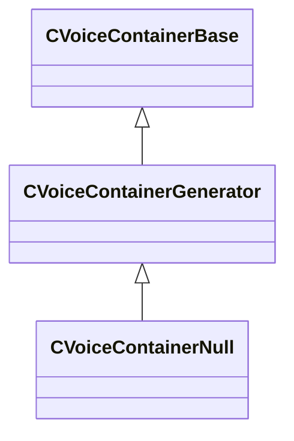
```mermaid
classDiagram
    CVoiceContainerGenerator <|-- CVoiceContainerNull
    CVoiceContainerBase <|-- CVoiceContainerGenerator
```

### CVoiceContainerParameterBlender

**Inherits from:** [CVoiceContainerBase](soundsystem_voicecontainers.md#cvoicecontainerbase)

**Metadata:** `MGetKV3ClassDefaults`, `MPropertyDescription Blends two containers according to parameter curves.`, `MPropertyFriendlyName Parameter Blender`

**Relationships:**

```mermaid
classDiagram
    CVoiceContainerBase <|-- CVoiceContainerParameterBlender
    CVoiceContainerParameterBlender *-- CSoundContainerReference
```

**Fields:**

| Name | Type | Annotations |
|------|------|-------------|
| `m_firstSound` | [CSoundContainerReference](../schemas/soundsystem_voicecontainers.md#csoundcontainerreference) | `MPropertyFriendlyName First Sound` |
| `m_secondSound` | [CSoundContainerReference](../schemas/soundsystem_voicecontainers.md#csoundcontainerreference) | `MPropertyFriendlyName Second Sound` |
| `m_bEnableOcclusionBlend` | bool | `MPropertyFriendlyName Enable Occlusion Blend` `MPropertyStartGroup Occlusion` |
| `m_curve1` | CPiecewiseCurve | `MPropertyFriendlyName First Curve` `MPropertySuppressExpr` |
| `m_curve2` | CPiecewiseCurve | `MPropertyFriendlyName Second Curve` `MPropertySuppressExpr` |
| `m_bEnableDistanceBlend` | bool | `MPropertyFriendlyName Enable Distance Blend` `MPropertyStartGroup Distance` |
| `m_curve3` | CPiecewiseCurve | `MPropertyFriendlyName First Curve` `MPropertySuppressExpr` |
| `m_curve4` | CPiecewiseCurve | `MPropertyFriendlyName Second Curve` `MPropertySuppressExpr` |

### CVoiceContainerRandomSampler

**Inherits from:** [CVoiceContainerAsyncGenerator](soundsystem_voicecontainers.md#cvoicecontainerasyncgenerator)

**Metadata:** `MGetKV3ClassDefaults`, `MPropertyDescription Trash Synth`, `MPropertyFriendlyName Random Sampler Container`

**Relationships:**

```mermaid
classDiagram
    CVoiceContainerAsyncGenerator <|-- CVoiceContainerRandomSampler
    CVoiceContainerGenerator <|-- CVoiceContainerAsyncGenerator
    CVoiceContainerBase <|-- CVoiceContainerGenerator
    CVoiceContainerRandomSampler *-- InfoForResourceTypeCVoiceContainerBase
```

**Fields:**

| Name | Type | Annotations |
|------|------|-------------|
| `m_flAmplitude` | float32 |  |
| `m_flAmplitudeJitter` | float32 |  |
| `m_flTimeJitter` | float32 |  |
| `m_flMaxLength` | float32 |  |
| `m_nNumDelayVariations` | int32 |  |
| `m_grainResources` | CUtlVector< CStrongHandle< [InfoForResourceTypeCVoiceContainerBase](../schemas/resourcesystem.md#infoforresourcetypecvoicecontainerbase) > > |  |

### CVoiceContainerRealtimeFMSineWave

**Inherits from:** [CVoiceContainerGenerator](soundsystem_voicecontainers.md#cvoicecontainergenerator)

**Metadata:** `MGetKV3ClassDefaults`, `MPropertyDescription Real time FM Synthesis`, `MPropertyFriendlyName TESTBED: FM Synth Container`

**Relationships:**

```mermaid
classDiagram
    CVoiceContainerGenerator <|-- CVoiceContainerRealtimeFMSineWave
    CVoiceContainerBase <|-- CVoiceContainerGenerator
```

**Fields:**

| Name | Type | Annotations |
|------|------|-------------|
| `m_flCarrierFrequency` | float32 | `MPropertyDescription The frequency of this sine tone.` `MPropertyFriendlyName Frequency (Hz)` |
| `m_flModulatorFrequency` | float32 | `MPropertyDescription The frequency of the sine tone modulating this sine tone.` `MPropertyFriendlyName Mod Frequency (Hz)` |
| `m_flModulatorAmount` | float32 | `MPropertyDescription The amount the modulating sine tone modulates this sine tone.` `MPropertyFriendlyName Mod Amount (Hz)` |

### CVoiceContainerSelector

**Inherits from:** [CVoiceContainerBase](soundsystem_voicecontainers.md#cvoicecontainerbase)

**Metadata:** `MGetKV3ClassDefaults`, `MPropertyDescription Plays a selected vsnd on playback.`, `MPropertyFriendlyName Selector`

**Relationships:**

```mermaid
classDiagram
    CVoiceContainerBase <|-- CVoiceContainerSelector
    CVoiceContainerSelector *-- PlayBackMode_t
    CVoiceContainerSelector *-- CSoundContainerReferenceArray
```

**Fields:**

| Name | Type | Annotations |
|------|------|-------------|
| `m_mode` | [PlayBackMode_t](../schemas/!GlobalTypes.md#playbackmode_t) | `MPropertyFriendlyName Playback Mode` |
| `m_soundsToPlay` | [CSoundContainerReferenceArray](../schemas/soundsystem_voicecontainers.md#csoundcontainerreferencearray) | `MPropertyFriendlyName Sounds To play` |
| `m_fProbabilityWeights` | CUtlVector< float32 > | `MPropertyFriendlyName Relative Weights` |

### CVoiceContainerSet

**Inherits from:** [CVoiceContainerBase](soundsystem_voicecontainers.md#cvoicecontainerbase)

**Metadata:** `MGetKV3ClassDefaults`, `MPropertyDescription An array of containers that are played all at once.`, `MPropertyFriendlyName Container Set`

**Relationships:**

```mermaid
classDiagram
    CVoiceContainerBase <|-- CVoiceContainerSet
    CVoiceContainerSet *-- CVoiceContainerSetElement
```

**Fields:**

| Name | Type | Annotations |
|------|------|-------------|
| `m_soundsToPlay` | CUtlVector< [CVoiceContainerSetElement](../schemas/soundsystem_voicecontainers.md#cvoicecontainersetelement) > | `MPropertyFriendlyName Container List` |

### CVoiceContainerSetElement

**Metadata:** `MGetKV3ClassDefaults`

**Relationships:**

```mermaid
classDiagram
    CVoiceContainerSetElement *-- CSoundContainerReference
```

**Fields:**

| Name | Type | Annotations |
|------|------|-------------|
| `m_sound` | [CSoundContainerReference](../schemas/soundsystem_voicecontainers.md#csoundcontainerreference) |  |
| `m_flVolumeDB` | float32 | `MPropertyFriendlyName Volume (in Decibels)` |

### CVoiceContainerShapedNoise

**Inherits from:** [CVoiceContainerGenerator](soundsystem_voicecontainers.md#cvoicecontainergenerator)

**Metadata:** `MGetKV3ClassDefaults`, `MPropertyDescription This is a synth meant to generate whoosh noises.`, `MPropertyFriendlyName Wind Generator Container`

**Relationships:**

```mermaid
classDiagram
    CVoiceContainerGenerator <|-- CVoiceContainerShapedNoise
    CVoiceContainerBase <|-- CVoiceContainerGenerator
```

**Fields:**

| Name | Type | Annotations |
|------|------|-------------|
| `m_bUseCurveForFrequency` | bool |  |
| `m_flFrequency` | float32 | `MPropertySuppressExpr` |
| `m_frequencySweep` | CPiecewiseCurve | `MPropertyFriendlyName Frequency Sweep` `MPropertySuppressExpr` |
| `m_bUseCurveForResonance` | bool |  |
| `m_flResonance` | float32 | `MPropertySuppressExpr` |
| `m_resonanceSweep` | CPiecewiseCurve | `MPropertyFriendlyName Resonance Sweep` `MPropertySuppressExpr` |
| `m_bUseCurveForAmplitude` | bool |  |
| `m_flGainInDecibels` | float32 | `MPropertySuppressExpr` |
| `m_gainSweep` | CPiecewiseCurve | `MPropertyFriendlyName Gain Sweep (in Decibels)` `MPropertySuppressExpr` |

### CVoiceContainerStaticAdditiveSynth

**Inherits from:** [CVoiceContainerAsyncGenerator](soundsystem_voicecontainers.md#cvoicecontainerasyncgenerator)

**Metadata:** `MGetKV3ClassDefaults`, `MPropertyDescription This is a static additive synth that can scale components of the synth based on how many instances are running.`, `MPropertyFriendlyName Additive Synth Container`

**Relationships:**

```mermaid
classDiagram
    CVoiceContainerAsyncGenerator <|-- CVoiceContainerStaticAdditiveSynth
    CVoiceContainerGenerator <|-- CVoiceContainerAsyncGenerator
    CVoiceContainerBase <|-- CVoiceContainerGenerator
```

**Fields:**

| Name | Type | Annotations |
|------|------|-------------|
| `m_tones` | CUtlVector< [CVoiceContainerStaticAdditiveSynth](../schemas/soundsystem_voicecontainers.md#cvoicecontainerstaticadditivesynth)::CTone > |  |

### CVoiceContainerStaticAdditiveSynth::CGainScalePerInstance

**Metadata:** `MGetKV3ClassDefaults`

**Fields:**

| Name | Type | Annotations |
|------|------|-------------|
| `m_flMinVolume` | float32 | `MPropertyFriendlyName Quietest Volume` |
| `m_nInstancesAtMinVolume` | int32 | `MPropertyFriendlyName # Instances Playing Until We Get Louder Than Quietest Volume` |
| `m_flMaxVolume` | float32 | `MPropertyFriendlyName Loudest Volume` |
| `m_nInstancesAtMaxVolume` | int32 | `MPropertyFriendlyName # Instances Playing Required To Reach Loudest Volume` |

### CVoiceContainerStaticAdditiveSynth::CHarmonic

**Metadata:** `MGetKV3ClassDefaults`

**Relationships:**

```mermaid
classDiagram
    "CVoiceContainerStaticAdditiveSynth::CHarmonic" *-- EWaveform
    "CVoiceContainerStaticAdditiveSynth::CHarmonic" *-- EMidiNote
    "CVoiceContainerStaticAdditiveSynth::CHarmonic" *-- CVoiceContainerStaticAdditiveSynth
```

**Fields:**

| Name | Type | Annotations |
|------|------|-------------|
| `m_nWaveform` | [EWaveform](../schemas/!GlobalTypes.md#ewaveform) | `MPropertyFriendlyName Waveform` |
| `m_nFundamental` | [EMidiNote](../schemas/!GlobalTypes.md#emidinote) | `MPropertyFriendlyName Note` |
| `m_nOctave` | int32 | `MPropertyFriendlyName Octave` |
| `m_flCents` | float32 | `MPropertyFriendlyName Cents To Detune ( -100:100 )` |
| `m_flPhase` | float32 | `MPropertyFriendlyName Phase ( 0 - 1 )` |
| `m_curve` | CPiecewiseCurve | `MPropertyFriendlyName Envelope (Relative to Tone Envelope)` |
| `m_volumeScaling` | [CVoiceContainerStaticAdditiveSynth](../schemas/soundsystem_voicecontainers.md#cvoicecontainerstaticadditivesynth)::CGainScalePerInstance |  |

### CVoiceContainerStaticAdditiveSynth::CTone

**Metadata:** `MGetKV3ClassDefaults`

**Relationships:**

```mermaid
classDiagram
    "CVoiceContainerStaticAdditiveSynth::CTone" *-- CVoiceContainerStaticAdditiveSynth
```

**Fields:**

| Name | Type | Annotations |
|------|------|-------------|
| `m_harmonics` | CUtlVector< [CVoiceContainerStaticAdditiveSynth](../schemas/soundsystem_voicecontainers.md#cvoicecontainerstaticadditivesynth)::CHarmonic > | `MPropertyFriendlyName Harmonics` |
| `m_curve` | CPiecewiseCurve | `MPropertyFriendlyName Envelope` |
| `m_bSyncInstances` | bool | `MPropertyFriendlyName Play All Instances In Sync` |

### CVoiceContainerSwitch

**Inherits from:** [CVoiceContainerBase](soundsystem_voicecontainers.md#cvoicecontainerbase)

**Metadata:** `MGetKV3ClassDefaults`, `MPropertyDescription An array of containers`, `MPropertyFriendlyName Container Switch`

**Relationships:**

```mermaid
classDiagram
    CVoiceContainerBase <|-- CVoiceContainerSwitch
    CVoiceContainerSwitch *-- CSoundContainerReference
```

**Fields:**

| Name | Type | Annotations |
|------|------|-------------|
| `m_soundsToPlay` | CUtlVector< [CSoundContainerReference](../schemas/soundsystem_voicecontainers.md#csoundcontainerreference) > | `MPropertyFriendlyName Container List` |

### CVoiceContainerTapePlayer

**Inherits from:** [CVoiceContainerAsyncGenerator](soundsystem_voicecontainers.md#cvoicecontainerasyncgenerator)

**Metadata:** `MGetKV3ClassDefaults`, `MPropertyFriendlyName Tape Player`

**Relationships:**

```mermaid
classDiagram
    CVoiceContainerAsyncGenerator <|-- CVoiceContainerTapePlayer
    CVoiceContainerGenerator <|-- CVoiceContainerAsyncGenerator
    CVoiceContainerBase <|-- CVoiceContainerGenerator
    CVoiceContainerTapePlayer *-- InfoForResourceTypeCVoiceContainerBase
```

**Fields:**

| Name | Type | Annotations |
|------|------|-------------|
| `m_bShouldWraparound` | bool |  |
| `m_sourceAudio` | CStrongHandle< [InfoForResourceTypeCVoiceContainerBase](../schemas/resourcesystem.md#infoforresourcetypecvoicecontainerbase) > |  |
| `m_flTapeSpeedAttackTime` | float32 |  |
| `m_flTapeSpeedReleaseTime` | float32 |  |

### CVoiceContainerVsndRadioButton

**Inherits from:** [CVoiceContainerBase](soundsystem_voicecontainers.md#cvoicecontainerbase)

**Metadata:** `MGetKV3ClassDefaults`, `MPropertyDescription Plays vsnds based on membership in a numbered index.`, `MPropertyFriendlyName Vsnd Radio Button`

**Relationships:**

```mermaid
classDiagram
    CVoiceContainerBase <|-- CVoiceContainerVsndRadioButton
    CVoiceContainerVsndRadioButton *-- CVsndRadioButtonSlot
```

**Fields:**

| Name | Type | Annotations |
|------|------|-------------|
| `m_namespace` | CUtlString | `MPropertyFriendlyName Namespace` |
| `m_slot1` | [CVsndRadioButtonSlot](../schemas/soundsystem_voicecontainers.md#cvsndradiobuttonslot) | `MPropertyFriendlyName Vsnd 01` |
| `m_slot2` | [CVsndRadioButtonSlot](../schemas/soundsystem_voicecontainers.md#cvsndradiobuttonslot) | `MPropertyFriendlyName Vsnd 02` |
| `m_slot3` | [CVsndRadioButtonSlot](../schemas/soundsystem_voicecontainers.md#cvsndradiobuttonslot) | `MPropertyFriendlyName Vsnd 03` |
| `m_slot4` | [CVsndRadioButtonSlot](../schemas/soundsystem_voicecontainers.md#cvsndradiobuttonslot) | `MPropertyFriendlyName Vsnd 04` |
| `m_slot5` | [CVsndRadioButtonSlot](../schemas/soundsystem_voicecontainers.md#cvsndradiobuttonslot) | `MPropertyFriendlyName Vsnd 05` |
| `m_slot6` | [CVsndRadioButtonSlot](../schemas/soundsystem_voicecontainers.md#cvsndradiobuttonslot) | `MPropertyFriendlyName Vsnd 06` |
| `m_slot7` | [CVsndRadioButtonSlot](../schemas/soundsystem_voicecontainers.md#cvsndradiobuttonslot) | `MPropertyFriendlyName Vsnd 07` |
| `m_slot8` | [CVsndRadioButtonSlot](../schemas/soundsystem_voicecontainers.md#cvsndradiobuttonslot) | `MPropertyFriendlyName Vsnd 08` |
| `m_slot9` | [CVsndRadioButtonSlot](../schemas/soundsystem_voicecontainers.md#cvsndradiobuttonslot) | `MPropertyFriendlyName Vsnd 09` |
| `m_slot10` | [CVsndRadioButtonSlot](../schemas/soundsystem_voicecontainers.md#cvsndradiobuttonslot) | `MPropertyFriendlyName Vsnd 10` |
| `m_slot11` | [CVsndRadioButtonSlot](../schemas/soundsystem_voicecontainers.md#cvsndradiobuttonslot) | `MPropertyFriendlyName Vsnd 11` |
| `m_slot12` | [CVsndRadioButtonSlot](../schemas/soundsystem_voicecontainers.md#cvsndradiobuttonslot) | `MPropertyFriendlyName Vsnd 12` |
| `m_slot13` | [CVsndRadioButtonSlot](../schemas/soundsystem_voicecontainers.md#cvsndradiobuttonslot) | `MPropertyFriendlyName Vsnd 13` |
| `m_slot14` | [CVsndRadioButtonSlot](../schemas/soundsystem_voicecontainers.md#cvsndradiobuttonslot) | `MPropertyFriendlyName Vsnd 14` |
| `m_slot15` | [CVsndRadioButtonSlot](../schemas/soundsystem_voicecontainers.md#cvsndradiobuttonslot) | `MPropertyFriendlyName Vsnd 15` |
| `m_slot16` | [CVsndRadioButtonSlot](../schemas/soundsystem_voicecontainers.md#cvsndradiobuttonslot) | `MPropertyFriendlyName Vsnd 16` |

### CVoiceContainerVsndTrigger

**Inherits from:** [CVoiceContainerBase](soundsystem_voicecontainers.md#cvoicecontainerbase)

**Metadata:** `MGetKV3ClassDefaults`, `MPropertyDescription Plays vsnds based on trigger parameter changes.`, `MPropertyFriendlyName Vsnd Trigger`

**Relationships:**

```mermaid
classDiagram
    CVoiceContainerBase <|-- CVoiceContainerVsndTrigger
    CVoiceContainerVsndTrigger *-- CVsndTriggerSlot
```

**Fields:**

| Name | Type | Annotations |
|------|------|-------------|
| `m_namespace` | CUtlString | `MPropertyFriendlyName Namespace` |
| `m_slot1` | [CVsndTriggerSlot](../schemas/soundsystem_voicecontainers.md#cvsndtriggerslot) | `MPropertyFriendlyName Vsnd 01` |
| `m_slot2` | [CVsndTriggerSlot](../schemas/soundsystem_voicecontainers.md#cvsndtriggerslot) | `MPropertyFriendlyName Vsnd 02` |
| `m_slot3` | [CVsndTriggerSlot](../schemas/soundsystem_voicecontainers.md#cvsndtriggerslot) | `MPropertyFriendlyName Vsnd 03` |
| `m_slot4` | [CVsndTriggerSlot](../schemas/soundsystem_voicecontainers.md#cvsndtriggerslot) | `MPropertyFriendlyName Vsnd 04` |
| `m_slot5` | [CVsndTriggerSlot](../schemas/soundsystem_voicecontainers.md#cvsndtriggerslot) | `MPropertyFriendlyName Vsnd 05` |
| `m_slot6` | [CVsndTriggerSlot](../schemas/soundsystem_voicecontainers.md#cvsndtriggerslot) | `MPropertyFriendlyName Vsnd 06` |
| `m_slot7` | [CVsndTriggerSlot](../schemas/soundsystem_voicecontainers.md#cvsndtriggerslot) | `MPropertyFriendlyName Vsnd 07` |
| `m_slot8` | [CVsndTriggerSlot](../schemas/soundsystem_voicecontainers.md#cvsndtriggerslot) | `MPropertyFriendlyName Vsnd 08` |
| `m_slot9` | [CVsndTriggerSlot](../schemas/soundsystem_voicecontainers.md#cvsndtriggerslot) | `MPropertyFriendlyName Vsnd 09` |
| `m_slot10` | [CVsndTriggerSlot](../schemas/soundsystem_voicecontainers.md#cvsndtriggerslot) | `MPropertyFriendlyName Vsnd 10` |
| `m_slot11` | [CVsndTriggerSlot](../schemas/soundsystem_voicecontainers.md#cvsndtriggerslot) | `MPropertyFriendlyName Vsnd 11` |
| `m_slot12` | [CVsndTriggerSlot](../schemas/soundsystem_voicecontainers.md#cvsndtriggerslot) | `MPropertyFriendlyName Vsnd 12` |
| `m_slot13` | [CVsndTriggerSlot](../schemas/soundsystem_voicecontainers.md#cvsndtriggerslot) | `MPropertyFriendlyName Vsnd 13` |
| `m_slot14` | [CVsndTriggerSlot](../schemas/soundsystem_voicecontainers.md#cvsndtriggerslot) | `MPropertyFriendlyName Vsnd 14` |
| `m_slot15` | [CVsndTriggerSlot](../schemas/soundsystem_voicecontainers.md#cvsndtriggerslot) | `MPropertyFriendlyName Vsnd 15` |
| `m_slot16` | [CVsndTriggerSlot](../schemas/soundsystem_voicecontainers.md#cvsndtriggerslot) | `MPropertyFriendlyName Vsnd 16` |

### CVsndRadioButtonSlot

**Metadata:** `MGetKV3ClassDefaults`

**Relationships:**

```mermaid
classDiagram
    CVsndRadioButtonSlot *-- CSoundContainerReference
    CVsndRadioButtonSlot *-- EVsndPlaybackMode
```

**Fields:**

| Name | Type | Annotations |
|------|------|-------------|
| `m_bEnableVsnd` | bool | `MPropertyFriendlyName Enable Vsnd` `MPropertyGroupName Vsnd` |
| `m_vsnd` | [CSoundContainerReference](../schemas/soundsystem_voicecontainers.md#csoundcontainerreference) | `MPropertyFriendlyName Vsnd File` `MPropertyGroupName Vsnd` |
| `m_bEnableEndcap` | bool | `MPropertyFriendlyName Enable Endcap` `MPropertyGroupName Endcap` |
| `m_endcapVsnd` | [CSoundContainerReference](../schemas/soundsystem_voicecontainers.md#csoundcontainerreference) | `MPropertyFriendlyName Endcap Vsnd (Stop)` `MPropertyGroupName Endcap` |
| `m_bEnableLoopcap` | bool | `MPropertyFriendlyName Enable Loopcap` `MPropertyGroupName Loopcap` |
| `m_loopcapVsnd` | [CSoundContainerReference](../schemas/soundsystem_voicecontainers.md#csoundcontainerreference) | `MPropertyFriendlyName Loopcap Vsnd (Loop)` `MPropertyGroupName Loopcap` |
| `m_group` | int32 | `MPropertyFriendlyName Group` |
| `m_volume` | float32 | `MPropertyFriendlyName Volume` |
| `m_fadeOut` | float32 | `MPropertyFriendlyName Fade Out (sec)` |
| `m_mode` | [EVsndPlaybackMode](../schemas/!GlobalTypes.md#evsndplaybackmode) | `MPropertyFriendlyName Mode` |

### CVsndTriggerSlot

**Metadata:** `MGetKV3ClassDefaults`

**Relationships:**

```mermaid
classDiagram
    CVsndTriggerSlot *-- CSoundContainerReference
    CVsndTriggerSlot *-- EVsndTriggerMode
```

**Fields:**

| Name | Type | Annotations |
|------|------|-------------|
| `m_bEnableVsnd` | bool | `MPropertyFriendlyName Enable Vsnd` `MPropertyGroupName Vsnd` |
| `m_vsnd` | [CSoundContainerReference](../schemas/soundsystem_voicecontainers.md#csoundcontainerreference) | `MPropertyFriendlyName Vsnd File` `MPropertyGroupName Vsnd` |
| `m_bEnableEndcap` | bool | `MPropertyFriendlyName Enable Endcap` `MPropertyGroupName Endcap` |
| `m_endcapVsnd` | [CSoundContainerReference](../schemas/soundsystem_voicecontainers.md#csoundcontainerreference) | `MPropertyFriendlyName Endcap Vsnd (Stop)` `MPropertyGroupName Endcap` |
| `m_bEnableLoopcap` | bool | `MPropertyFriendlyName Enable Loopcap` `MPropertyGroupName Loopcap` |
| `m_loopcapVsnd` | [CSoundContainerReference](../schemas/soundsystem_voicecontainers.md#csoundcontainerreference) | `MPropertyFriendlyName Loopcap Vsnd (Loop)` `MPropertyGroupName Loopcap` |
| `m_volume` | float32 | `MPropertyFriendlyName Volume` |
| `m_fadeOut` | float32 | `MPropertyFriendlyName Fade Out (sec)` |
| `m_mode` | [EVsndTriggerMode](../schemas/!GlobalTypes.md#evsndtriggermode) | `MPropertyFriendlyName Mode` |
