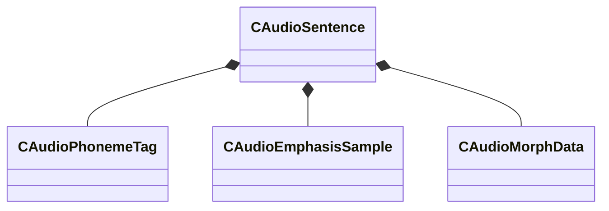

[Schemas](../../schemas.md) / [soundsystem_voicecontainers](../soundsystem_voicecontainers.md) / CAudioSentence

# CAudioSentence

**Kind:** class · **Size:** 160 bytes (`0xa0`) · **Align:** 8 · **Module:** soundsystem_voicecontainers

**Relationships:**

## Memory layout

4 fields (4 declared here, 0 inherited). Offsets are absolute from the object base.

| Offset | Field | Type | From | Annotations |
|--------|-------|------|------|-------------|
| `0x0` | `m_bShouldVoiceDuck` | bool |  |  |
| `0x8` | `m_RunTimePhonemes` | CUtlVector< [CAudioPhonemeTag](../soundsystem_voicecontainers/CAudioPhonemeTag.md) > |  |  |
| `0x20` | `m_EmphasisSamples` | CUtlVector< [CAudioEmphasisSample](../soundsystem_voicecontainers/CAudioEmphasisSample.md) > |  |  |
| `0x38` | `m_morphData` | [CAudioMorphData](../soundsystem_voicecontainers/CAudioMorphData.md) |  |  |

KV3 class defaults

<pre>{
	&quot;m_bShouldVoiceDuck&quot;: false,
	&quot;m_RunTimePhonemes&quot;:
	[
	],
	&quot;m_EmphasisSamples&quot;:
	[
	],
	&quot;m_morphData&quot;:
	{
		&quot;m_times&quot;:
		[
		],
		&quot;m_nameHashCodes&quot;:
		[
		],
		&quot;m_nameStrings&quot;:
		[
		],
		&quot;m_samples&quot;:
		[
		],
		&quot;m_flEaseIn&quot;: 0.200000,
		&quot;m_flEaseOut&quot;: 0.200000
	}
}</pre>

