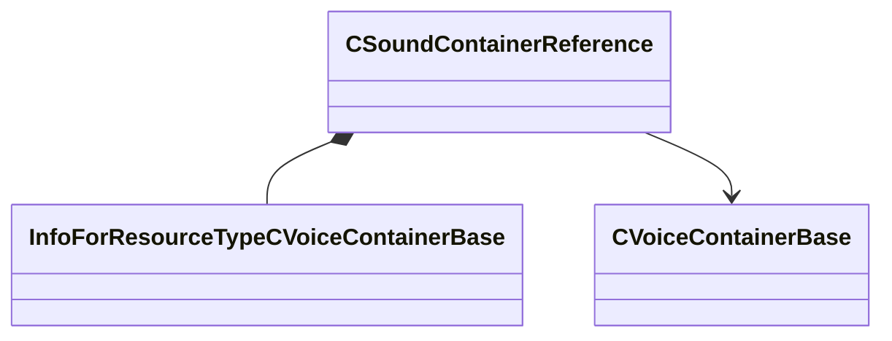

[Schemas](../../schemas.md) / [soundsystem_voicecontainers](../soundsystem_voicecontainers.md) / CSoundContainerReference

# CSoundContainerReference

> Source: **Build 25000182** · 2026-08-28 · `windows-x86_64` · schema `0.10.0`

**Kind:** class · **Size:** 32 bytes (`0x20`) · **Align:** 8 · **Module:** soundsystem_voicecontainers

**Metadata:** `MPropertyDescription Reference to a vsnd file or another container.`, `MPropertyFriendlyName Sound`

**Relationships:**

## Memory layout

4 fields (4 declared here, 0 inherited). Offsets are absolute from the object base.

| Offset | Field | Type | From | Annotations |
|--------|-------|------|------|-------------|
| `0x0` | `m_namespace` | CUtlString |  |  |
| `0x8` | `m_bUseReference` | bool |  | `MPropertyFriendlyName Use Vsnd File` |
| `0x10` | `m_sound` | CStrongHandle< [InfoForResourceTypeCVoiceContainerBase](../resourcesystem/InfoForResourceTypeCVoiceContainerBase.md) > |  | `MPropertyFriendlyName Vsnd File` `MPropertySuppressExpr m_bUseReference == 0` |
| `0x18` | `m_pSound` | [CVoiceContainerBase](../soundsystem_voicecontainers/CVoiceContainerBase.md)* |  | `MPropertyFriendlyName Vsnd Container` `MPropertySuppressExpr m_bUseReference == 1` |

KV3 class defaults

<pre>{
	&quot;m_namespace&quot;: &quot;&quot;,
	&quot;m_bUseReference&quot;: true,
	&quot;m_sound&quot;: &quot;&quot;,
	&quot;m_pSound&quot;: null
}</pre>

