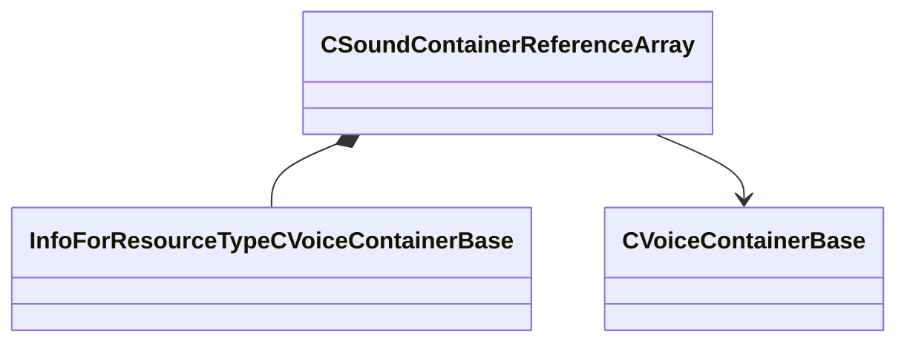

[Schemas](../../schemas.md) / [soundsystem_voicecontainers](../soundsystem_voicecontainers.md) / CSoundContainerReferenceArray

# CSoundContainerReferenceArray

> Source: **Build 25000182** · 2026-08-28 · `windows-x86_64` · schema `0.10.0`

**Kind:** class · **Size:** 56 bytes (`0x38`) · **Align:** 8 · **Module:** soundsystem_voicecontainers

**Metadata:** `MPropertyDescription Reference to list of vsnd files or other containers.`, `MPropertyFriendlyName Sound Array`

**Relationships:**

## Memory layout

3 fields (3 declared here, 0 inherited). Offsets are absolute from the object base.

| Offset | Field | Type | From | Annotations |
|--------|-------|------|------|-------------|
| `0x0` | `m_bUseReference` | bool |  | `MPropertyFriendlyName Use Vsnd File` |
| `0x8` | `m_sounds` | CUtlVector< CStrongHandle< [InfoForResourceTypeCVoiceContainerBase](../resourcesystem/InfoForResourceTypeCVoiceContainerBase.md) > > |  | `MPropertyFriendlyName Vsnd File` `MPropertySuppressExpr m_bUseReference == 0` |
| `0x20` | `m_pSounds` | CUtlVector< [CVoiceContainerBase](../soundsystem_voicecontainers/CVoiceContainerBase.md)* > |  | `MPropertyFriendlyName Vsnd Container` `MPropertySuppressExpr m_bUseReference == 1` |

KV3 class defaults

<pre>{
	&quot;m_bUseReference&quot;: true,
	&quot;m_sounds&quot;:
	[
	],
	&quot;m_pSounds&quot;:
	[
	]
}</pre>

