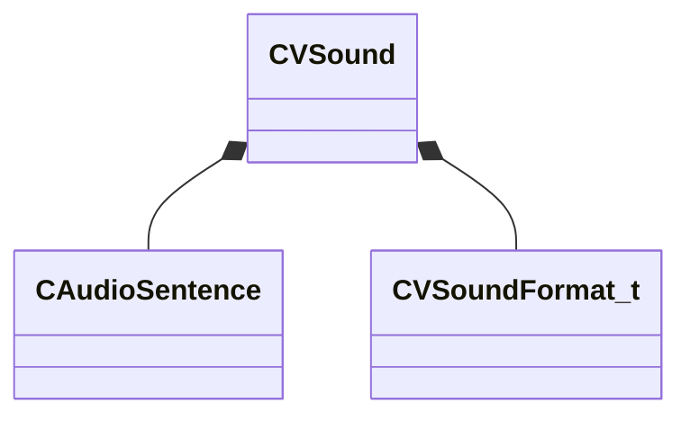

[Schemas](../../schemas.md) / [soundsystem_voicecontainers](../soundsystem_voicecontainers.md) / CVSound

# CVSound

> Source: **Build 25000182** · 2026-08-28 · `windows-x86_64` · schema `0.10.0`

**Kind:** class · **Size:** 64 bytes (`0x40`) · **Align:** 8 · **Module:** soundsystem_voicecontainers

**Relationships:**

## Memory layout

9 fields (9 declared here, 0 inherited). Offsets are absolute from the object base.

| Offset | Field | Type | From | Annotations |
|--------|-------|------|------|-------------|
| `0x0` | `m_Sentences` | CUtlLeanVector< [CAudioSentence](../soundsystem_voicecontainers/CAudioSentence.md) > |  |  |
| `0x10` | `m_nRate` | int32 |  |  |
| `0x14` | `m_nFormat` | [CVSoundFormat_t](../soundsystem_voicecontainers/CVSoundFormat_t.md) |  |  |
| `0x18` | `m_nChannels` | uint32 |  |  |
| `0x1c` | `m_nLoopStart` | int32 |  |  |
| `0x20` | `m_nSampleCount` | uint32 |  |  |
| `0x24` | `m_flDuration` | float32 |  |  |
| `0x28` | `m_nStreamingSize` | uint32 |  |  |
| `0x2c` | `m_nLoopEnd` | int32 |  |  |

KV3 class defaults

<pre>{
	&quot;m_Sentences&quot;:
	[
	],
	&quot;m_nRate&quot;: 0,
	&quot;m_nFormat&quot;: &quot;PCM16&quot;,
	&quot;m_nChannels&quot;: 0,
	&quot;m_nLoopStart&quot;: 0,
	&quot;m_nSampleCount&quot;: 0,
	&quot;m_flDuration&quot;: 0.000000,
	&quot;m_nStreamingSize&quot;: 0,
	&quot;m_nLoopEnd&quot;: 0
}</pre>

