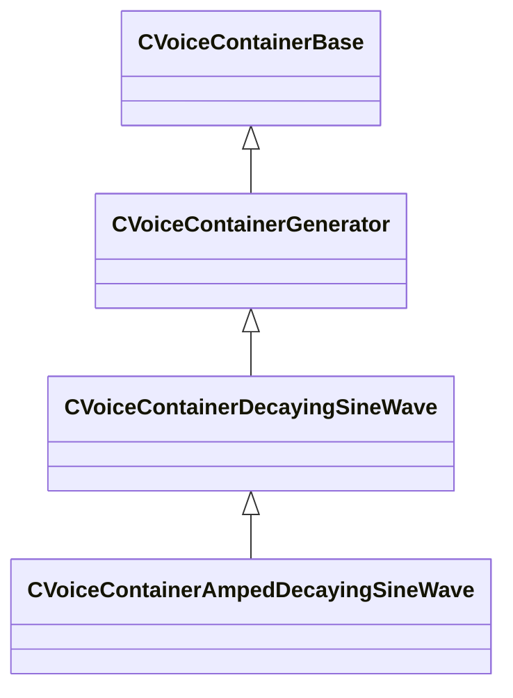

[Schemas](../../schemas.md) / [soundsystem_voicecontainers](../soundsystem_voicecontainers.md) / CVoiceContainerAmpedDecayingSineWave

# CVoiceContainerAmpedDecayingSineWave

**Kind:** class · **Size:** 128 bytes (`0x80`) · **Align:** 8 · **Module:** soundsystem_voicecontainers

**Inherits from:** [CVoiceContainerDecayingSineWave](../soundsystem_voicecontainers/CVoiceContainerDecayingSineWave.md)

**Metadata:** `MPropertyDescription Bytecode instruction`, `MPropertyFriendlyName TESTBED: Amped Decaying Sine Wave Container`

**Relationships:**

## Memory layout

5 fields (1 declared here, 4 inherited). Offsets are absolute from the object base.

| Offset | Field | Type | From | Annotations |
|--------|-------|------|------|-------------|
| `0x28` | `m_vSound` | [CVSound](../soundsystem_voicecontainers/CVSound.md) | [CVoiceContainerBase](../soundsystem_voicecontainers/CVoiceContainerBase.md) | `MPropertySuppressField` |
| `0x68` | `m_pEnvelopeAnalyzer` | [CVoiceContainerAnalysisBase](../soundsystem_voicecontainers/CVoiceContainerAnalysisBase.md)* | [CVoiceContainerBase](../soundsystem_voicecontainers/CVoiceContainerBase.md) | `MPropertySuppressExpr true` |
| `0x70` | `m_flFrequency` | float32 | [CVoiceContainerDecayingSineWave](../soundsystem_voicecontainers/CVoiceContainerDecayingSineWave.md) | `MPropertyDescription The frequency of this sine tone.` `MPropertyFriendlyName Frequency (Hz)` |
| `0x74` | `m_flDecayTime` | float32 | [CVoiceContainerDecayingSineWave](../soundsystem_voicecontainers/CVoiceContainerDecayingSineWave.md) | `MPropertyDescription The frequency of this sine tone.` `MPropertyFriendlyName Decay Time (Seconds)` |
| `0x78` | `m_flGainAmount` | float32 |  | `MPropertyDescription The amount of attenuation .` `MPropertyFriendlyName Attenuation Amount (dB)` |

KV3 class defaults

<pre>{
	&quot;_class&quot;: &quot;CVoiceContainerAmpedDecayingSineWave&quot;,
	&quot;m_vSound&quot;:
	{
		&quot;m_Sentences&quot;:
		[
		],
		&quot;m_nRate&quot;: 0,
		&quot;m_nFormat&quot;: &quot;PCM16&quot;,
		&quot;m_nChannels&quot;: 0,
		&quot;m_nLoopStart&quot;: 0,
		&quot;m_nSampleCount&quot;: 0,
		&quot;m_flDuration&quot;: 0.000000,
		&quot;m_nStreamingSize&quot;: 0,
		&quot;m_nLoopEnd&quot;: 0
	},
	&quot;m_pEnvelopeAnalyzer&quot;: null,
	&quot;m_flFrequency&quot;: 0.000000,
	&quot;m_flDecayTime&quot;: 0.000000,
	&quot;m_flGainAmount&quot;: 0.000000
}</pre>

