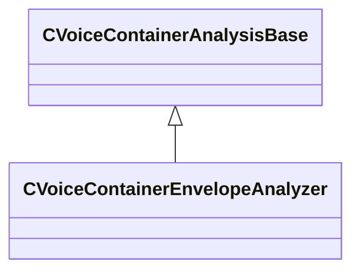

[Schemas](../../schemas.md) / [soundsystem_voicecontainers](../soundsystem_voicecontainers.md) / CVoiceContainerAnalysisBase

# CVoiceContainerAnalysisBase

> Source: **Build 25000182** · 2026-08-28 · `windows-x86_64` · schema `0.10.0`

**Kind:** class · **Size:** 72 bytes (`0x48`) · **Align:** 8 · **Module:** soundsystem_voicecontainers

**Derived by:** [CVoiceContainerEnvelopeAnalyzer](../soundsystem_voicecontainers/CVoiceContainerEnvelopeAnalyzer.md)

**Metadata:** `MPropertyDescription Does Not Play Sound, member of CVoiceContainerDefaultDefault`, `MPropertyFriendlyName Analysis Container`, `MPropertyPolymorphicClass`, `MVDataNodeType 1`

**Relationships:**

## Memory layout

1 field (1 declared here, 0 inherited). Offsets are absolute from the object base.

| Offset | Field | Type | From | Annotations |
|--------|-------|------|------|-------------|
| `0x8` | `m_curve` | CPiecewiseCurve |  | `MPropertyFriendlyName Envelope Curve` |

KV3 class defaults

<pre>{
	&quot;_class&quot;: &quot;CVoiceContainerAnalysisBase&quot;,
	&quot;m_curve&quot;:
	{
		&quot;m_spline&quot;:
		[
		],
		&quot;m_tangents&quot;:
		[
		],
		&quot;m_vDomainMins&quot;:
		[
			0.000000,
			0.000000
		],
		&quot;m_vDomainMaxs&quot;:
		[
			0.000000,
			0.000000
		]
	}
}</pre>

